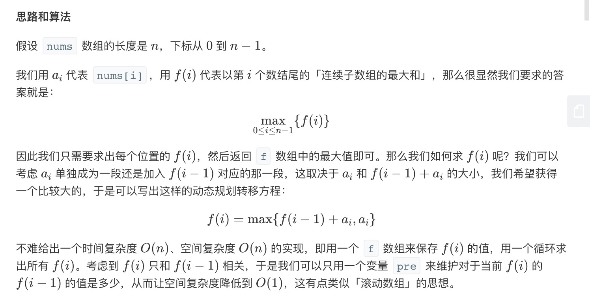
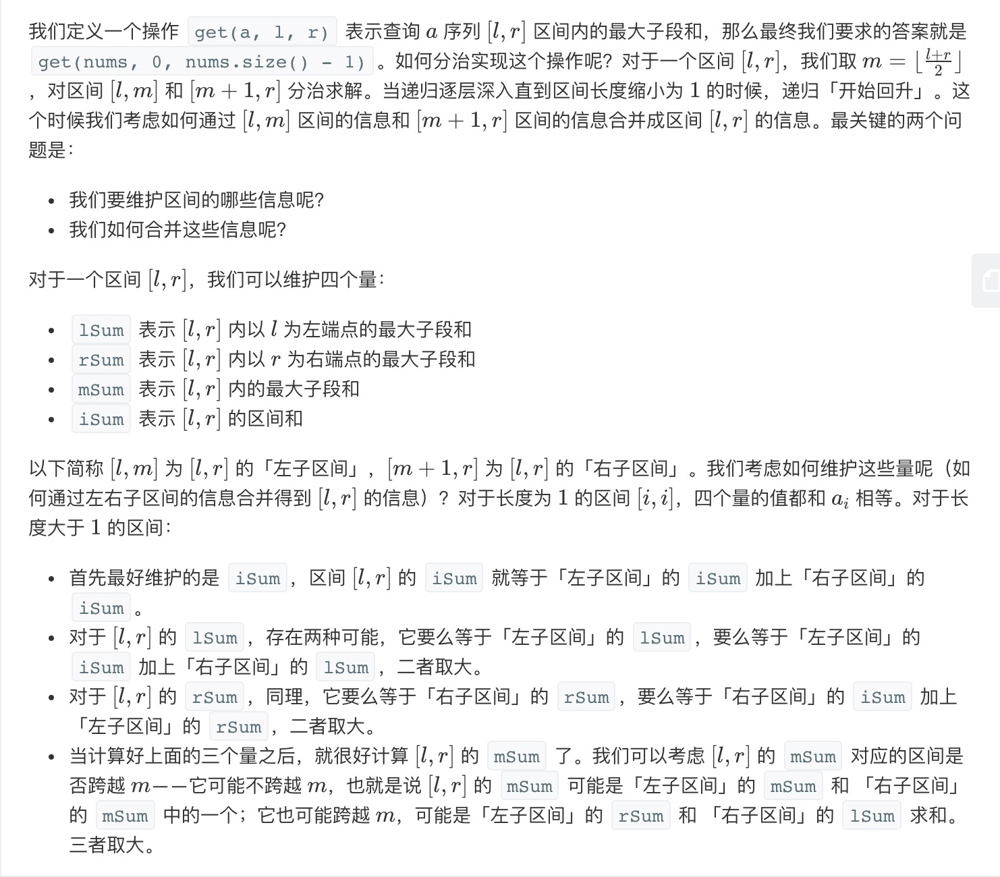

= 最大子序和
:toc:
:toc-title: 目录

给定一个整数数组 nums ，找到一个具有最大和的连续子数组（子数组最少包含一个元素），返回其最大和。

示例:
```
输入: [-2,1,-3,4,-1,2,1,-5,4],
输出: 6
解释: 连续子数组 [4,-1,2,1] 的和最大，为 6。
```
进阶:
```
如果你已经实现复杂度为 O(n) 的解法，尝试使用更为精妙的分治法求解。
```

== 参考
https://leetcode-cn.com/problems/maximum-subarray/

== 题解思路
=== 动态规划
参见: link:../../../data_structure/dynamicProgramming[动态规划详解]



```go
func maxSubArray(nums []int) int {
	max := nums[0]
	for i := 1; i < len(nums); i++ {
		if nums[i]+nums[i-1] > nums[i] {
			nums[i] = nums[i] + nums[i-1]
		}
		if nums[i] > max {
			max = nums[i]
		}
	}
	return max
}
```


复杂度
```
时间复杂度：O(n)，其中 nn 为 nums 数组的长度。我们只需要遍历一遍数组即可求得答案。
空间复杂度：O(1)。我们只需要常数空间存放若干变量。
```

=== 分治法
参见: link:../../../data_structure/dichotomy/[分治法详解]



```go

func maxSubArray(nums []int) int {
	return get(nums, 0, len(nums)-1).mSum
}

func pushUp(left, right Status) Status {
	iSum := left.iSum + right.iSum
	lSum := max(left.lSum, left.iSum+right.lSum)
	rSum := max(right.rSum, right.iSum+left.rSum)
	mSum := max(max(left.mSum, right.mSum), left.rSum+right.lSum)
	return Status{iSum: iSum, lSum: lSum, rSum: rSum, mSum: mSum}
}

func max(x, y int) int {
	if x > y {
		return x
	}
	return y
}

func get(nums []int, left, right int) Status {
	if left == right {
		return Status{lSum: nums[left], rSum: nums[left], mSum: nums[left], iSum: nums[left]}
	}
	m := (left + right) >> 1
	lSub := get(nums, left, m)
	rSub := get(nums, m+1, right)
	return pushUp(lSub, rSub)
}

type Status struct {
	lSum, rSum, mSum, iSum int
}

```

复杂度分析

假设序列 a 的长度为 n。
```
时间复杂度：假设我们把递归的过程看作是一颗二叉树的先序遍历，那么这颗二叉树的深度的渐进上界为 O(\log n)O(logn)，这里的总时间相当于遍历这颗二叉树的所有节点，故总时间的渐进上界是 O(\sum_{i = 1}^{\log n} 2^{i - 1}) = O(n)O(∑
i=1
logn
​
 2
i−1
 )=O(n)，故渐进时间复杂度为 O(n)O(n)。
空间复杂度：递归会使用 O(\log n)O(logn) 的栈空间，故渐进空间复杂度为 O(\log n)O(logn)。
```

