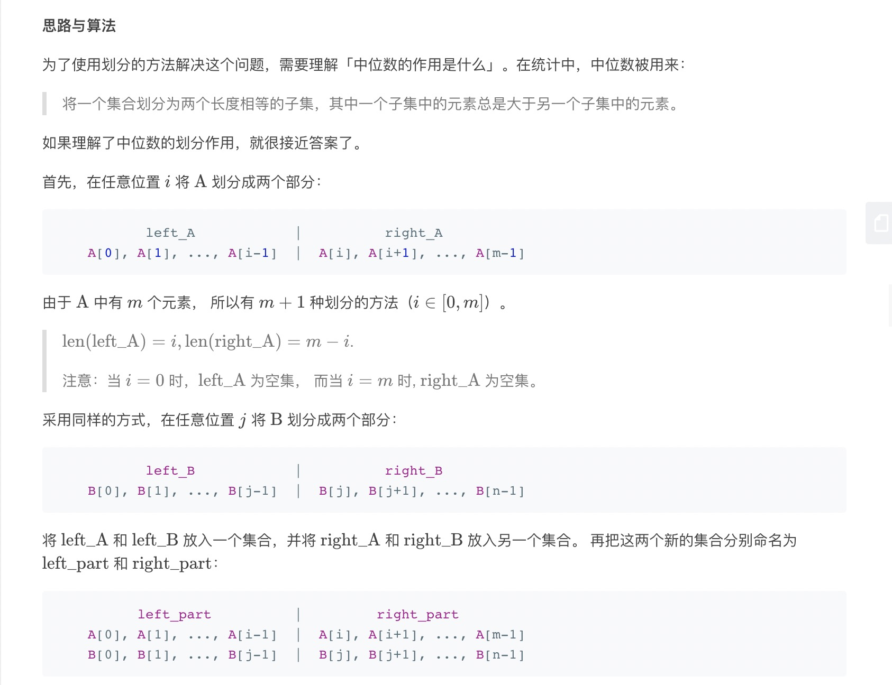
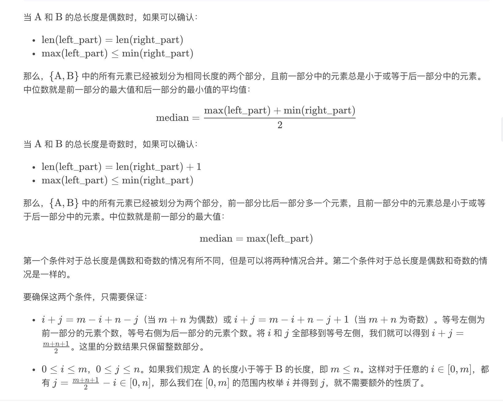
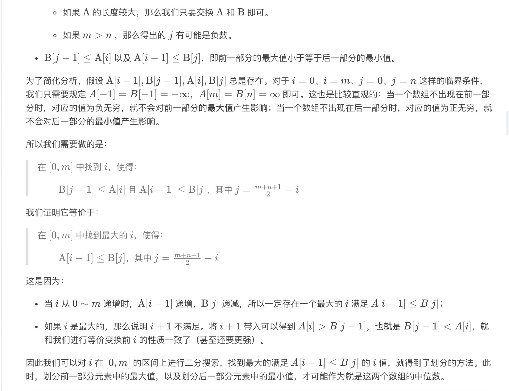

= 寻找两个有序数组的中位数

给定两个大小为 m 和 n 的有序数组 nums1 和 nums2。

请你找出这两个有序数组的中位数，并且要求算法的时间复杂度为 O(log(m + n))。

你可以假设 nums1 和 nums2 不会同时为空。

== 参考
https://leetcode-cn.com/problems/median-of-two-sorted-arrays/

== 知识点
=== 中位数
将一个集合划分为两个长度相等的子集，其中一个子集中的元素总是大于另一个子集中的元素。





```python
def findMedianSortedArrays(nums1, nums2):
    """
    :type nums1: List[int]
    :type nums2: List[int]
    :rtype: float
    """
    m = len(nums1)
    n = len(nums2)
    # 保证n >= m
    if m > n:
        nums1, nums2 = nums2, nums1
        m, n = n, m
    half_m_n = (m + n + 1) >> 1
    imin = 0
    imax = m
    while imin <= imax:
        i = (imin + imax) >> 1
        j = half_m_n - i
        if i < m and nums1[i] < nums2[j - 1]:
            imin = i + 1
        elif i > 0 and nums1[i - 1] > nums2[j]:
            imax = i - 1
        else:
            # 找到复合条件的i
            if i == 0:
                max_of_left = nums2[j - 1]
            elif j == 0:
                max_of_left = nums1[i - 1]
            else:
                max_of_left = max(nums1[i - 1], nums2[j - 1])

            # 如果是奇数
            if (m + n) % 2 == 1:
                return max_of_left

            # 如果是偶数
            if i == m:
                min_of_right = nums2[j]
            elif j == n:
                min_of_right = nums1[i]
            else:
                min_of_right = min(nums1[i], nums2[i])
            return (min_of_right + max_of_left) / 2
```
