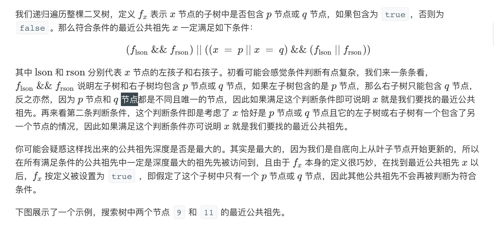
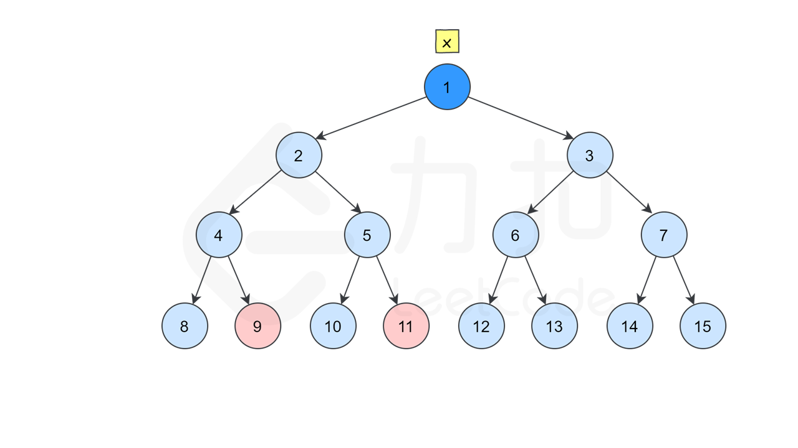
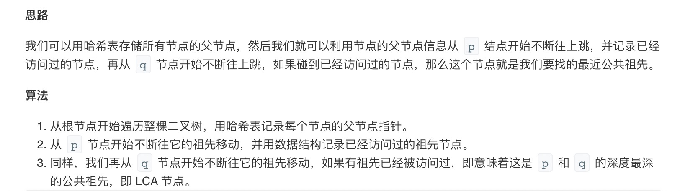

= 二叉树的最近公共祖先
:toc:
:toclevels: 5
:toc-title: 目录
:sectnums:

== 说明
给定一个二叉树, 找到该树中两个指定节点的最近公共祖先。

百度百科中最近公共祖先的定义为：“对于有根树 T 的两个结点 p、q，最近公共祖先表示为一个结点 x，满足 x 是 p、q 的祖先且 x 的深度尽可能大（一个节点也可以是它自己的祖先）。”

例如，给定如下二叉树:  root = [3,5,1,6,2,0,8,null,null,7,4]

image:images/binarytree.png[]

 

示例 1:
```
输入: root = [3,5,1,6,2,0,8,null,null,7,4], p = 5, q = 1
输出: 3
解释: 节点 5 和节点 1 的最近公共祖先是节点 3。
```
示例 2:
```
输入: root = [3,5,1,6,2,0,8,null,null,7,4], p = 5, q = 4
输出: 5
解释: 节点 5 和节点 4 的最近公共祖先是节点 5。因为根据定义最近公共祖先节点可以为节点本身。
```

说明:
```
所有节点的值都是唯一的。
p、q 为不同节点且均存在于给定的二叉树中。
```

== 题解
=== 递归法





```go
func lowestCommonAncestor(root, p, q *TreeNode) *TreeNode {
	if root == nil {
		return nil
	}
	if root.Val == p.Val || root.Val == q.Val {
		return root
	}
	left := lowestCommonAncestor(root.Left, p, q)
	right := lowestCommonAncestor(root.Right, p, q)
	if left != nil && right != nil {
		//p,q 节点公共节点是其他节点
		return root
	}
	// 公共节点是p或者q节点
	if left == nil {
		return right
	}
	return left
}
```

时间复杂度：O(N)，其中 N 是二叉树的节点数。二叉树的所有节点有且只会被访问一次，因此时间复杂度为 O(N)。

空间复杂度：O(N) ，其中 N 是二叉树的节点数。递归调用的栈深度取决于二叉树的高度，二叉树最坏情况下为一条链，此时高度为 N，因此空间复杂度为 O(N)。


=== 存储公共父节点




```go
func lowestCommonAncestor(root, p, q *TreeNode) *TreeNode {
	parent := map[int]*TreeNode{}
	visterd := map[int]bool{}
	var dfs func(root *TreeNode)
	dfs = func(root *TreeNode) {
		if root == nil {
			return
		}
		// 存储父节点，key 为左右子树的Val，key 为 父节点
		if root.Left != nil {
			parent[root.Left.Val] = root
			dfs(root.Left)
		}
		if root.Right != nil {
			parent[root.Right.Val] = root
			dfs(root.Right)
		}
	}
	dfs(root)
	// 遍历从p节点到root的访问路径
	for p != nil {
		visterd[p.Val] = true
		p = parent[p.Val]
	}
	// 从q开始跳到root，如果找到第一个p访问过的节点，即为最小公共父节点
	for q != nil {
		if visterd[q.Val] {
			return q
		}
		q = parent[q.Val]
	}
	return nil
}
```

时间复杂度：O(N)，其中 N 是二叉树的节点数。二叉树的所有节点有且只会被访问一次，从 p 和 q 节点往上跳经过的祖先节点个数不会超过 N，因此总的时间复杂度为 O(N)。

空间复杂度：O(N) ，其中 N 是二叉树的节点数。递归调用的栈深度取决于二叉树的高度，二叉树最坏情况下为一条链，此时高度为 N，因此空间复杂度为 O(N)，哈希表存储每个节点的父节点也需要 O(N) 的空间复杂度，因此最后总的空间复杂度为 O(N)


== 参考
https://leetcode-cn.com/problems/lowest-common-ancestor-of-a-binary-tree/

