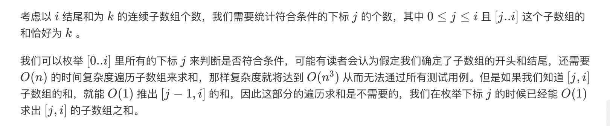
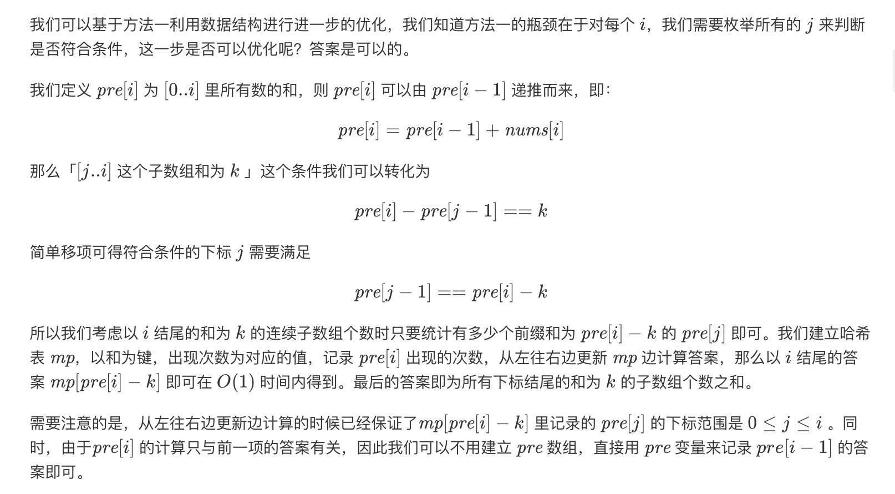

= 和为K的子数组
:toc:
:toc-title: 目录
:toclevels: 5
:sectnums:

== 说明
给定一个整数数组和一个整数 k，你需要找到该数组中和为 k 的连续的子数组的个数。

示例 1 :
```
输入:nums = [1,1,1], k = 2
输出: 2 , [1,1] 与 [1,1] 为两种不同的情况。
```
说明 :
```
数组的长度为 [1, 20,000]。
数组中元素的范围是 [-1000, 1000] ，且整数 k 的范围是 [-1e7, 1e7]。
```
== 参考
https://leetcode-cn.com/problems/subarray-sum-equals-k/

== 题解
=== 枚举


```go
func subarraySum(nums []int, k int) int {
	count := 0
	for i := 0; i < len(nums); i++ {
		sum := 0
		for j := i; j >= 0; j-- {
			sum += nums[j]
			if sum == k {
				count++
			}
		}
	}
	return count
}
```

复杂度:

- 时间复杂度: o(n^2)
- 空间复杂度: o(1) ,只需要常量的空间存储结果

=== 前缀和 + 哈希表优化




*核心算法:*

从j->i 之间的和为 sum(0->i) - sum(0->j),假设j到k的和为k，则
需要从mp找到有几个sum(0-j),即

```
pre[j-1] = pre[i] - k
```

```go
func subarraySum2(nums []int, k int) int {
	count, pre := 0, 0
	mp := map[int]int{0: 1}
	for i := 0; i < len(nums); i++ {
		pre += nums[i]
		if _, ok := mp[pre-k]; ok {
			count += mp[pre-k]
		}
		mp[pre] += 1
	}
	return count
}

```

