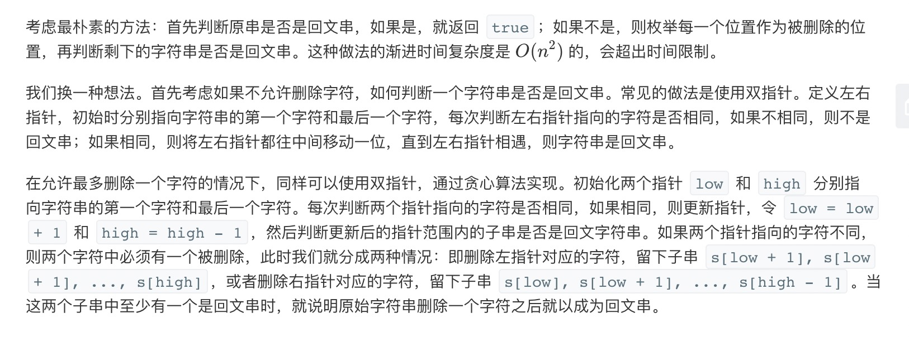

= 验证回文字符串 Ⅱ
:toc:
:toc-title: 目录
:toclevels: 5
:sectnums:

== 说明
给定一个非空字符串 s，最多删除一个字符。判断是否能成为回文字符串。

示例 1:
```
输入: "aba"
输出: True
```
示例 2:
```
输入: "abca"
输出: True
解释: 你可以删除c字符。
```
注意:

字符串只包含从 a-z 的小写字母。字符串的最大长度是50000。

== 参考
https://leetcode-cn.com/problems/valid-palindrome-ii/

== 知识点
双指针求解，初始化两个指针，分别指向头和尾，不断的移动指针比较

== 题解



```go
func validPalindrome(s string) bool {
	i, j := 0, len(s)-1
	flag := true
	for i <= j {
		if s[i] == s[j] {
			i += 1
			j -= 1
		} else {
			flag = validate(s[i:j]) || validate(s[i+1:j+1])
			break
		}
	}
	return flag
}

func validate(s string) bool {
	i, j := 0, len(s)-1
	for i <= j {
		if s[i] != s[j] {
			return false
		}
		i += 1
		j -= 1
	}
	return true
}


```

复杂度:

- 时间复杂度:o(n) ,需要遍历整个数组
- 空间复杂度:o(1) ,需要几个常量空间

