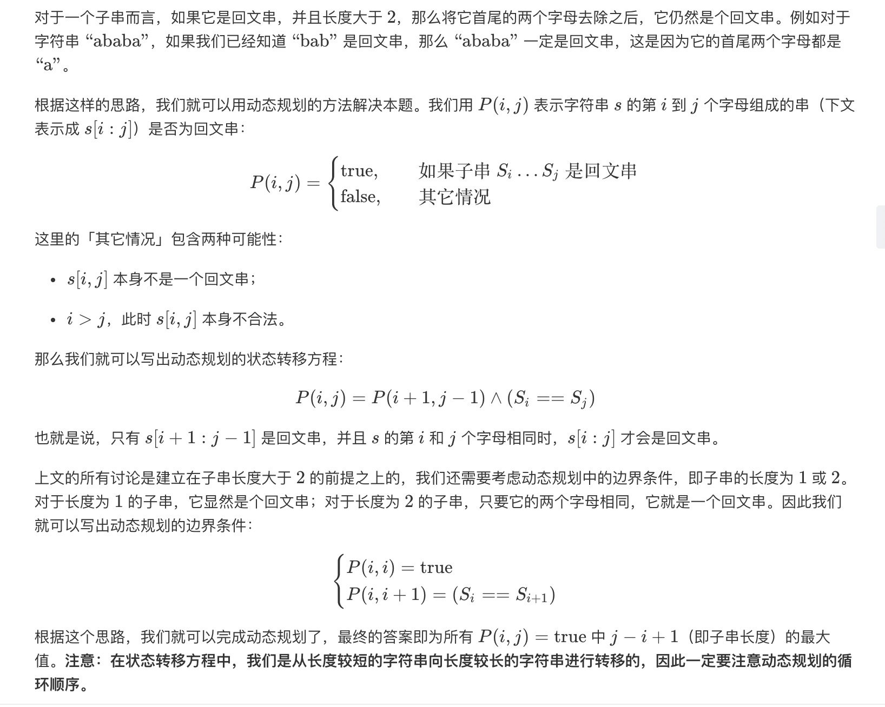

= 最长回文子串
:toc:
:toc-title: 目录
:toclevels: 5
:sectnums:

== 题目说明
给定一个字符串 s，找到 s 中最长的回文子串。你可以假设 s 的最大长度为 1000。

示例 1：
```
输入: "babad"
输出: "bab"
注意: "aba" 也是一个有效答案。
```
示例 2：
```
输入: "cbbd"
输出: "bb"
```


== 参考
https://leetcode-cn.com/problems/longest-palindromic-substring/

== 题解
=== 动态规划



```go
func longestPalindrome(s string) string {
	n := len(s)
	dp := make([][]int, n)
	for i := 0; i < n; i++ {
		dp[i] = make([]int, n)
	}
	result := ""
	for l := 0; l < n; l++ {
		for i := 0; i+l < n; i++ {
			j := i + l
			if l == 0 {
				dp[i][j] = 1
			} else if l == 1 {
				if s[i] == s[j] {
					dp[i][j] = 1
				}
			} else {
				if s[i] == s[j] {
					dp[i][j] = dp[i+1][j-1]
				}
			}
			if dp[i][j] > 0 && l+1 > len(result) {
				result = s[i : j+1]
			}
		}
	}
	return result
}
```

复杂度:

- 时间复杂度:o(n^2),动态规划的总状态数o(n^2),状态转移的时间为o(1)
- 空间复杂度:o(n^2),存储动态规划状态需要的空间

=== 中心扩展法

image:images/2.jpg[]

```go
func longestPalindrome(s string) string {
	if s == "" {
		return ""
	}
	start, end := 0, 0
	for i := 0; i < len(s); i++ {
		left1, right1 := expandAroundCenter(s, i, i)
		left2, right2 := expandAroundCenter(s, i, i+1)
		if right1-left1 > end-start {
			start, end = left1, right1
		}
		if right2-left2 > end-start {
			start, end = left2, right2
		}
	}
	return s[start : end+1]
}

func expandAroundCenter(s string, left, right int) (int, int) {
	for ; left >= 0 && right < len(s) && s[left] == s[right]; left, right = left-1, right+1 {

	}
	return left + 1, right - 1
}
```

复杂度:

- 时间复杂度: o(n^2) 其中 nn 是字符串的长度。长度为 1 和 2 的回文中心分别有 n 和 n-1 个，每个回文中心最多会向外扩展 O(n)次。
- 空间复杂度: o(1)
