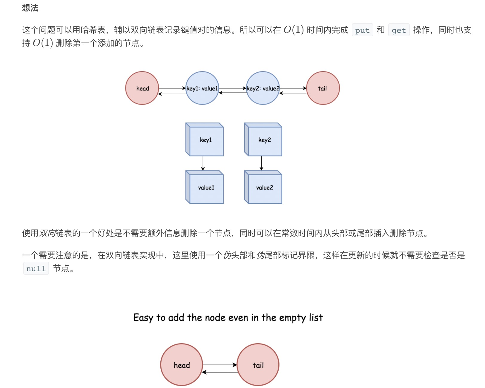

= LRU缓存机制
:toc: right
:toc-title: 目录
:toclevels: 5
:sectnums:

== 题目说明
运用你所掌握的数据结构，设计和实现一个  LRU (最近最少使用) 缓存机制。它应该支持以下操作： 获取数据 get 和 写入数据 put 。

获取数据 get(key) - 如果密钥 (key) 存在于缓存中，则获取密钥的值（总是正数），否则返回 -1。
写入数据 put(key, value) - 如果密钥已经存在，则变更其数据值；如果密钥不存在，则插入该组「密钥/数据值」。当缓存容量达到上限时，它应该在写入新数据之前删除最久未使用的数据值，从而为新的数据值留出空间。

 

进阶:

你是否可以在 O(1) 时间复杂度内完成这两种操作？

 

示例:
```
LRUCache cache = new LRUCache( 2 /* 缓存容量 */ );

cache.put(1, 1);
cache.put(2, 2);
cache.get(1);       // 返回  1
cache.put(3, 3);    // 该操作会使得密钥 2 作废
cache.get(2);       // 返回 -1 (未找到)
cache.put(4, 4);    // 该操作会使得密钥 1 作废
cache.get(1);       // 返回 -1 (未找到)
cache.get(3);       // 返回  3
cache.get(4);       // 返回  4
```

== 参考
https://leetcode-cn.com/problems/lru-cache/solution/lru-huan-cun-ji-zhi-by-leetcode/

== 题解
=== 有序字典
需要在 O(1)O(1) 时间内完成如下操作：

- 获取键 / 检查键是否存在
- 设置键
- 删除最先插入的键

前两个操作可以用标准的哈希表在O(1)时间内完成。

有一种叫做有序字典的数据结构，综合了哈希表和链表，在 Python 中为 OrderedDict。

下面用这个数据结构来实现。

```python
from collections import OrderedDict
class LRUCache(OrderedDict):
    def __init__(self, capacity: int):
        self.capacity = capacity

    def get(self, key: int) -> int:
        if key not in self :
            return -1
        self.move_to_end(key)
        return self[key]

    def put(self, key: int, value: int) -> None:
        if key in self :
            self.move_to_end(key)
        self[key] = value
        if len(self) > self.capacity :
            self.popitem(last = False)
```

或者

```
from collections import OrderedDict
class LRUCache():

    def __init__(self, capacity: int):
        self.capacity = capacity
        self.mappings = OrderedDict()

    def get(self, key: int) -> int:
        if key not in self.mappings :
            return -1
        self.mappings.move_to_end(key)
        return self.mappings[key]

    def put(self, key: int, value: int) -> None:
        if key in self.mappings :
            self.mappings.move_to_end(key)
        self.mappings[key] = value
        if len(self.mappings) > self.capacity :
            self.mappings.popitem(last = False)
```

复杂度:

- 时间复杂度: put/get 是o(1)，有序字典的所有操作都可以在常数时间内完成
- 空间复杂度: o(capacity)

=== 哈希表+双向链表



```python
class DlinkedNode():
    def __init__(self):
        self.key = 0
        self.value = 0
        self.next = None
        self.prev = None


class LRUCache():
    def __init__(self, capacity: int):
        self.capacity = capacity
        self.size = 0
        self.cache = {}
        self.head = DlinkedNode()
        self.tail = DlinkedNode()
        self.head.next = self.tail
        self.tail.prev = self.head

    def _add_node(self, node):
        """ 始终放在head的右边 """
        node.prev = self.head
        node.next = self.head.next

        self.head.next.prev = node
        self.head.next = node

    def _remove_node(self, node):
        """删除一个节点"""
        _prev = node.prev
        _next = node.next

        _prev.next = _next
        _next.prev = _prev

    def _move_to_head(self, node):
        """
        先删除再增加
        :param node:
        :return:
        """
        self._remove_node(node)
        self._add_node(node)

    def _pop_tail(self):
        """
        删除最后一个节点的前一个
        :return:
        """
        res = self.tail.prev
        self._remove_node(res)
        return res

    def get(self, key: int) -> int:
        node = self.cache.get(key, None)
        if not node:
            return -1
        self._move_to_head(node)
        return node.value

    def put(self, key: int, value: int) -> None:
        node = self.cache.get(key, None)
        if not node:
            node = DlinkedNode()
            node.key = key
            node.value = value
            self.size += 1
            self.cache[key] = node
            self._add_node(node)

            if self.size > self.capacity:
                tail = self._pop_tail()
                del self.cache[tail.key]
                self.size -= 1
        else:
            node.value = value
            self._move_to_head(node)

```

复杂度:

- 时间复杂度: o(1)
- 空间复杂度: o(capacity) ，最大存储 capacity 个元素

