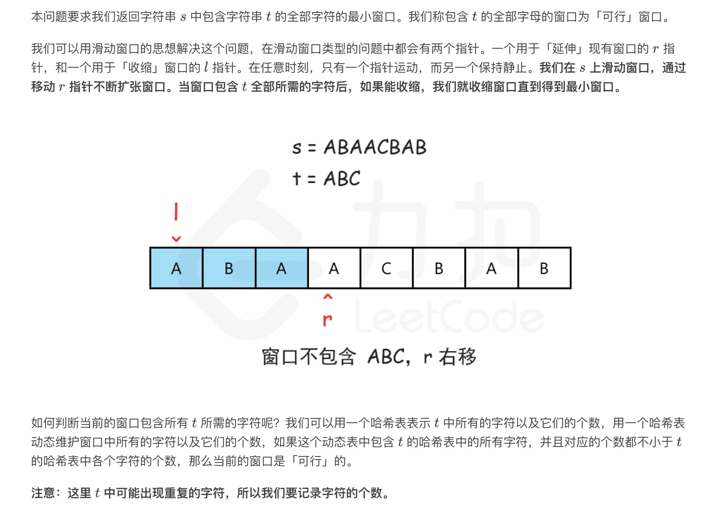
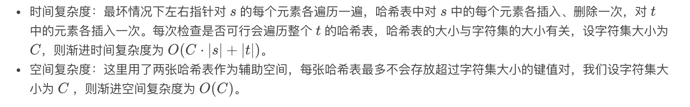

= 最小覆盖子串
:toc: right
:toc-title: 目录
:toclevels: 5
:sectnums:

== 题目说明
给你一个字符串 S、一个字符串 T，请在字符串 S 里面找出：包含 T 所有字符的最小子串。

示例：
```
输入: S = "ADOBECODEBANC", T = "ABC"
输出: "BANC"
说明：

如果 S 中不存这样的子串，则返回空字符串 ""。
如果 S 中存在这样的子串，我们保证它是唯一的答案。

```

== 参考
https://leetcode-cn.com/problems/minimum-window-substring/

== 知识点
滑动窗口

== 题解



```python
def minWindow(s: str, t: str) -> str:
    mappings_t = {}
    mappings_windows = {}
    for i in range(len(t)):
        if t[i] not in mappings_t:
            mappings_t[t[i]] = 1
        else:
            mappings_t[t[i]] += 1
    i = 0
    result_l, result_r = -1, -1
    max_len = float("inf")

    def check():
        for k, v in mappings_t.items():
            tmp_v = mappings_windows.get(k) or 0
            if tmp_v < v:
                return False
        return True

    for j in range(len(s)):
        if s[j] in mappings_t:
            tmp = mappings_windows.get(s[j]) or 0
            mappings_windows[s[j]] = tmp + 1
        while check() and i <= j:
            if j - i + 1 < max_len:
                max_len = j - i + 1
                result_l, result_r = i, j
            if s[i] in mappings_t:
                mappings_windows[s[i]] -= 1
            i += 1
    if result_r == -1:
        return ""
    return s[result_l:result_r + 1]
```

复杂度:


