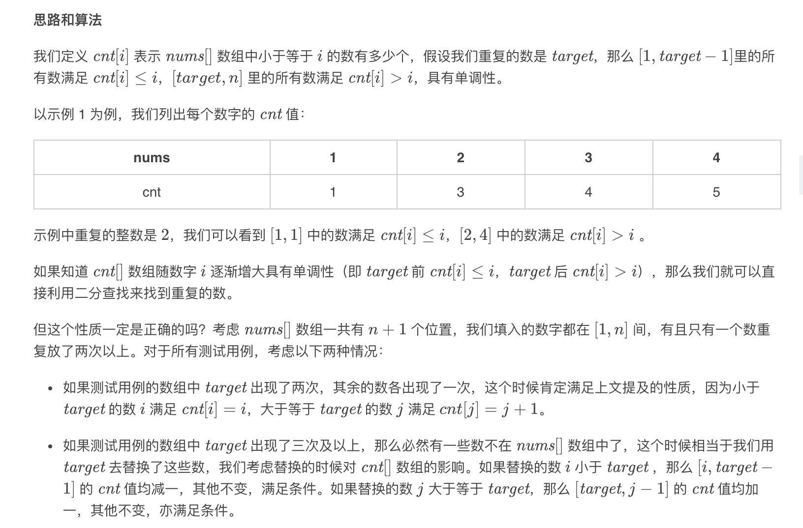
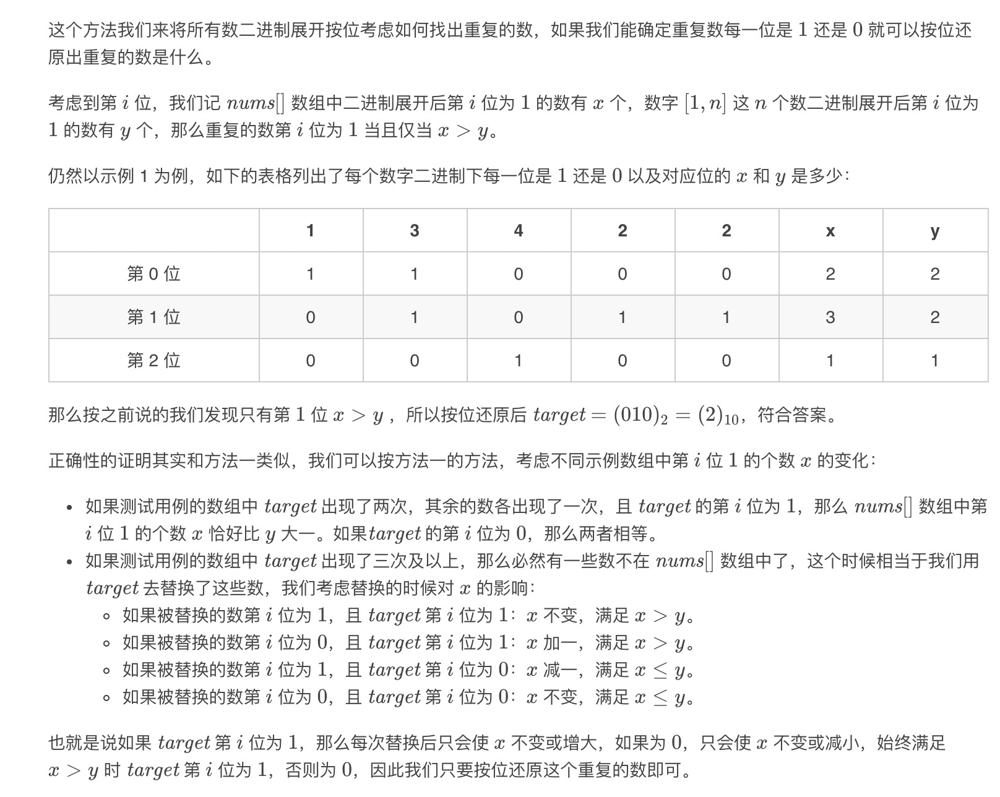
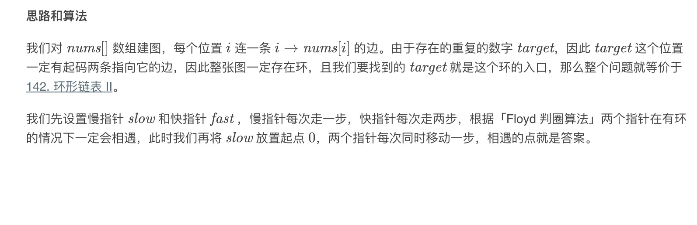
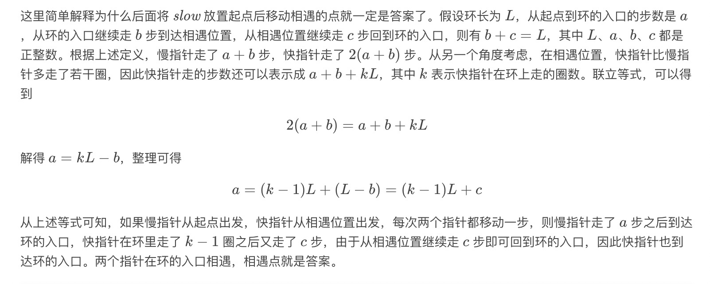

= 寻找重复数
:toc: right
:toc-title: 目录
:toclevels: 4
:sectnums:

== 题目说明
给定一个包含 n + 1 个整数的数组 nums，其数字都在 1 到 n 之间（包括 1 和 n），可知至少存在一个重复的整数。假设只有一个重复的整数，找出这个重复的数。

示例 1:
```
输入: [1,3,4,2,2]
输出: 2
```
示例 2:
```
输入: [3,1,3,4,2]
输出: 3
```
说明：
```
不能更改原数组（假设数组是只读的）。
只能使用额外的 O(1) 的空间。
时间复杂度小于 O(n2) 。
数组中只有一个重复的数字，但它可能不止重复出现一次。
```

== 参考
https://leetcode-cn.com/problems/find-the-duplicate-number/

== 知识点
- 二分法
- 位运算
- 快慢指针

== 题解
=== 二分查找



```go
func findDuplicate(nums []int) int {
	n := len(nums)
	left, right := 1, n-1
	result := -1
	for left <= right {
		mid := (left + right) >> 1
		cnt := 0
		for i := 0; i < n; i++ {
			if nums[i] <= mid {
				cnt++
			}
		}
		if cnt <= mid {
			left = mid + 1
		} else {
			right = mid - 1
			result = mid
		}
	}
	return result
}
```

复杂度:

- 时间复杂度:o(nlogn),其中 n 为nums[] 数组的长度。二分查找最多需要二分O(logn) 次，每次判断的时候需要O(n) 遍历nums[] 数组求解小于等于mid 的数的个数，因此总时间复杂度为 O(nlogn)
- 空间复杂度:o(nlogn), 我们只需要常数空间存放若干变量

=== 位运算



```go
func findDuplicate(nums []int) int {
	n := len(nums)
	bit_max := 32
	for (n-1)>>bit_max == 0 {
		bit_max--
	}
	result := 0
	for bit := 0; bit <= bit_max; bit++ {
		x, y := 0, 0
		for i := 0; i < n; i++ {
			if nums[i]&(1<<bit) > 0 {
				x++
			}
			if n >= 1 && (i&(1<<bit) > 0) {
				y++
			}
		}
		if x > y {
			result |= (1 << bit)
		}
	}
	return result
}
```

复杂度:

- 时间复杂度：O(nlogn)，其中 n 为nums[] 数组的长度。O(logn) 代表了我们枚举二进制数的位数个数，枚举第 ii 位的时候需要遍历数组统计 x 和 y 的答案，因此总时间复杂度为 O(nlogn)。
- 空间复杂度：O(1)。我们只需要常数空间存放若干变量。

=== 快慢指针





```go
func findDuplicate(nums []int) int {
    slow, fast := 0, 0
    for slow, fast = nums[slow], nums[nums[fast]]; slow != fast; slow, fast = nums[slow], nums[nums[fast]] { }
    slow = 0
    for slow != fast {
        slow = nums[slow]
        fast = nums[fast]
    }
    return slow
}
```

