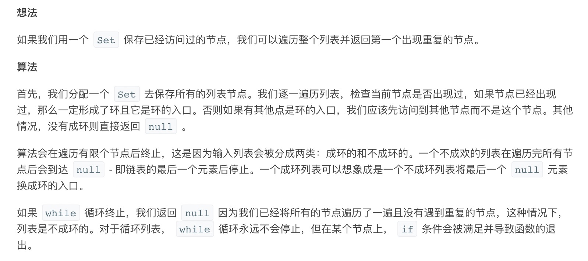
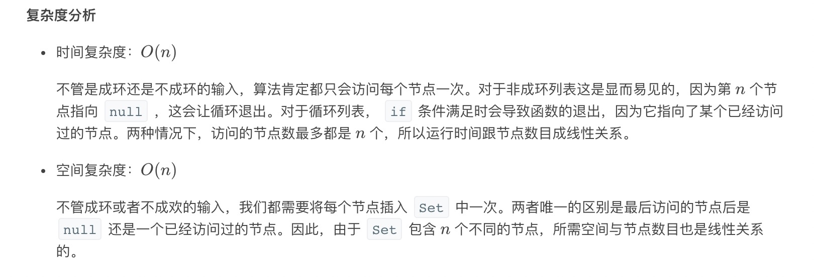
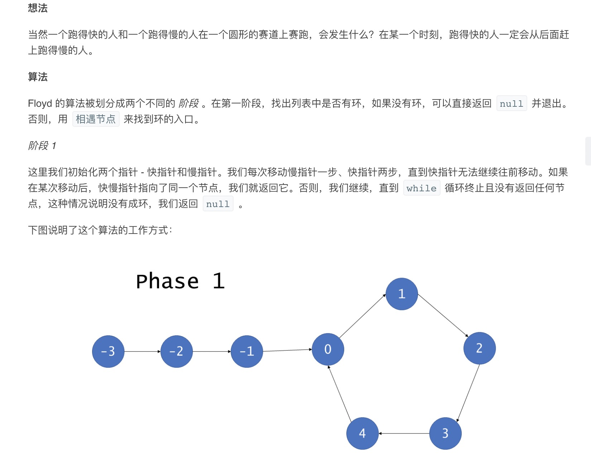
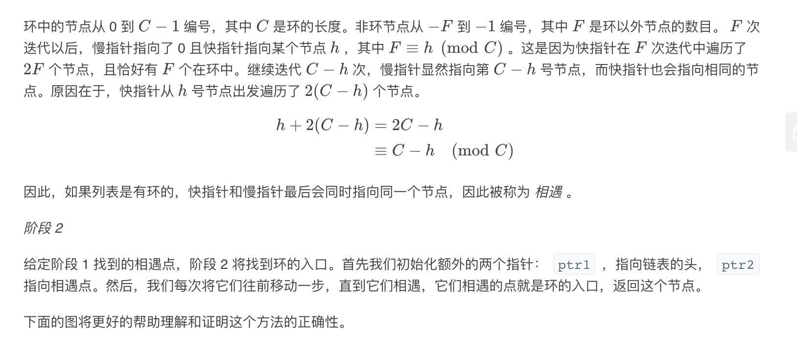
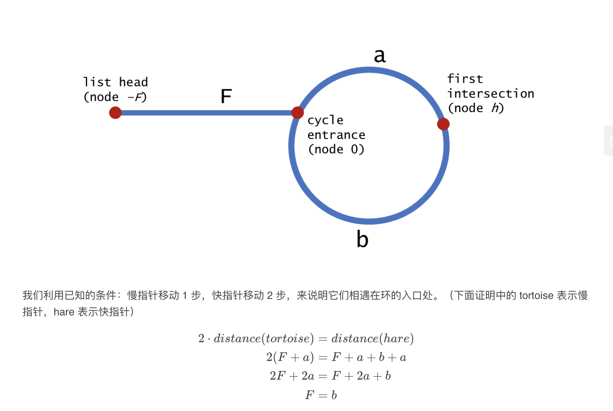
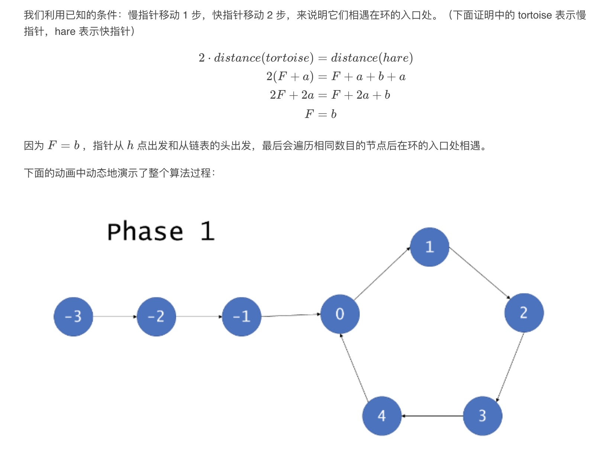
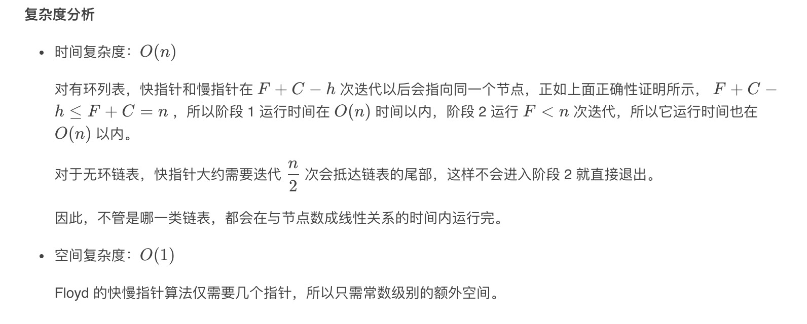

= 环境链表

== 说明

给定一个链表，返回链表开始入环的第一个节点。 如果链表无环，则返回 null。

为了表示给定链表中的环，我们使用整数 pos 来表示链表尾连接到链表中的位置（索引从 0 开始）。 如果 pos 是 -1，则在该链表中没有环。

说明：不允许修改给定的链表。

 

示例 1：
```
输入：head = [3,2,0,-4], pos = 1
输出：tail connects to node index 1
解释：链表中有一个环，其尾部连接到第二个节点。
```

image:images/circularlinkedlist.png[]

示例 2：
```
输入：head = [1,2], pos = 0
输出：tail connects to node index 0
解释：链表中有一个环，其尾部连接到第一个节点。
```

image:images/circularlinkedlist_test2.png[]

示例 3：
```
输入：head = [1], pos = -1
输出：no cycle
解释：链表中没有环。
```

image:images/circularlinkedlist_test3.png[]


进阶：
你是否可以不用额外空间解决此题？


== 参考
https://leetcode-cn.com/problems/linked-list-cycle-ii/

== 知识点
- Floyd(龟兔赛跑)算法

== 题解
=== 哈希表



```python
def detectCycle(head: ListNode) -> ListNode:
    tmp = {}
    while head:
        if head in tmp:
            return head
        tmp[head] = ""
        head = head.next
    return None
```



=== Floyd 算法





```python
def detectCycle(head: ListNode) -> ListNode:
    def getInstance(head):
        fast = head
        slow = head
        while fast and fast.next:
            fast = fast.next.next
            slow = slow.next
            if fast == slow:
                return slow
        return None

    if not head:
        return None
    prt2 = getInstance(head)
    if not prt2:
        return None

    prt1 = head
    while prt1 != prt2:
        prt1 = prt1.next
        prt2 = prt2.next
    return prt1
```



