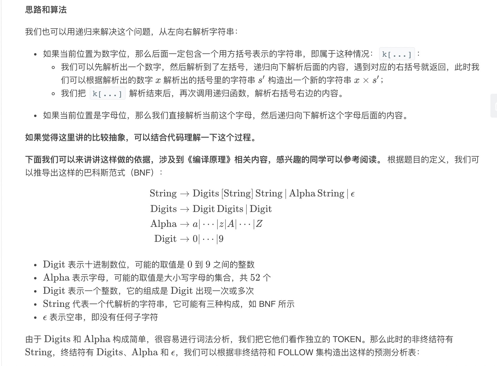
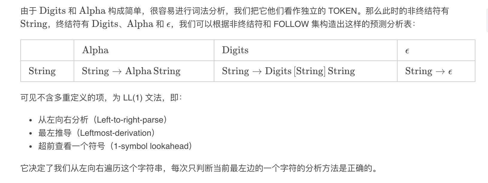
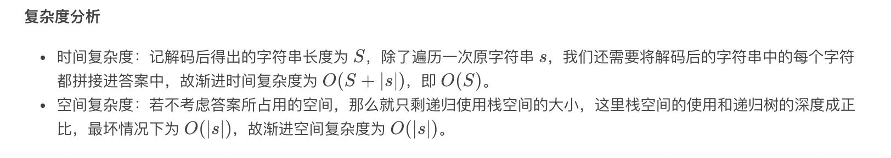

= 字符串解码
:toc:
:toc-title: 目录
:toclevels: 5
:sectnums:

== 题目说明
给定一个经过编码的字符串，返回它解码后的字符串。

编码规则为: k[encoded_string]，表示其中方括号内部的 encoded_string 正好重复 k 次。注意 k 保证为正整数。

你可以认为输入字符串总是有效的；输入字符串中没有额外的空格，且输入的方括号总是符合格式要求的。

此外，你可以认为原始数据不包含数字，所有的数字只表示重复的次数 k ，例如不会出现像 3a 或 2[4] 的输入。

示例:

```
s = "3[a]2[bc]", 返回 "aaabcbc".
s = "3[a2[c]]", 返回 "accaccacc".
s = "2[abc]3[cd]ef", 返回 "abcabccdcdcdef".
```

== 参考
https://leetcode-cn.com/problems/decode-string/

== 知识点
- 栈
    * 先进先出
- 递归

== 题解
=== 栈
image:images/1.jpg

```python
def decodeString(s: str) -> str:
    def is_num(num):
        if num >= '0' and num<= '9' :
                return True
            return False

    stack = []
    for i in range(len(s)):
        if s[i] == "]":
            s1 = ""
            num = ""
            while stack[-1] != "[":
                s1 = stack.pop() + s1
            stack.pop()
            while len(stack) != 0 and is_num(stack[-1]):
                num = stack.pop() + num
            s1 = s1 * int(num)
            stack.append(s1)
        else:
            stack.append(s[i])
    return stack[-1]
```

复杂度:

- 时间复杂度:o(S),其中S为解码后的长度
- 空间复杂度:s(S)

=== 递归




```go

var (
	src string
	ptr int
)

func decodeString(s string) string {
	src = s
	ptr = 0
	return getString()
}

func getString() string {
	if ptr == len(src) || src[ptr] == ']' {
		return ""
	}
	repeat := 1
	result := ""
	current := src[ptr]
	if current >= '0' && current <= '9' {
		repeat = getDigits()
		ptr++
		s := getString()
		ptr++
		result = strings.Repeat(s, repeat)
	} else if current >= 'a' && current <= 'z' || current >= 'A' && current <= 'Z' {
		result = string(current)
		ptr++
	}
	return result + getString()

}

func getDigits() int {
	ret := 0
	for ; src[ptr] >= '0' && src[ptr] <= '9'; ptr++ {
		ret = ret*10 + int(src[ptr]-'0')
	}
	return ret
}
```



