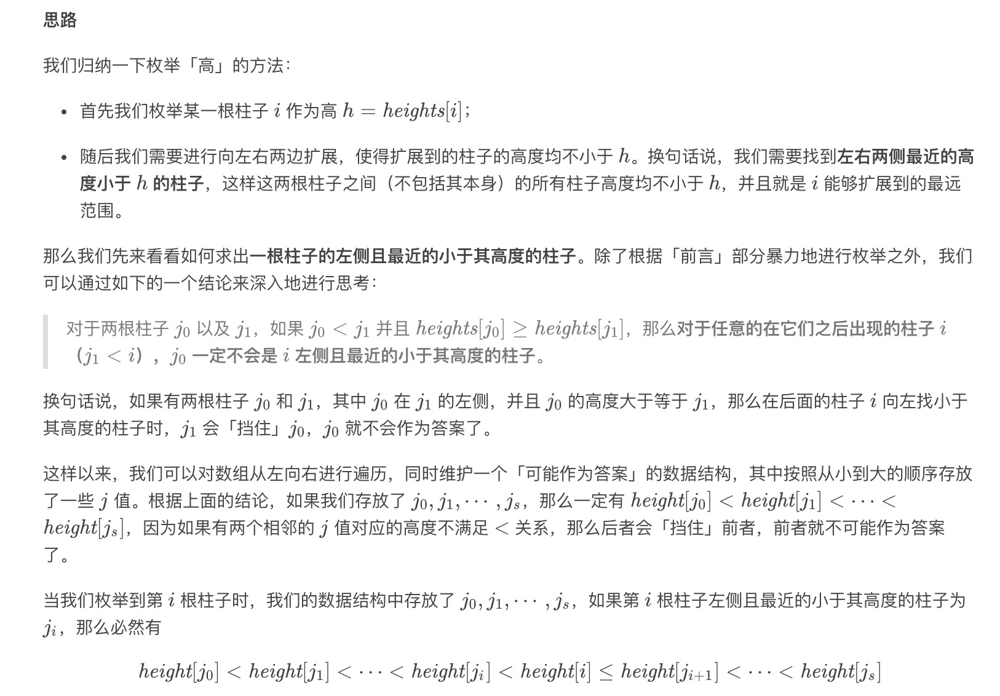
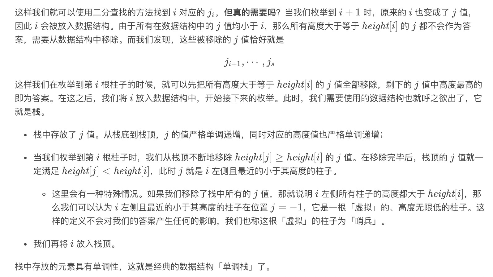
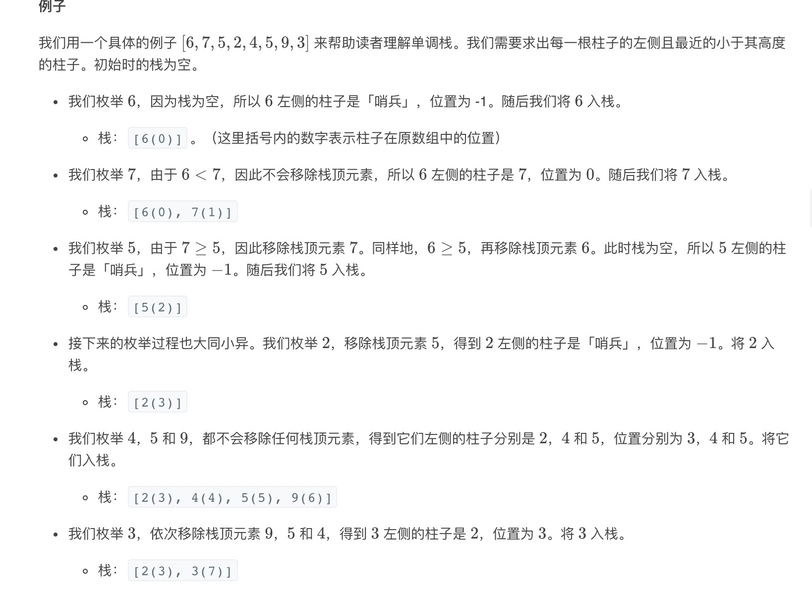
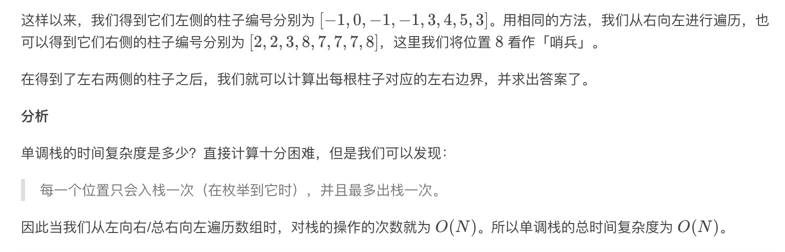
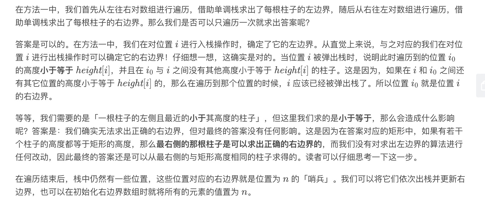

= 柱状图中最大的矩形
:toc:
:toc-title:
:toclevels: 5
:sectnums:

== 题目说明
给定 n 个非负整数，用来表示柱状图中各个柱子的高度。每个柱子彼此相邻，且宽度为 1 。

求在该柱状图中，能够勾勒出来的矩形的最大面积。
 
image:images/histogram1.png[]

以上是柱状图的示例，其中每个柱子的宽度为 1，给定的高度为 [2,1,5,6,2,3]。

image:images/histogram_area.png[]

图中阴影部分为所能勾勒出的最大矩形面积，其面积为 10 个单位。

示例:
```
输入: [2,1,5,6,2,3]
输出: 10

```

== 参考
- https://leetcode-cn.com/problems/largest-rectangle-in-histogram/

== 知识点

== 题解
=== 暴力解法
我们需要在柱状图中找出最大的矩形，因此我们可以考虑枚举矩形的宽和高，其中「宽」表示矩形贴着柱状图底边的宽度，「高」表示矩形在柱状图上的高度。

- 如果我们枚举「宽」，我们可以使用两重循环枚举矩形的左右边界以固定宽度 w，此时矩形的高度 h，就是所有包含在内的柱子的「最小高度」，对应的面积为 w * h。
- 如果我们枚举「高」，我们可以使用一重循环枚举某一根柱子，将其固定为矩形的高度 h。随后我们从这跟柱子开始向两侧延伸，直到遇到高度小于 h 的柱子，就确定了矩形的左右边界。如果左右边界之间的宽度为 w，那么对应的面积为 w * h。

枚举高的参见:

```python
# 暴力题解法
def largestRectangleArea(heights: [int]) -> int:
    """
    柱状图中最大的矩形
    :param heights:
    :return:
    """
    result = 0
    for i in range(len(heights)):
        height = heights[i]
        left, right = i, i
        while left - 1 >= 0 and heights[left - 1] >= height:
            left -= 1
        while right + 1 < len(heights) and heights[right + 1] >= height:
            right += 1
        result = max(result, (right - left + 1) * height)

    return result
```

复杂度:

- 时间复杂度: o(n^2) ,数据量大的时候容易超时
- 空间复杂度: o(1)

=== 单调栈





```python
# 单调栈
def largestRectangleArea(heights: [int]) -> int:
    n = len(heights)
    left, right = [0] * n, [0] * n
    mono_stack = []
    for i in range(n):
        while mono_stack and heights[mono_stack[-1]] >= heights[i]:
            mono_stack.pop()
        left[i] = mono_stack[-1] if mono_stack else -1
        mono_stack.append(i)

    mono_stack = []
    for i in range(n - 1, -1, -1):
        while mono_stack and heights[mono_stack[-1]] >= heights[i]:
            mono_stack.pop()
        right[i] = mono_stack[-1] if mono_stack else n
        mono_stack.append(i)

    result = max((right[i] - left[i] - 1) * heights[i] for i in range(n)) if n > 0 else 0
    return result

```

复杂度:

- 时间复杂度:o(n)
- 空间复杂度:o(n)

=== 单调栈 + 常数优化



```python
# 单调栈 + 常数优化
def largestRectangleArea(heights: [int]) -> int:
    n = len(heights)
    left = [0] * n
    right = [n] * n
    mono_stack = []
    for i in range(n):
        while mono_stack and heights[mono_stack[-1]] >= heights[i]:
            right[mono_stack[-1]] = i
            mono_stack.pop()
        left[i] = mono_stack[-1] if mono_stack else -1
        mono_stack.append(i)
    result = max((right[i] - left[i] - 1) * heights[i] for i in range(n)) if heights else 0
    return result
```

复杂度:

- 时间复杂度:o(n)
- 空间复杂度:o(n)

