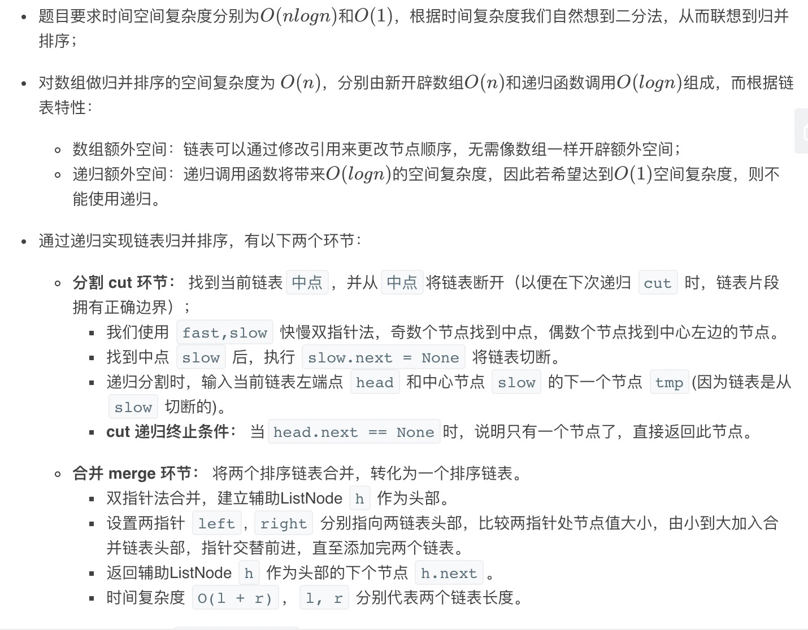
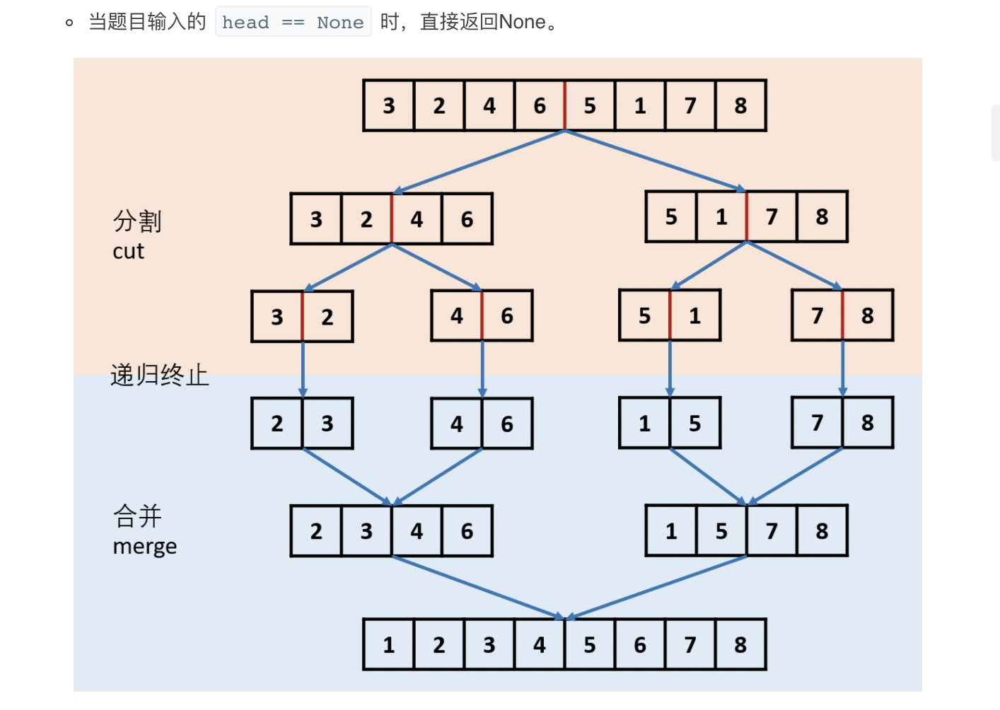
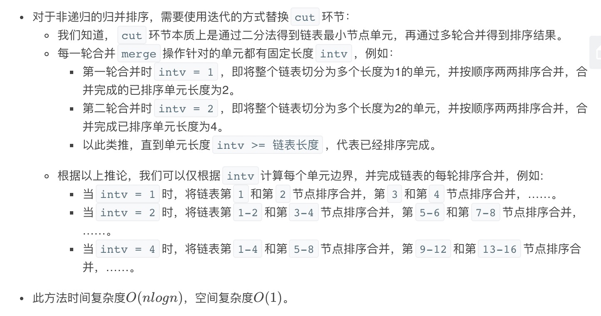
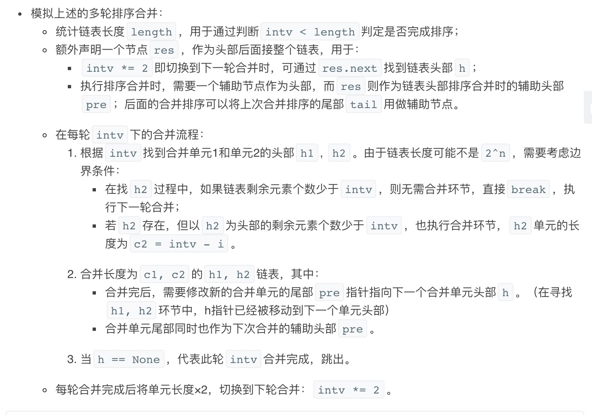

= 排序链表
:toc:
:toc-title: 目录
:toclevels: 5
:sectnums:

== 说明
在 O(n log n) 时间复杂度和常数级空间复杂度下，对链表进行排序。

示例 1:
```
输入: 4->2->1->3
输出: 1->2->3->4
```
示例 2:
```
输入: -1->5->3->4->0
输出: -1->0->3->4->5
```

== 参考
https://leetcode-cn.com/problems/sort-list/

== 知识点
- 链表
- 二分法
- 归并

== 题解
=== 递归




```python
def sortList(head: ListNode) -> ListNode:
    if not head or not head.next :
        return head
    slow, fast = head, head.next
    while fast and fast.next :
        fast = fast.next.next
        slow = slow.next
    mid, slow.next = slow.next , None
    left ,right = sortList(head), sortList(mid)
    h = result = ListNode(0)
    while left and right :
        if left.val > right.val :
            h.next = right
            right = right.next
        else :
            h.next = left
            left = left.next
        h = h.next
    h.next = left if left else right
    return result.next
```

复杂度:

- 时间复杂度: o(nlogn)
- 空间复杂度: o(logn)

=== 归并



image:images/4.png[]



```python
def sortList(head: ListNode) -> ListNode:
    h, length, intv = head, 0, 1
    while h:
        h, length = h.next, length + 1
    res = ListNode(0)
    res.next = head
    # merge the list in different intv.
    while intv < length:
        pre, h = res, res.next
        while h:
            # get the two merge head `h1`, `h2`
            h1, i = h, intv
            while i and h:
                h, i = h.next, i - 1
            if i:
                break  # no need to merge because the `h2` is None.
            h2, i = h, intv
            while i and h:
                h, i = h.next, i - 1
            c1, c2 = intv, intv - i  # the `c2`: length of `h2` can be small than the `intv`.
            # merge the `h1` and `h2`.
            while c1 and c2:
                if h1.val < h2.val:
                    pre.next = h1
                    h1 = h1.next
                    c1 = c1 - 1
                else:
                    pre.next = h2
                    h2 = h2.next
                    c2 = c2 -1
                pre = pre.next
            pre.next = h1 if c1 else h2
            while c1 > 0 or c2 > 0:
                pre, c1, c2 = pre.next, c1 - 1, c2 - 1
            pre.next = h
        intv = intv << 1
    return res.next
```

复杂度:

- 时间复杂度: o(nlogn)
- 空间复杂度: o(1)
