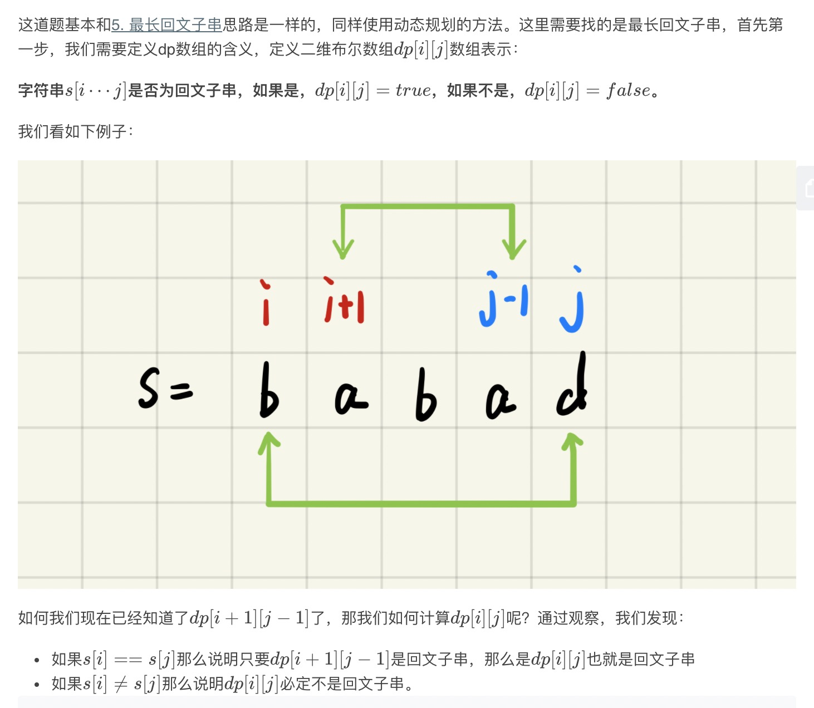
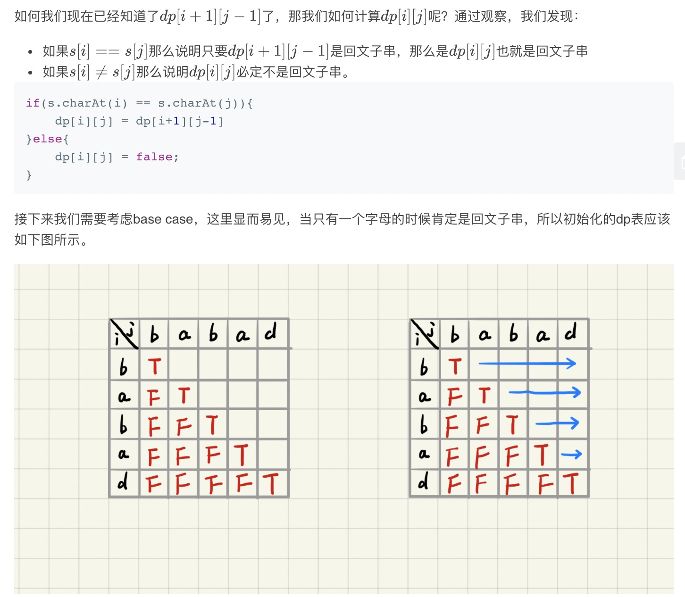
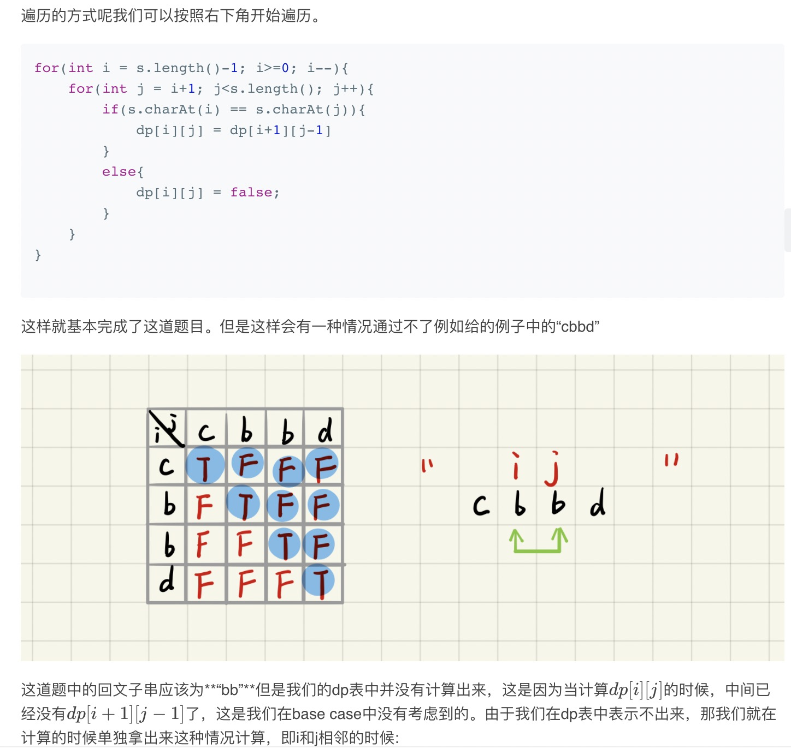
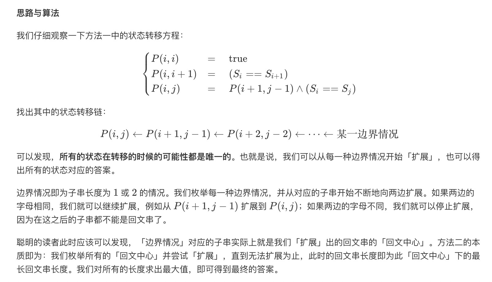

= 回文子串
:toc:
:toc-title: 目录
:toclevels: 5
:sectnums:

== 说明
给定一个字符串，你的任务是计算这个字符串中有多少个回文子串。

具有不同开始位置或结束位置的子串，即使是由相同的字符组成，也会被计为是不同的子串。

示例 1:
```
输入: "abc"
输出: 3
解释: 三个回文子串: "a", "b", "c".
```

示例 2:
```
输入: "aaa"
输出: 6
说明: 6个回文子串: "a", "a", "a", "aa", "aa", "aaa".
```

== 参考
https://leetcode-cn.com/problems/palindromic-substrings/

== 题解
=== 动态规划






```python
def countSubstrings(s: str) -> int:
    result = 0
    if not s :
        return result
    len_s = len(s)
    dp = [[False]* len_s for _ in range(len_s)]
    for length in range(len_s) :
        for i in range(len_s - length) :
            j = i + length
            if length == 0 :
                dp[i][j] = True
            elif length == 1 :
                if s[i] == s[j] :
                    dp[i][j] = True
            else :
                if s[i] == s[j] :
                    dp[i][j] = dp[i+1][j-1]
            if dp[i][j] :
                result += 1
    return result
```

复杂度:

- 时间复杂度:o(n^2),动态规划的总状态数o(n^2),状态转移的时间为o(1)
- 空间复杂度:o(n^2),存储动态规划状态需要的空间

=== 中心扩展法


```python
def countSubstrings(s: str) -> int:
    def expendAroundCentor(s, i, j):
        result = 0
        while i >= 0 and j < len(s) and s[i] == s[j]:
            result += 1
            i -= 1
            j += 1

        return result

    result = 0
    if not s:
        return result
    for i in range(len(s)):
        result += expendAroundCentor(s, i, i)
        result += expendAroundCentor(s, i, i + 1)

    return result
```

复杂度:

- 时间复杂度: o(n^2)
- 空间复杂度: o(1)
