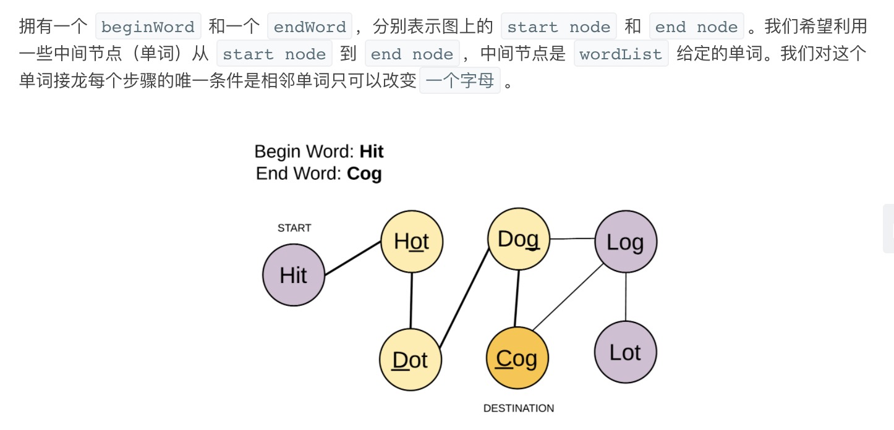
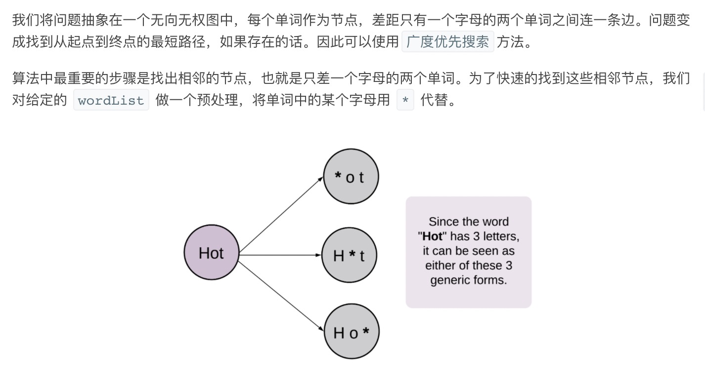
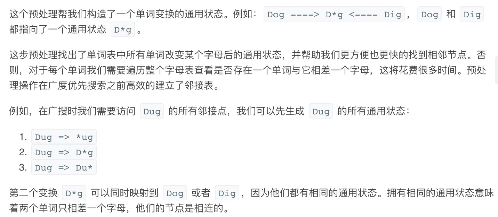
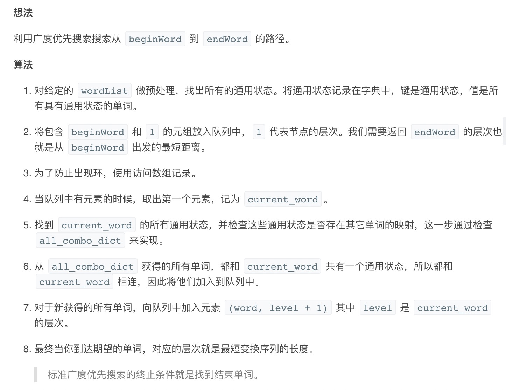
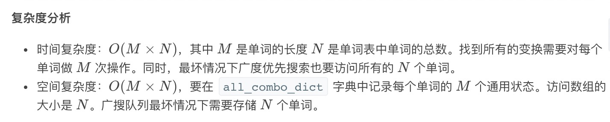

= 单词接龙
:toc:
:toc-title: 目录
:toclevels: 5
:sectnums:

== 说明
给定两个单词（beginWord 和 endWord）和一个字典，找到从 beginWord 到 endWord 的最短转换序列的长度。转换需遵循如下规则：

- 每次转换只能改变一个字母。
- 转换过程中的中间单词必须是字典中的单词。

说明:
```
如果不存在这样的转换序列，返回 0。
所有单词具有相同的长度。
所有单词只由小写字母组成。
字典中不存在重复的单词。
你可以假设 beginWord 和 endWord 是非空的，且二者不相同。
```
示例 1:
```
输入:
beginWord = "hit",
endWord = "cog",
wordList = ["hot","dot","dog","lot","log","cog"]

输出: 5

解释: 一个最短转换序列是 "hit" -> "hot" -> "dot" -> "dog" -> "cog",
     返回它的长度 5。
```
示例 2:
```
输入:
beginWord = "hit"
endWord = "cog"
wordList = ["hot","dot","dog","lot","log"]

输出: 0

解释: endWord "cog" 不在字典中，所以无法进行转换。

```

== 参考
https://leetcode-cn.com/problems/word-ladder/

== 知识点

== 题解
=== 广度优先搜索








```python
from collections import defaultdict, deque


def ladderLength(beginWord: str, endWord: str, wordList: [str]) -> int:
    result = 0
    if endWord not in wordList:
        return result
    all_combine_dict = defaultdict(list)
    L = len(beginWord)
    for item in wordList:
        for i in range(L):
            all_combine_dict[item[:i] + "*" + item[i + 1:]].append(item)
    queue = deque([(beginWord, 1)])
    visited = {beginWord: True}
    while queue:
        current_word, level = queue.popleft()
        for i in range(L):
            intermediate_word = current_word[:i] + "*" + current_word[i + 1:]
            for word in all_combine_dict[intermediate_word]:
                if word == endWord:
                    return level + 1
                if word not in visited:
                    visited[word] = True
                    queue.append((word, level + 1))
            all_combine_dict[intermediate_word] = []
    return result
```


