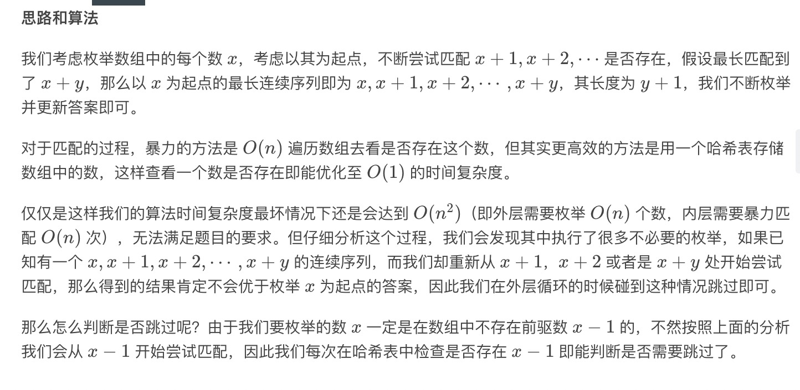
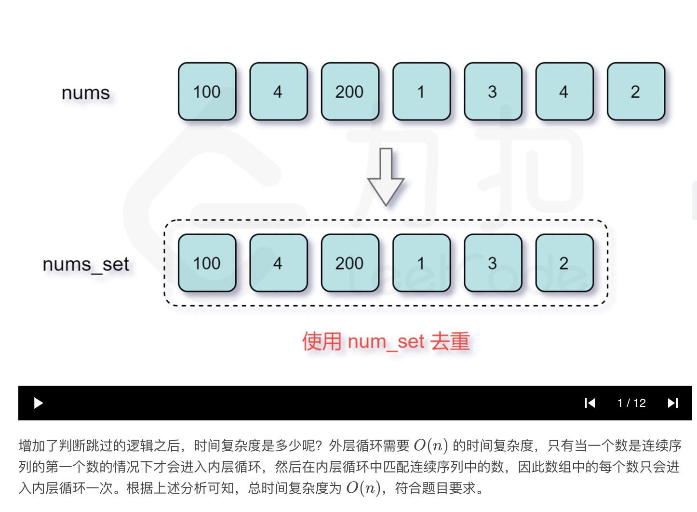

= 最长连续序列
:toc:
:toc-title: 目录
:toclevels:
:sectnums:

== 说明
给定一个未排序的整数数组，找出最长连续序列的长度。

要求算法的时间复杂度为 O(n)。

示例:
```
输入: [100, 4, 200, 1, 3, 2]
输出: 4
解释: 最长连续序列是 [1, 2, 3, 4]。它的长度为 4。
```

== 参考
https://leetcode-cn.com/problems/longest-consecutive-sequence/

== 题解
=== 哈希表




```python
def longestConsecutive(nums: [int]) -> int:
    nums = set(nums)
    longest = 0
    for num in nums:
        if num - 1 not in nums:
            current = num
            current_len = 1
            while current + 1 in nums:
                current += 1
                current_len += 1
            longest = max(longest, current_len)
    return longest
```

复杂度:

- 时间复杂度: o(n) ,其中 n 为数组的长度
- 空间复杂度: o(n) ,哈希表存储数组中所有的数需要 O(n) 的空间。
