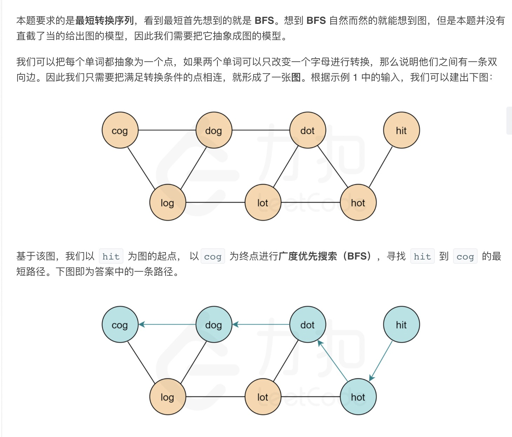
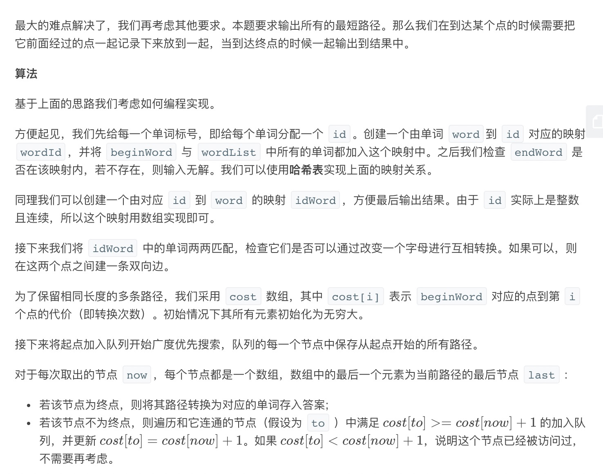
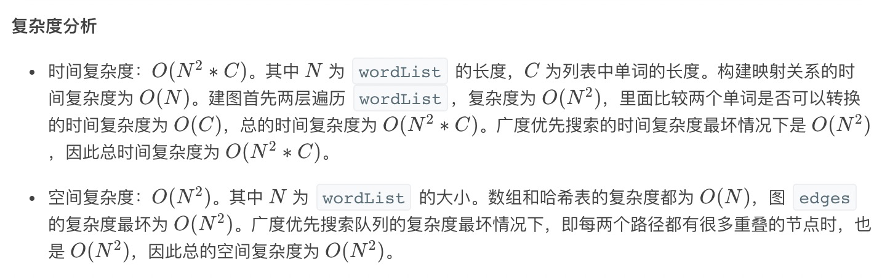

= 单词接龙 II
:toc:
:toc-title: 目录
:toclevels:
:sectnums:

== 题目说明
给定两个单词（beginWord 和 endWord）和一个字典 wordList，找出所有从 beginWord 到 endWord 的最短转换序列。转换需遵循如下规则：

- 每次转换只能改变一个字母。
- 转换过程中的中间单词必须是字典中的单词。

说明:
```
如果不存在这样的转换序列，返回一个空列表。
所有单词具有相同的长度。
所有单词只由小写字母组成。
字典中不存在重复的单词。
你可以假设 beginWord 和 endWord 是非空的，且二者不相同。
```
示例 1:
```
输入:
beginWord = "hit",
endWord = "cog",
wordList = ["hot","dot","dog","lot","log","cog"]

输出:
[
  ["hit","hot","dot","dog","cog"],
  ["hit","hot","lot","log","cog"]
]
```
示例 2:
```
输入:
beginWord = "hit"
endWord = "cog"
wordList = ["hot","dot","dog","lot","log"]

输出: []

解释: endWord "cog" 不在字典中，所以不存在符合要求的转换序列。
```

== 参考

== 题解
=== 广度优先搜索




```go
func findLadders(beginWord string, endWord string, wordList []string) [][]string {
	ids := map[string]int{}
	for i, word := range wordList {
		ids[word] = i
	}
	if _, ok := ids[beginWord]; !ok {
		wordList = append(wordList, beginWord)
		ids[beginWord] = len(wordList) - 1
	}
	if _, ok := ids[endWord]; !ok {
		return [][]string{}
	}

	n := len(wordList)
	edges := make([][]int, len(wordList))
	for i := 0; i < n; i++ {
		for j := i + 1; j < n; j++ {
			if transformCheck(wordList[i], wordList[j]) {
				edges[i] = append(edges[i], j)
				edges[j] = append(edges[j], i)
			}
		}
	}
	res := [][]string{}
	cost := make([]int, n)
	queue := [][]int{[]int{ids[beginWord]}}

	for i := 0; i < n; i++ {
		cost[i] = math.MaxInt32
	}
	cost[ids[beginWord]] = 0

	for i := 0; i < len(queue); i++ {
		now := queue[i]
		last := now[len(now)-1]
		if last == ids[endWord] {
			tmp := []string{}
			for _, index := range now {
				tmp = append(tmp, wordList[index])
			}
			res = append(res, tmp)
		} else {
			for _, to := range edges[last] {
				if cost[last]+1 <= cost[to] {
					cost[to] = cost[last] + 1
					tmp := make([]int, len(now))
					copy(tmp, now)
					tmp = append(tmp, to)
					queue = append(queue, tmp)
				}
			}
		}
	}
	return res
}

func transformCheck(from, to string) bool {
	for i := 0; i < len(from); i++ {
		if from[i] != to[i] {
			return from[i+1:] == to[i+1:]
		}
	}
	return false
}
```



