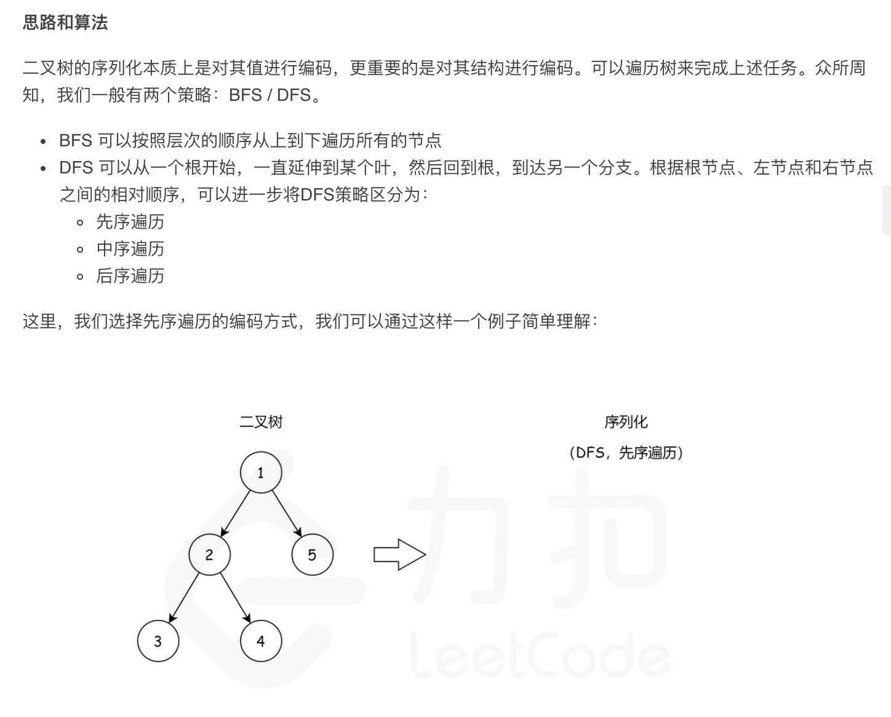
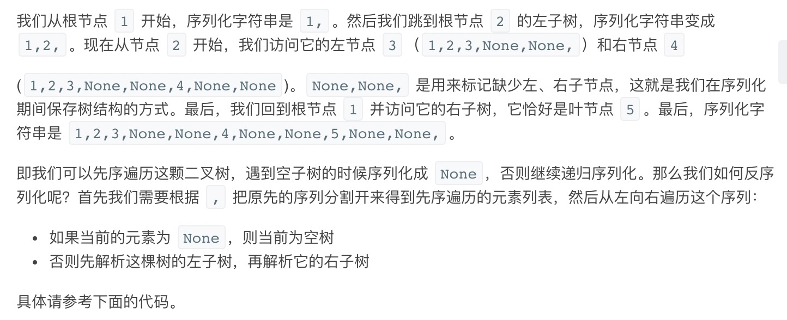

= 二叉树的序列化与反序列化
:toc:
:toc-title:
:toclevels: 5
:sectnums:

== 说明
序列化是将一个数据结构或者对象转换为连续的比特位的操作，进而可以将转换后的数据存储在一个文件或者内存中，同时也可以通过网络传输到另一个计算机环境，采取相反方式重构得到原数据。

请设计一个算法来实现二叉树的序列化与反序列化。这里不限定你的序列 / 反序列化算法执行逻辑，你只需要保证一个二叉树可以被序列化为一个字符串并且将这个字符串反序列化为原始的树结构。

示例: 

你可以将以下二叉树：
```
    1
   / \
  2   3
     / \
    4   5
```
序列化为 "[1,2,3,null,null,4,5]"
提示: 这与 LeetCode 目前使用的方式一致，详情请参阅 LeetCode 序列化二叉树的格式。你并非必须采取这种方式，你也可以采用其他的方法解决这个问题。

说明: 不要使用类的成员 / 全局 / 静态变量来存储状态，你的序列化和反序列化算法应该是无状态的。

== 参考
https://leetcode-cn.com/problems/serialize-and-deserialize-binary-tree/

== 题解
=== 深度优先搜索





```go

type TreeNode struct {
	Val   int
	Left  *TreeNode
	Right *TreeNode
}

type Codec struct {
	list []string
}

func Constructor() Codec {
	return Codec{}
}

func (this *Codec) rserialize(root *TreeNode, str string) string {
	if root == nil {
		str += "null,"
	} else {
		str += strconv.Itoa(root.Val) + ","
		str = this.rserialize(root.Left, str)
		str = this.rserialize(root.Right, str)
	}
	return str
}

// Serializes a tree to a single string.
func (this *Codec) serialize(root *TreeNode) string {
	return this.rserialize(root, "")
}

// Deserializes your encoded data to tree.
func (this *Codec) deserialize(data string) *TreeNode {
	list := strings.Split(data, ",")
	for i := 0; i < len(list); i++ {
		if list[i] != "" {
			this.list = append(this.list, list[i])
		}
	}
	return this.rdeserialize()
}

func (this *Codec) rdeserialize() *TreeNode {
	if len(this.list) == 0 {
		return nil
	}
	if this.list[0] == "null" {
		this.list = this.list[1:]
		return nil
	}
	val, _ := strconv.Atoi(this.list[0])
	this.list = this.list[1:]
	root := &TreeNode{Val: val}
	root.Left = this.rdeserialize()
	root.Right = this.rdeserialize()
	return root
}
```

复杂度分析：

- 时间复杂度：在序列化和反序列化函数中，我们只访问每个节点一次，因此时间复杂度为 O(n)，其中 n 是节点数，即树的大小。
- 空间复杂度：在序列化和反序列化函数中，我们递归会使用栈空间，故渐进空间复杂度为 O(n)

===
