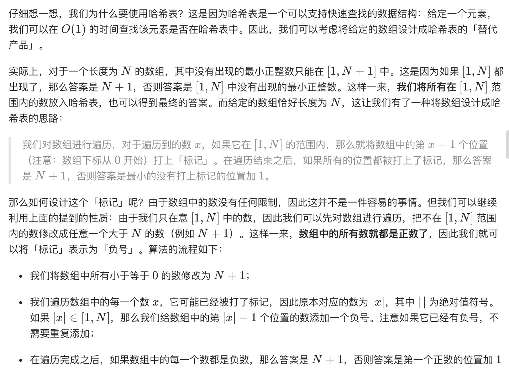
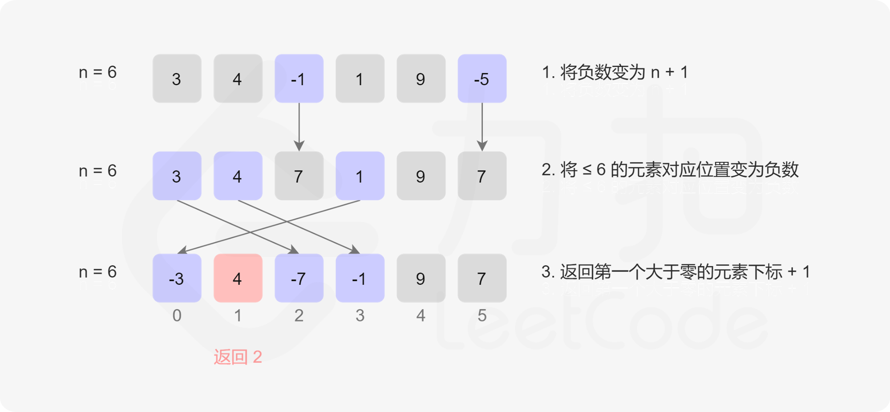
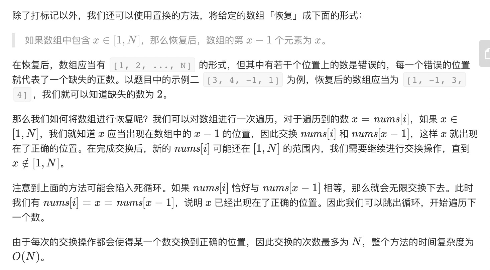

= 缺失的第一个正数
:toc:
:toc-title: 目录
:toclevels: 5
:sectnums:

== 说明
给你一个未排序的整数数组，请你找出其中没有出现的最小的正整数。

示例 1:
```
输入: [1,2,0]
输出: 3
```
示例 2:
```
输入: [3,4,-1,1]
输出: 2
```
示例 3:
```
输入: [7,8,9,11,12]
输出: 1
```

提示：

你的算法的时间复杂度应为O(n)，并且只能使用常数级别的额外空间。


== 参考
- https://leetcode-cn.com/problems/first-missing-positive/

== 题解
=== 最小数寻找
先遍历一遍找出最小的整数，判断整数是否为1，如果为1则递增判断，否则返回1

```python
def firstMissingPositive(nums: [int]) -> int:
    min_num = float('inf')
    for item in nums:
        if item <= 0:
            continue
        min_num = min(min_num, item)

    if min_num != 1 or min_num < 0:
        return 1
    else:
        while min_num in nums:
            min_num += 1
    return min_num
```

复杂度:

- 时间复杂度: o(N) ，只有一层遍历
- 空间复杂度: o(1) ，只用到常数空间报错临时变量

=== 哈希表



```python
def firstMissingPositive(nums: [int]) -> int:
    n = len(nums)
    for i in range(n):
        if nums[i] <= 0:
            nums[i] = n + 1
    for i in range(n):
        num = abs(nums[i])
        if num <= n:
            nums[num - 1] = -abs(nums[num - 1])
    for i in range(n):
        if nums[i] > 0:
            return i + 1
    return n + 1
```

复杂度:

- 时间复杂度: o(N) ，只有一层遍历
- 空间复杂度: o(1) ，只用到常数空间报错临时变量

=== 置换


```python
def firstMissingPositive(nums: [int]) -> int:
    n = len(nums)
    for i in range(n):
        while 1 <= nums[i] <= n and nums[nums[i] - 1] != nums[i]:
            nums[nums[i] - 1], nums[i] = nums[i], nums[nums[i] - 1]
    for i in range(n):
        if nums[i] != i + 1:
            return i + 1
    return n + 1
```

复杂度:

- 时间复杂度: o(N) ，只有一层遍历
- 空间复杂度: o(1) ，只用到常数空间报错临时变量

