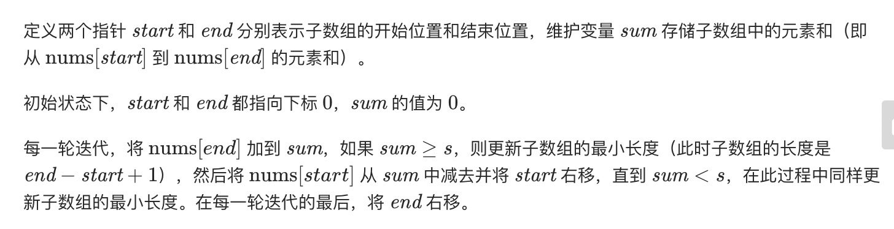

= 长度最小的子数组
:toc:
:toc-title: 目录
:toclevels: 5
:sectnums:

== 说明
给定一个含有 n 个正整数的数组和一个正整数 s ，找出该数组中满足其和 ≥ s 的长度最小的连续子数组，并返回其长度。如果不存在符合条件的连续子数组，返回 0。

 

示例：
```
输入：s = 7, nums = [2,3,1,2,4,3]
输出：2
解释：子数组 [4,3] 是该条件下的长度最小的连续子数组。
```

进阶：

如果你已经完成了 O(n) 时间复杂度的解法, 请尝试 O(n log n) 时间复杂度的解法。

== 参考
- https://leetcode-cn.com/problems/minimum-size-subarray-sum/

== 知识点
- 滑动窗口

== 题解
=== 双指针(滑动窗口)


```go
func minSubArrayLen(s int, nums []int) int {
	n := len(nums)
	if n == 0 {
		return 0
	}
	start, end, result := 0 , 0 , math.MaxInt32
	sum := 0
	for end < n {
		sum += nums[end]
		for sum >= s {
			result = min(result,end-start+1)
			sum -= nums[start]
			start ++
		}
		end ++
	}
	if result == math.MaxInt32 {
		return 0
	}
	return result
}

func min(x,y int) int {
	if x > y {
		return y
	}
	return x
}
```

复杂度分析

- 时间复杂度：O(n)，其中 n 是数组的长度。指针 start 和 end 最多各移动 n 次。
- 空间复杂度：O(1)。


