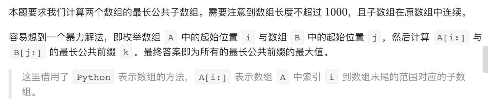
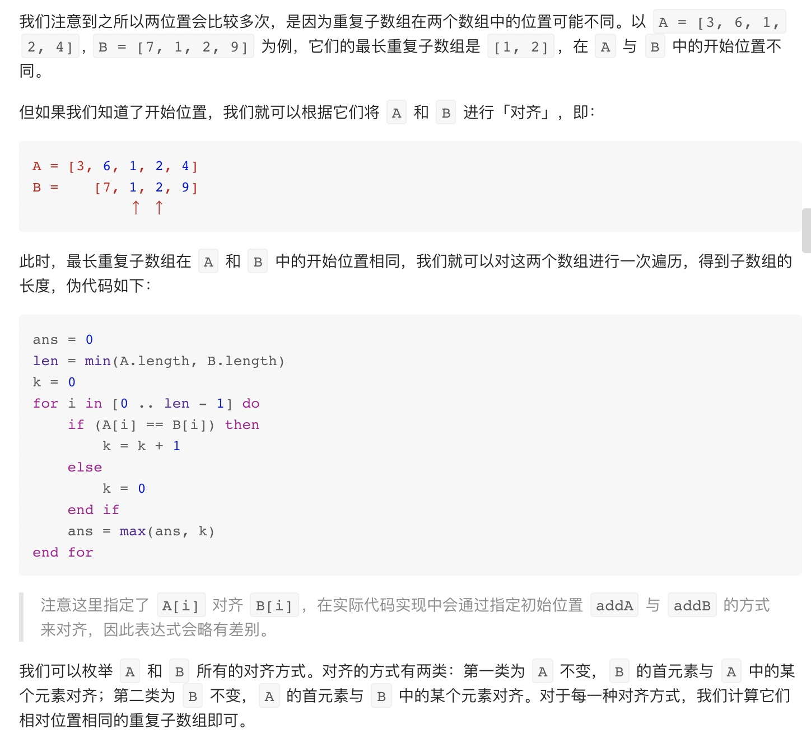
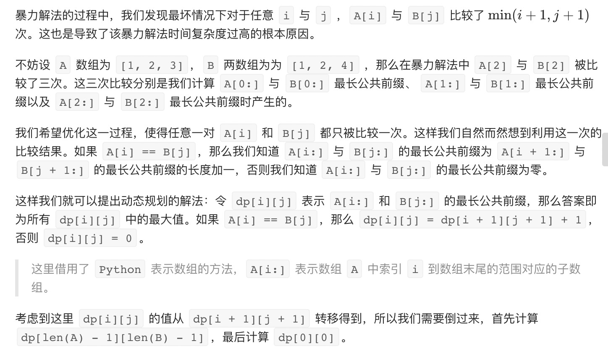
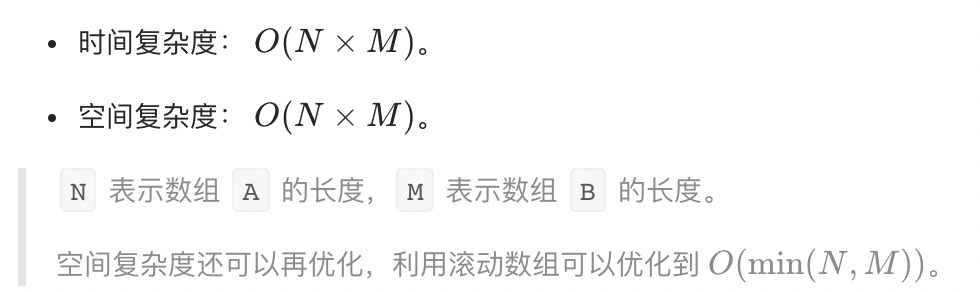

= 最长重复子数组
:toc:
:toclevels: 5
:toc-title: 目录
:sectnums:

== 说明
给两个整数数组 A 和 B ，返回两个数组中公共的、长度最长的子数组的长度。

 

示例：

输入：
```
A: [1,2,3,2,1]
B: [3,2,1,4,7]
输出：3
解释：
长度最长的公共子数组是 [3, 2, 1] 。
```

提示：

- 1 <= len(A), len(B) <= 1000
- 0 <= A[i], B[i] < 100

== 参考
- https://leetcode-cn.com/problems/maximum-length-of-repeated-subarray/

== 知识点
-

== 题解
=== 暴力法


```python
def findLength(A: [int], B: [int]) -> int:
    len_A = len(A)
    len_B = len(B)
    min_len = min(len_A, len_B)
    result = 0
    for i in range(len_A) :
        for j in range(len_B) :
            k = 0
            while i + k < min_len and j+k < min_len and A[i+k] == B[j+k] :
                k += 1
            result = max(result, k )
    return result
```

复杂度:

- 时间复杂度: o(n^3)
- 空间复杂度: o(1)

=== 滑动窗口


```python
def findLength(A: [int], B: [int]) -> int:
    def maxLength(addA: int, addB: int, length: int) -> int:
        ret = k = 0
        for i in range(length):
            if A[addA + i] == B[addB + i]:
                k += 1
                ret = max(ret, k)
            else:
                k = 0
        return ret

    n, m = len(A), len(B)
    ret = 0
    for i in range(n):
        length = min(m, n - i)
        ret = max(ret, maxLength(i, 0, length))
    for i in range(m):
        length = min(n, m - i)
        ret = max(ret, maxLength(0, i, length))
    return ret
```


=== 动态规划

```python
def findLength(A: [int], B: [int]) -> int:
    n, m = len(A), len(B)
    dp = [[0] * (m + 1) for _ in range(n + 1)]
    ans = 0
    for i in range(n - 1, -1, -1):
        for j in range(m - 1, -1, -1):
            dp[i][j] = dp[i + 1][j + 1] + 1 if A[i] == B[j] else 0
            ans = max(ans, dp[i][j])
    return ans
```



