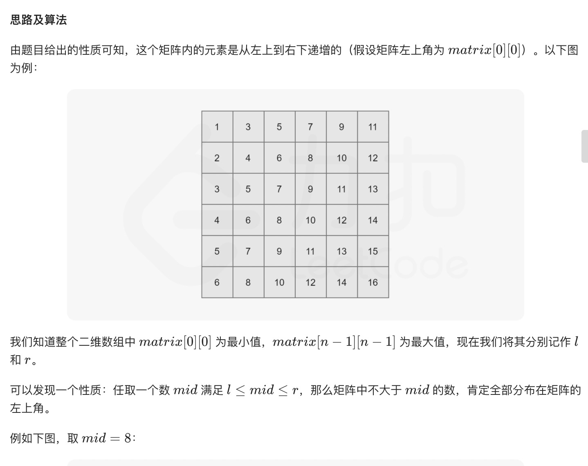
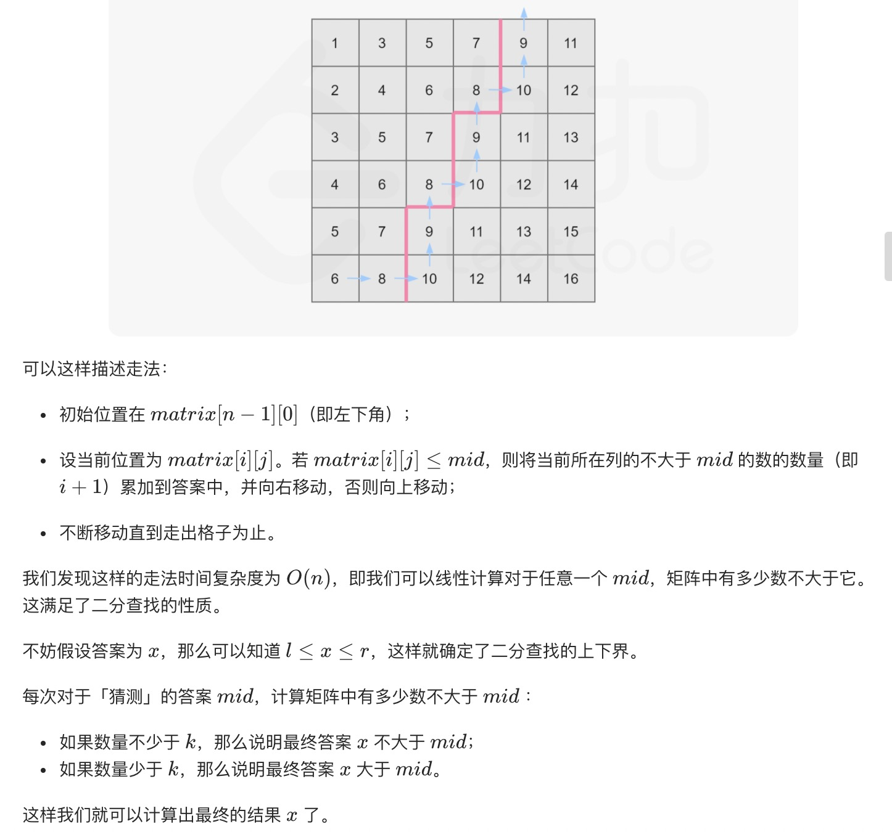
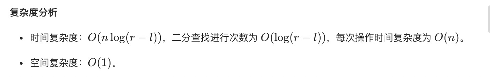
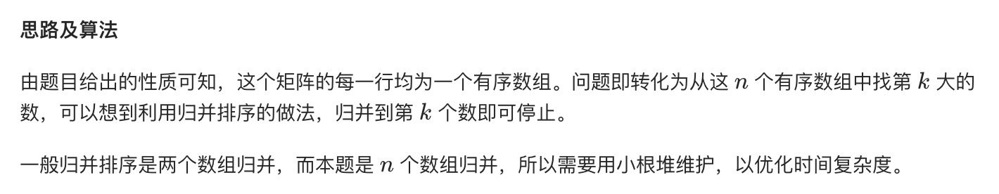
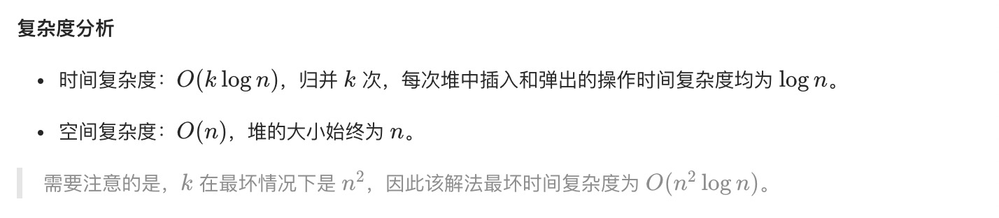

= 有序矩阵中第K小的元素
:toc:
:toc-title: 目录
:toclevels: 5
:sectnums:

== 说明

给定一个 n x n 矩阵，其中每行和每列元素均按升序排序，找到矩阵中第 k 小的元素。
请注意，它是排序后的第 k 小元素，而不是第 k 个不同的元素。


示例：
```
matrix = [
   [ 1,  5,  9],
   [10, 11, 13],
   [12, 13, 15]
],
k = 8,

返回 13。
 
```

提示：

你可以假设 k 的值永远是有效的，1 ≤ k ≤ n2 。

== 参考
- https://leetcode-cn.com/problems/kth-smallest-element-in-a-sorted-matrix/

== 知识点

== 题解
=== 二分法


image:images/3.jpg[]



```python
def kthSmallest(matrix: [[int]], k: int) -> int:
    n = len(matrix)

    def check(mid):
        i, j = n - 1, 0
        num = 0
        while i >= 0 and j < n:
            if matrix[i][j] <= mid:
                num += i + 1
                j += 1
            else:
                i -= 1
        return num >= k

    left, right = matrix[0][0], matrix[-1][-1]
    while left < right:
        mid = (left + right) >> 1
        if check(mid):
            right = mid
        else:
            left = mid + 1
    return left

```



=== 归并排序


```python
```



=== 直接排序
最直接的做法是将这个二维数组另存为为一维数组，并对该一维数组进行排序。最后这个一维数组中的第 k 个数即为答案。
