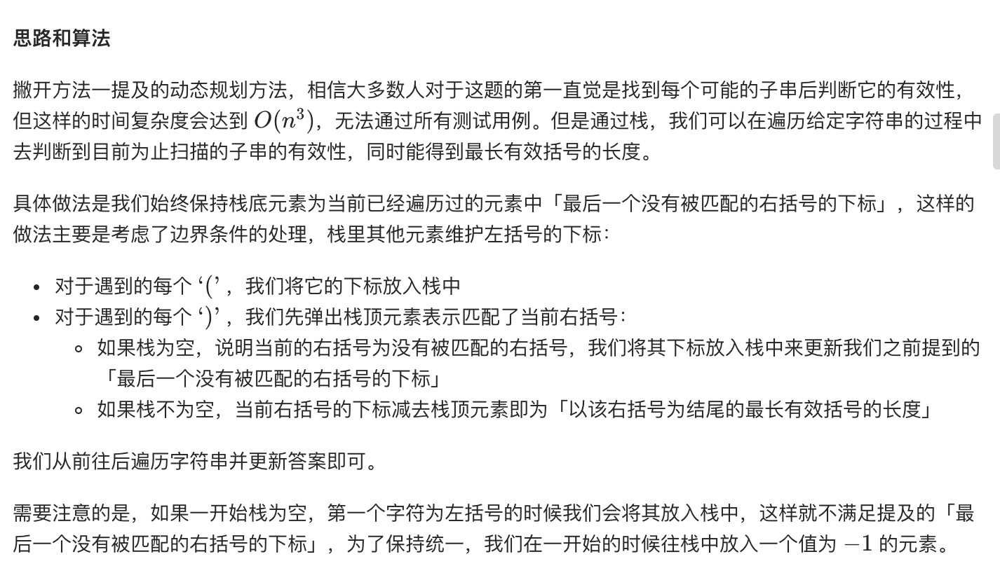
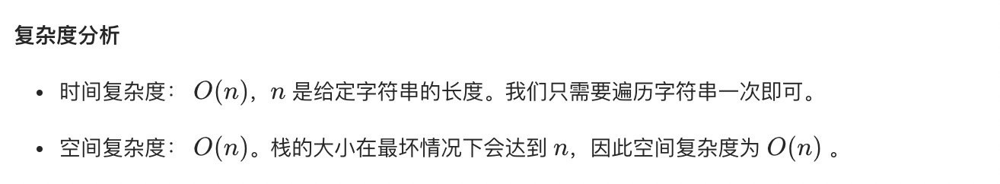
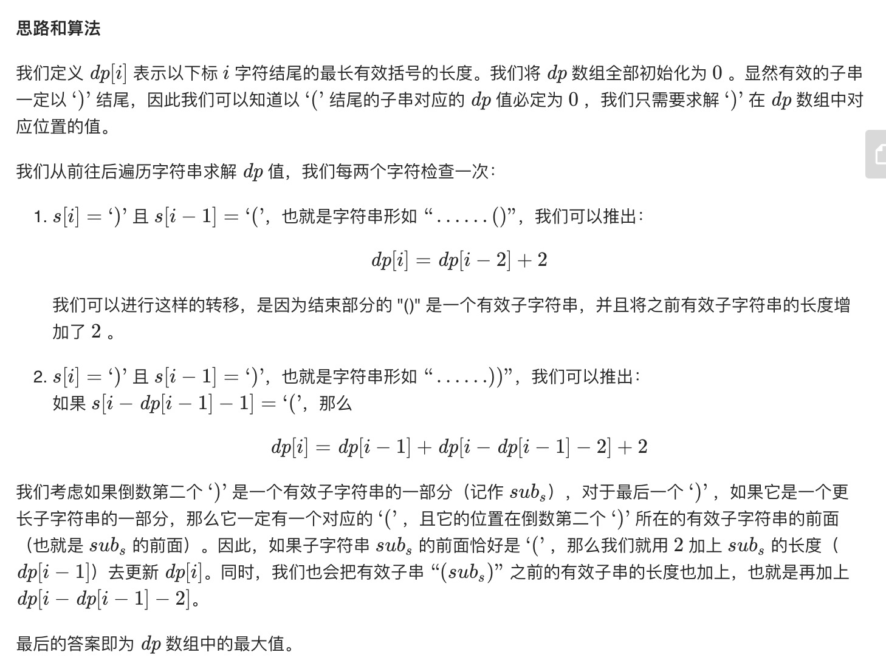
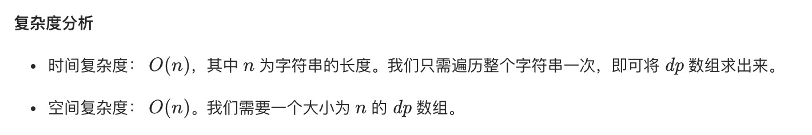

= 最长有效括号
:toc:
:toc-title: 目录
:toclevels: 5
:sectnums:

== 说明
给定一个只包含 '(' 和 ')' 的字符串，找出最长的包含有效括号的子串的长度。

示例 1:

输入: "(()"
输出: 2
解释: 最长有效括号子串为 "()"
示例 2:

输入: ")()())"
输出: 4
解释: 最长有效括号子串为 "()()"

== 参考
- https://leetcode-cn.com/problems/longest-valid-parentheses/

== 知识点
- 栈
- 动态规划

== 题解
=== 栈


```python
def longestValidParentheses(s: str) -> int:
    result = 0
    if not s:
        return result
    n = len(s)
    stack = [-1]
    for i in range(n):
        if s[i] == "(":
            stack.append(i)
        else:
            stack.pop()
            if not stack:
                stack.append(i)
            else:
                result = max(result, i - stack[len(stack) - 1])
    return result

```



=== 动态规划


```python
def longestValidParentheses(s: str) -> int:
    result = 0
    if not s:
        return result
    n = len(s)
    dp = [0] * n
    for i in range(1, n):
        if s[i] == ")":
            if s[i - 1] == "(":
                dp[i] = dp[i - 2] + 2
            elif i - dp[i - 1] > 0 and s[i - dp[i - 1] - 1] == "(":
                if i - dp[i - i] >= 2:
                    dp[i] = dp[i - 1] + dp[i - dp[i - 1] - 2] + 2
                else:
                    dp[i] = dp[i - 1] + 2
            result = max(result, dp[i])
    return result
```



=== 不需要额外的空间,两次遍历计数
image:images/5.jpg[]

```python
def longestValidParentheses(s: str) -> int:
    result = 0
    if not s:
        return result
    n = len(s)
    left, right = 0, 0
    for i in range(n):
        if s[i] == "(":
            left += 1
        else:
            right += 1
        if left == right:
            result = max(result, left + right)
        elif left < right:
            left, right = 0, 0
    left, right = 0, 0
    for i in range(n - 1, -1, -1):
        if s[i] == "(":
            left += 1
        else:
            right += 1
        if left == right:
            result = max(result, left + right)
        if left > right:
            left, right = 0, 0
    return result
```


