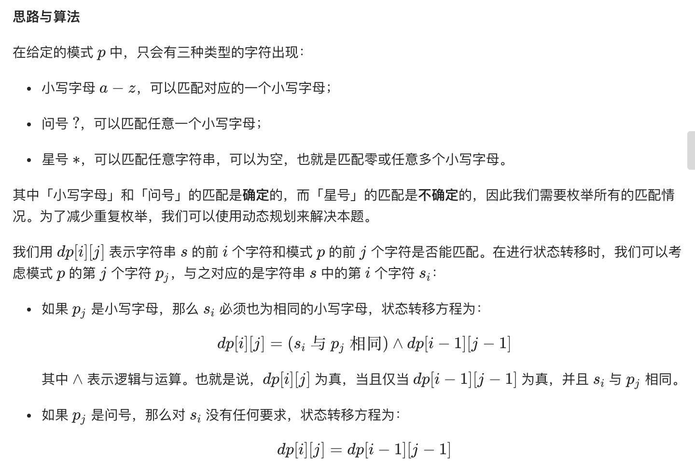
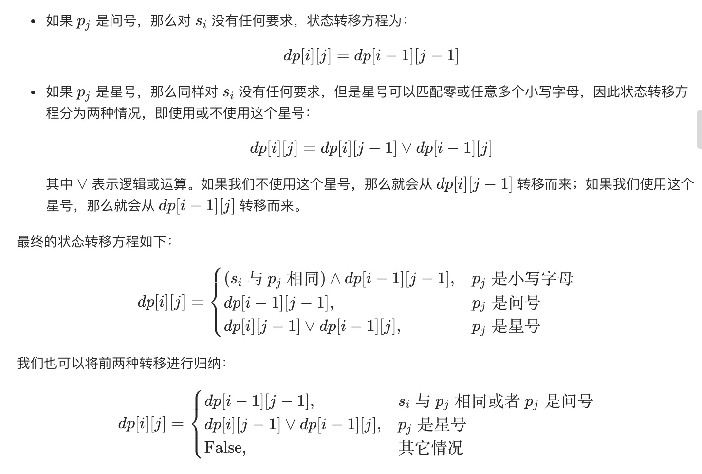
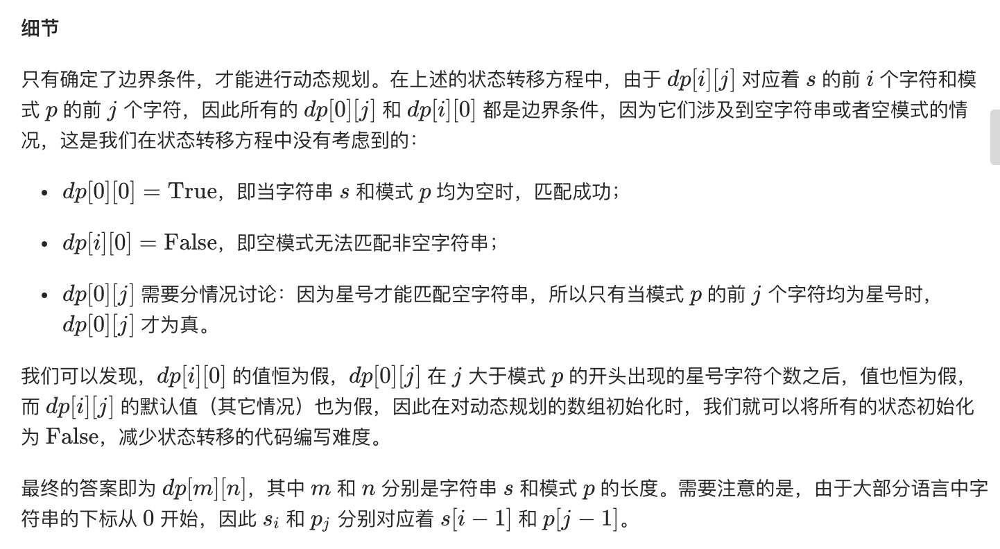
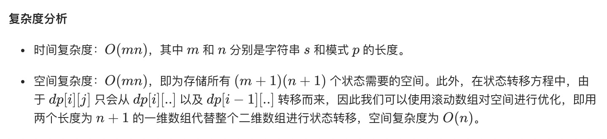

= 通配符匹配
:toc:
:toclevels: 5
:toc-title: 目录
:sectnums:

== 说明
给定一个字符串 (s) 和一个字符模式 (p) ，实现一个支持 '?' 和 '*' 的通配符匹配。

- '?' 可以匹配任何单个字符。
- '*' 可以匹配任意字符串（包括空字符串）。

两个字符串完全匹配才算匹配成功。

说明:

- s 可能为空，且只包含从 a-z 的小写字母。
- p 可能为空，且只包含从 a-z 的小写字母，以及字符 ? 和 *。

示例 1:
```
输入:
s = "aa"
p = "a"
输出: false
解释: "a" 无法匹配 "aa" 整个字符串。
```
示例 2:
```
输入:
s = "aa"
p = "*"
输出: true
解释: '*' 可以匹配任意字符串。
```
示例 3:
```
输入:
s = "cb"
p = "?a"
输出: false
解释: '?' 可以匹配 'c', 但第二个 'a' 无法匹配 'b'。
```
示例 4:
```
输入:
s = "adceb"
p = "*a*b"
输出: true
解释: 第一个 '*' 可以匹配空字符串, 第二个 '*' 可以匹配字符串 "dce".
```
示例 5:
```
输入:
s = "acdcb"
p = "a*c?b"
输出: false
```

== 参考
- https://leetcode-cn.com/problems/wildcard-matching/

== 知识点
- 动态规划
- 贪心算法

== 题解
=== 动态规划






```python
def isMatch(s: str, p: str) -> bool:
    m, n = len(s), len(p)
    dp = [[False] * (n + 1) for _ in range(m + 1)]
    dp[0][0] = True
    for i in range(1, n + 1):
        if p[i - 1] == "*":
            dp[0][i] = True
        else:
            break

    for i in range(1, m + 1):
        for j in range(1, n + 1):
            if p[j - 1] == "*":
                dp[i][j] = dp[i][j - 1] | dp[i - 1][j]
            elif p[j - 1] == "?" or s[i - 1] == p[j - 1]:
                dp[i][j] = dp[i - 1][j - 1]
    return dp[m][n]
```




