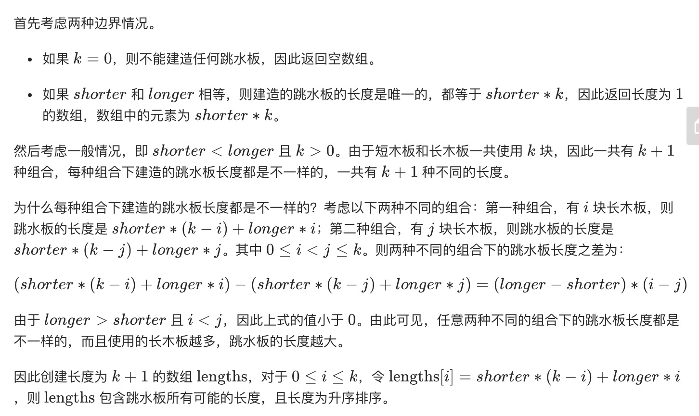

= 跳水板
:toc:
:toc-title:
:toclevels: 5
:sectnums:

== 说明
你正在使用一堆木板建造跳水板。有两种类型的木板，其中长度较短的木板长度为shorter，长度较长的木板长度为longer。你必须正好使用k块木板。编写一个方法，生成跳水板所有可能的长度。

返回的长度需要从小到大排列。

示例：
```
输入：
shorter = 1
longer = 2
k = 3
输出： {3,4,5,6}
```
提示：

- 0 < shorter <= longer
- 0 <= k <= 100000

== 参考
- https://leetcode-cn.com/problems/diving-board-lcci/

== 题解


```python
def divingBoard(shorter: int, longer: int, k: int) -> [int]:
    result = []
    if k == 0 :
        return result
    if longer == shorter :
        result.append(shorter*k)
        return result
    for i in range(k,-1,-1) :
        item = shorter * i + (k-i) *longer
        result.append(item)
    return result
```

复杂度分析

- 时间复杂度：O(k)，其中 k 是木板数量。短木板和长木板一共使用 k 块，一共有 k+1种组合，对于每种组合都要计算跳水板的长度。
- 空间复杂度：O(1)。除了返回值以外，额外使用的空间复杂度为常数。

