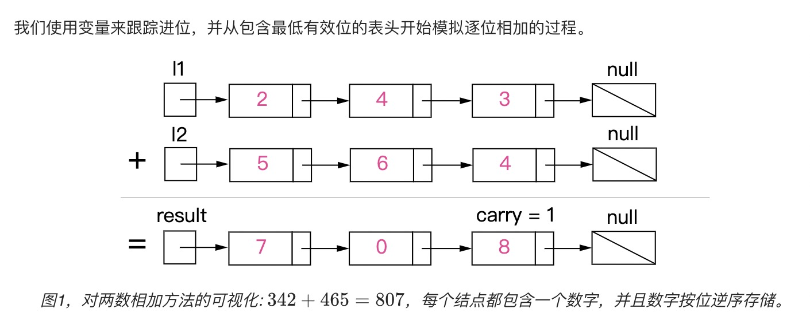
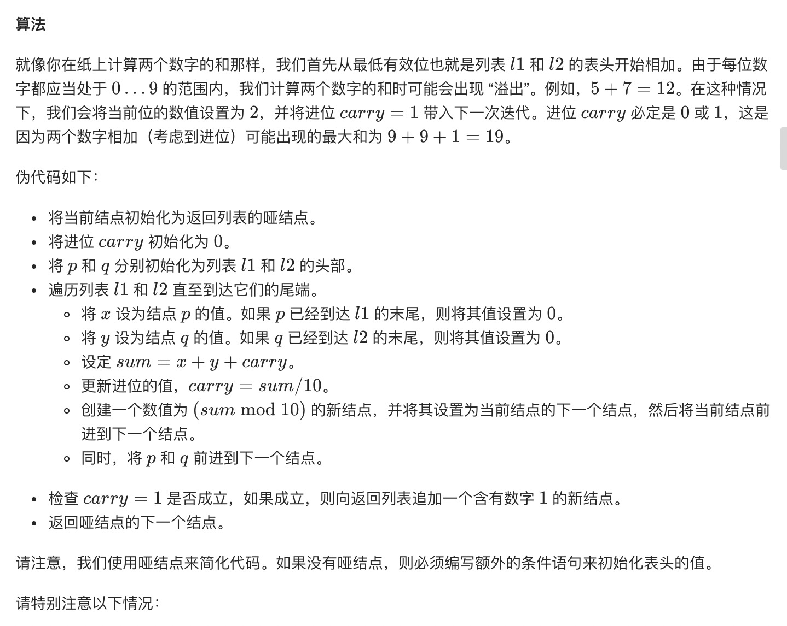
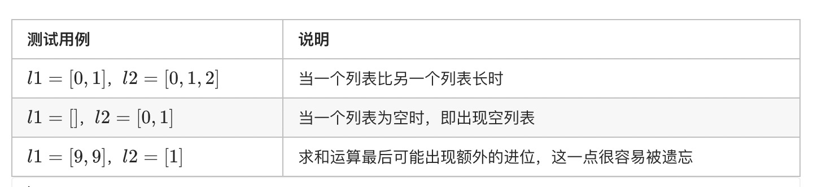

= 两数相加
:toc:
:toc-title:
:toclevels: 5
:sectnums:

== 说明
给出两个 非空 的链表用来表示两个非负的整数。其中，它们各自的位数是按照 逆序 的方式存储的，并且它们的每个节点只能存储 一位 数字。

如果，我们将这两个数相加起来，则会返回一个新的链表来表示它们的和。

您可以假设除了数字 0 之外，这两个数都不会以 0 开头。

示例：
```
输入：(2 -> 4 -> 3) + (5 -> 6 -> 4)
输出：7 -> 0 -> 8
原因：342 + 465 = 807

```

== 参考
- https://leetcode-cn.com/problems/add-two-numbers/

== 题解






```go
func addTwoNumbers(l1 *ListNode, l2 *ListNode) *ListNode {
	result := &ListNode{Val: 0}
	dummy := result
	tmp := 0
	for l1 != nil || l2 != nil {
		if l1 != nil {
			tmp += l1.Val
			l1 = l1.Next
		}
		if l2 != nil {
			tmp += l2.Val
			l2 = l2.Next
		}
		val := tmp % 10
		result.Next = &ListNode{Val: val}
		result = result.Next
		tmp /= 10
	}
	if tmp != 0 {
		result.Next = &ListNode{Val: tmp}
	}
	return dummy.Next

}
```


复杂度分析

- 时间复杂度：O(max(m,n))，假设 m 和 n 分别表示 l1 和 l2 的长度，上面的算法最多重复max(m,n) 次。
- 空间复杂度：O(max(m,n))， 新列表的长度最多为max(m,n)+1。

