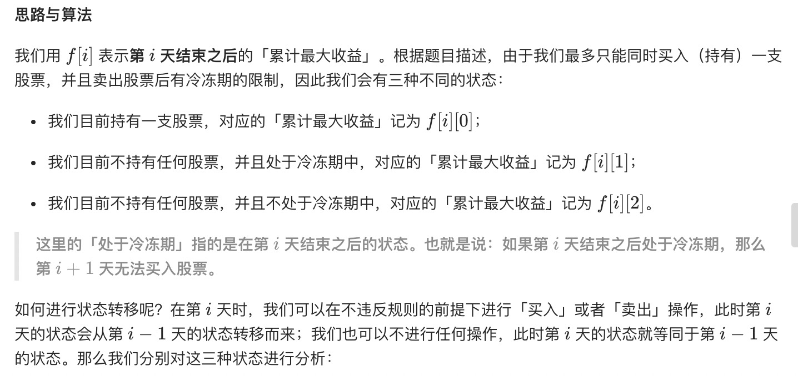
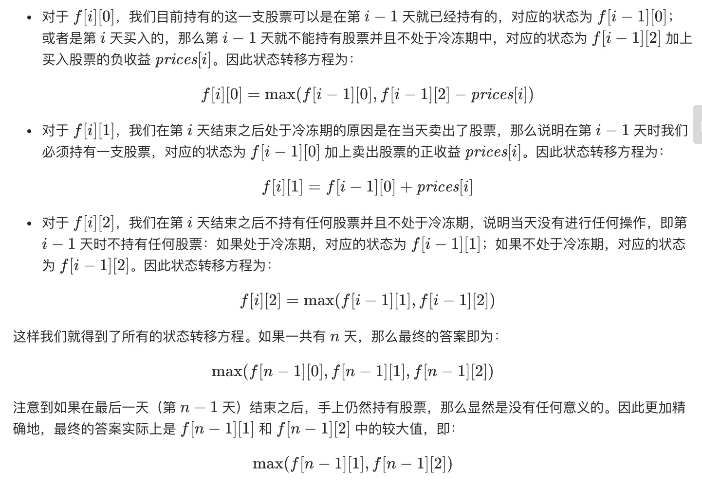
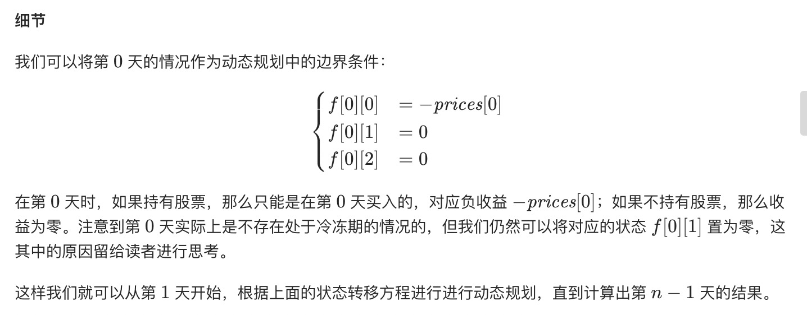
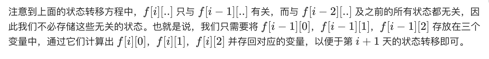

= 最佳买卖股票时机含冷冻期
:toc:
:toc-title:
:toclevels: 5
:sectnums:

== 说明
给定一个整数数组，其中第 i 个元素代表了第 i 天的股票价格 。​

设计一个算法计算出最大利润。在满足以下约束条件下，你可以尽可能地完成更多的交易（多次买卖一支股票）:

你不能同时参与多笔交易（你必须在再次购买前出售掉之前的股票）。
卖出股票后，你无法在第二天买入股票 (即冷冻期为 1 天)。
示例:
```
输入: [1,2,3,0,2]
输出: 3
解释: 对应的交易状态为: [买入, 卖出, 冷冻期, 买入, 卖出]

```

== 参考
- https://leetcode-cn.com/problems/best-time-to-buy-and-sell-stock-with-cooldown/


== 知识点
- 动态规划

== 题解
=== 动态规划






```go
func maxProfit(prices []int) int {
	n := len(prices)
	if n == 0 {
		return 0
	}
	dp := make([][3]int, n)
	dp[0][0] = -prices[0]
	for i := 1; i < n; i++ {
		dp[i][0] = max(dp[i-1][0], dp[i-1][2]-prices[i])
		dp[i][1] = dp[i-1][0] + prices[i]
		dp[i][2] = max(dp[i-1][1], dp[i-1][2])
	}
	return max(dp[n-1][1], dp[n-1][2])

}
```

复杂度:
- 时间复杂度：O(n)，其中 n 为数组 prices 的长度。
- 空间复杂度：O(n)。我们需要 3n 的空间存储动态规划中的所有状态，对应的空间复杂度为 O(n)

==== 空间优化


```go
func maxProfit(prices []int) int {
	n := len(prices)
	if n == 0 {
		return 0
	}
	dp0 := -prices[0]
	dp1 := 0
	dp2 := 0
	for i := 1; i < n; i++ {
		_dp0 := max(dp0, dp2-prices[i])
		_dp1 := dp0 + prices[i]
		_dp2 := max(dp1, dp2)
		dp0, dp1, dp2 = _dp0, _dp1, _dp2
	}
	return max(dp1, dp2)

}
```


