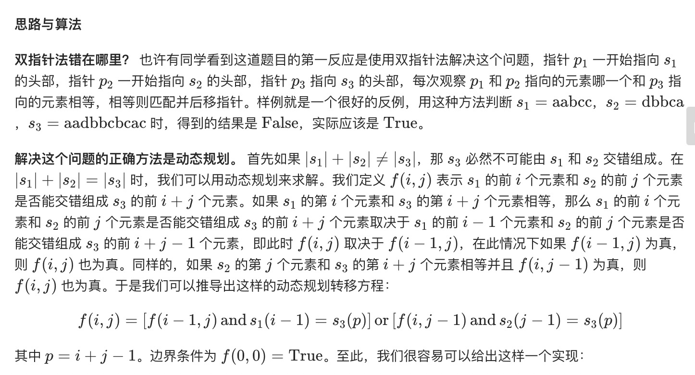

= 交错字符串
:toc:
:toc-title:
:toclevels: 5
:sectnums:

== 说明
给定三个字符串 s1, s2, s3, 验证 s3 是否是由 s1 和 s2 交错组成的。

示例 1:
```
输入: s1 = "aabcc", s2 = "dbbca", s3 = "aadbbcbcac"
输出: true
```
示例 2:
```
输入: s1 = "aabcc", s2 = "dbbca", s3 = "aadbbbaccc"
输出: false
```

== 参考
- https://leetcode-cn.com/problems/interleaving-string/

== 知识点
- 动态规划

== 题解
=== 动态规划


```python
def isInterleave(s1, s2, s3):
    """
    :type s1: str
    :type s2: str
    :type s3: str
    :rtype: bool
    """
    m = len(s1)
    n = len(s2)
    t = len(s3)
    if m + n != t:
        return False
    dp = [[False] * (n + 1) for _ in range(m + 1)]
    dp[0][0] = True
    for i in range(m + 1):
        for j in range(n + 1):
            if i > 0:
                dp[i][j] = dp[i][j] or (dp[i - 1][j] and s1[i - 1] == s3[i + j - 1])
            if j > 0:
                dp[i][j] = dp[i][j] or (dp[i][j - 1] and s2[j - 1] == s3[i + j - 1])
    return dp[m][n]
```

复杂度:

- 时间复杂度: o(mn)
- 空间复杂度: o(mn)

=== 滚动数组优化
使用滚动数组优化空间复杂度。 因为这里数组 f 的第 i 行只和第 i - 1 行相关，所以我们可以用滚动数组优化这个动态规划，这样空间复杂度可以变成 O(m)。

```python
m, n, t = len(s1), len(s2), len(s3)
    if m + n != t:
        return False
    dp = [False] * (n + 1)
    dp[0] = True
    for i in range(m + 1):
        for j in range(n + 1):
            if i > 0:
                dp[j] = dp[j] and s1[i - 1] == s3[i + j - 1]
            if j > 0:
                dp[j] = dp[j] or (dp[j - 1] and s2[j - 1] == s3[i + j - 1])
    return dp[n]
```

复杂度:

- 时间复杂度: o(mn)
- 空间复杂度: o(n) n 为s2的长度
