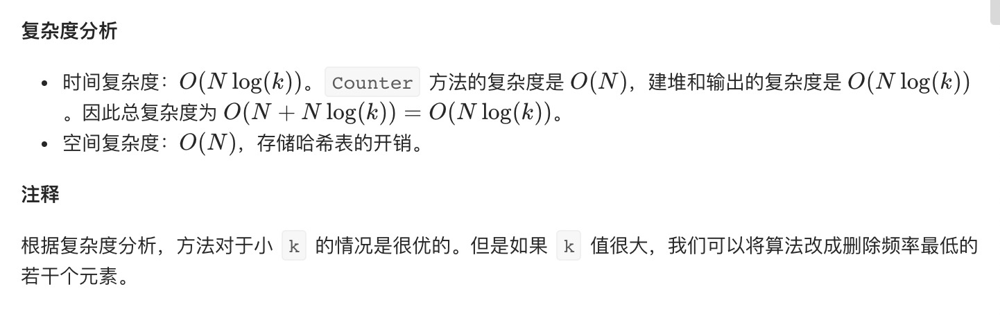

=  K 个高频元素
:toc:
:toc-title:
:toclevels: 5
:sectnums:

== 说明
给定一个非空的整数数组，返回其中出现频率前 k 高的元素。

 

示例 1:
```
输入: nums = [1,1,1,2,2,3], k = 2
输出: [1,2]
```
示例 2:
```
输入: nums = [1], k = 1
输出: [1]
```

提示：

- 你可以假设给定的 k 总是合理的，且 1 ≤ k ≤ 数组中不相同的元素的个数。
- 你的算法的时间复杂度必须优于 O(n log n) , n 是数组的大小。
- 题目数据保证答案唯一，换句话说，数组中前 k 个高频元素的集合是唯一的。
- 你可以按任意顺序返回答案。

== 参考
https://leetcode-cn.com/problems/top-k-frequent-elements/

== 题解
=== 最小堆
image:images/1.jpg[]

```
def topKFrequent(nums: [int], k: int) -> [int]:
    count = collections.Counter(nums)
    result = heapq.nlargest(k,count.keys(),key=count.get)
    return result
```


