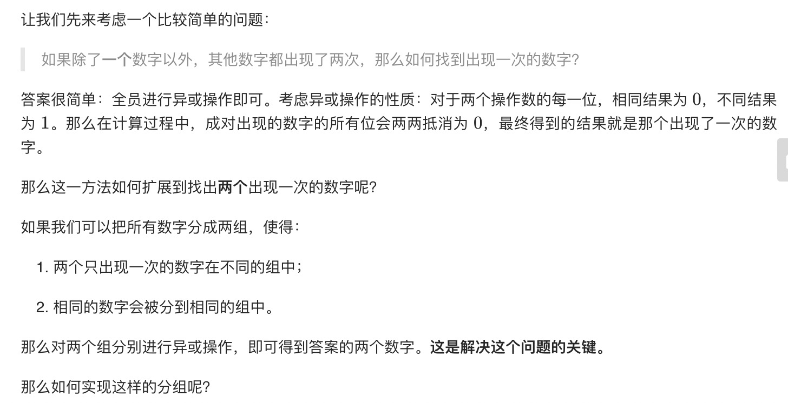
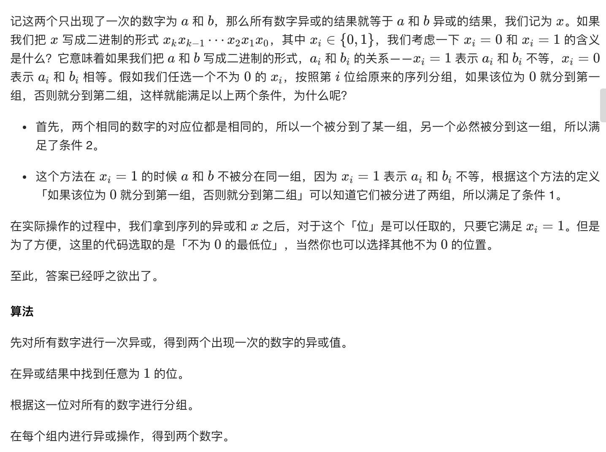

= 数组中数字出现的次数
:toc-title:
:toc:
:toclevels:
:sectnums:

== 说明
一个整型数组 nums 里除两个数字之外，其他数字都出现了两次。请写程序找出这两个只出现一次的数字。要求时间复杂度是O(n)，空间复杂度是O(1)。

示例 1：
```
输入：nums = [4,1,4,6]
输出：[1,6] 或 [6,1]
```
示例 2：
```
输入：nums = [1,2,10,4,1,4,3,3]
输出：[2,10] 或 [10,2]
 
```
限制：

- 2 <= nums.length <= 10000

== 参考
- https://leetcode-cn.com/problems/shu-zu-zhong-shu-zi-chu-xian-de-ci-shu-lcof/

== 知识点
- 位运算

== 题解
=== 位运算




```go
func singleNumbers(nums []int) []int {
    ret := 0
    for _, num := range nums {
        ret ^= num
    }
    mask := 1
    for mask & ret == 0 {
        mask <<= 1
    }
    a ,b := 0,0
    for _,num := range nums {
        if num & mask == 0 {
            a ^= num
        } else {
            b ^= num
        }
    }
    return []int{a,b}
}
```

复杂度分析:

- 时间复杂度：O(n)O(n)，我们只需要遍历数组两次。
- 空间复杂度：O(1)O(1)，只需要常数的空间存放若干变量。

