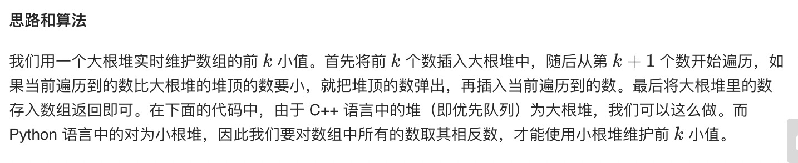

= 最小的k个数
:toc:
:toclevels:
:toc-title:
:sectnums:

== 说明
输入整数数组 arr ，找出其中最小的 k 个数。例如，输入4、5、1、6、2、7、3、8这8个数字，则最小的4个数字是1、2、3、4。


示例 1：
```
输入：arr = [3,2,1], k = 2
输出：[1,2] 或者 [2,1]
```
示例 2：
```
输入：arr = [0,1,2,1], k = 1
输出：[0]
```

限制：
```
0 <= k <= arr.length <= 10000
0 <= arr[i] <= 10000
```

== 参考
- https://leetcode-cn.com/problems/zui-xiao-de-kge-shu-lcof/

== 知识点
- https://leetcode-cn.com/problems/zui-xiao-de-kge-shu-lcof/

== 题解
=== 堆


```python
import heapq

def getLeastNumbers(arr: [int], k: int) -> [int]:
    result = [-arr[i] for i in range(k)]
    heapq.heapify(result)
    for i in range(k, len(arr)):
        heapq.heappushpop(result, -arr[i])
    result = [-result[i] for i in range(k)]
    return result
```


