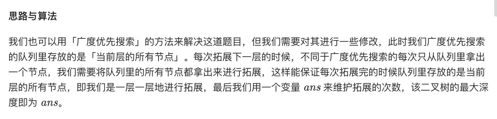

= 二叉树的最大深度
:toc:
:toc-title:
:toclevels: 5
:sectnums:

== 说明
给定一个二叉树，找出其最大深度。

二叉树的深度为根节点到最远叶子节点的最长路径上的节点数。

说明: 叶子节点是指没有子节点的节点。

示例：
```
给定二叉树 [3,9,20,null,null,15,7]，

    3
   / \
  9  20
    /  \
   15   7
返回它的最大深度 3 。
```


== 参考
- https://leetcode-cn.com/problems/maximum-depth-of-binary-tree/

== 知识点
- 递归
- 广度优先搜索

== 题解
=== 递归


```python
def maxDepth(root: TreeNode) -> int:
    if not root :
        return 0
    return max(maxDepth(root.left), maxDepth(root.right)) + 1
```

复杂度分析

- 时间复杂度：O(n)，其中 n 为二叉树节点的个数。每个节点在递归中只被遍历一次。
- 空间复杂度：O(height)，其中height 表示二叉树的高度。递归函数需要栈空间，而栈空间取决于递归的深度，因此空间复杂度等价于二叉树的高度。

=== 广度优先搜索



```python
def maxDepth(root: TreeNode) -> int:
    if not root:
        return 0
    height = 0
    queue = [root]
    while queue:
        size = len(queue)
        height += 1
        stack = []
        while size != 0:
            node = queue.pop()
            if node.left:
                stack.append(node.left)
            if node.right:
                stack.append(node.right)
            size -= 1
        queue.extend(stack)
    return height

```

