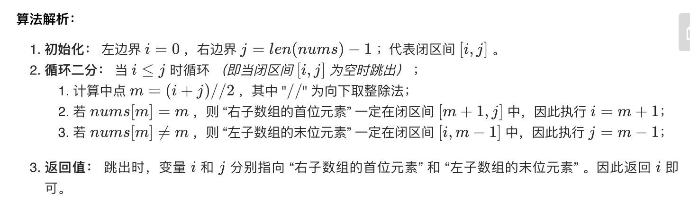

= 0～n-1中缺失的数字
:toc:
:toc-title:
:toclevels:
:sectnums:

== 说明
一个长度为n-1的递增排序数组中的所有数字都是唯一的，并且每个数字都在范围0～n-1之内。在范围0～n-1内的n个数字中有且只有一个数字不在该数组中，请找出这个数字。

示例 1:
```
输入: [0,1,3]
输出: 2
```
示例 2:
```
输入: [0,1,2,3,4,5,6,7,9]
输出: 8
```


== 参考
- https://leetcode-cn.com/problems/que-shi-de-shu-zi-lcof/

== 题解
=== 二分法
image:images/1.jpg[]



```python
# 二分法
def missingNumber(nums: [int]) -> int:
    i, j = 0, nums[-1]
    while i <= j:
        m = (i + j) >> 1
        if nums[m] == m:
            i = m + 1
        else:
            j = m - 1
    return i
```


复杂度分析:

- 时间复杂度 O(log N)O(logN)： 二分法为对数级别复杂度。
- 空间复杂度 O(1)O(1)： 几个变量使用常数大小的额外空间。

