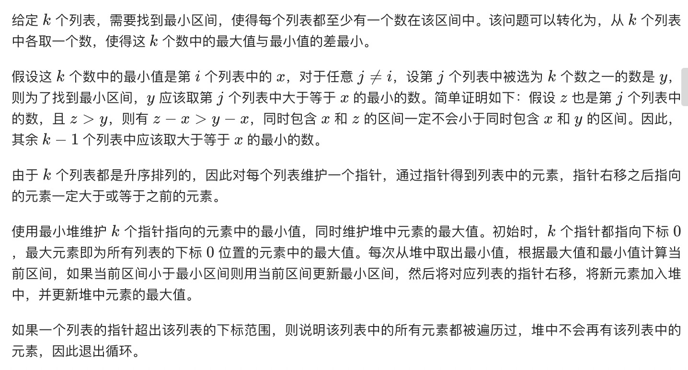
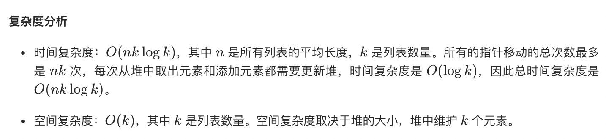

= 最小区间
:toc:
:toclevels: 5
:toc-title:
:sectnums:

== 说明
你有 k 个升序排列的整数数组。找到一个最小区间，使得 k 个列表中的每个列表至少有一个数包含在其中。

我们定义如果 b-a < d-c 或者在 b-a == d-c 时 a < c，则区间 [a,b] 比 [c,d] 小。

示例 1:
```
输入:[[4,10,15,24,26], [0,9,12,20], [5,18,22,30]]
输出: [20,24]
解释:
列表 1：[4, 10, 15, 24, 26]，24 在区间 [20,24] 中。
列表 2：[0, 9, 12, 20]，20 在区间 [20,24] 中。
列表 3：[5, 18, 22, 30]，22 在区间 [20,24] 中。
```
注意:

- 给定的列表可能包含重复元素，所以在这里升序表示 >= 。
- 1 <= k <= 3500
- -105 <= 元素的值 <= 105

== 参考
- https://leetcode-cn.com/problems/smallest-range-covering-elements-from-k-lists/

== 知识点
- 堆
- 滑动窗口

== 题解
=== 堆


```python
def smallestRange(nums: [[int]]) -> [int]:
    rangeLeft, rangeRight = -10 ** 9, 10 ** 9
    maxValue = max(vec[0] for vec in nums)
    priorityQueue = [(vec[0], i, 0) for i, vec in enumerate(nums)]
    heapq.heapify(priorityQueue)

    while True:
        minValue, row, idx = heapq.heappop(priorityQueue)
        if maxValue - minValue < rangeRight - rangeLeft:
            rangeLeft, rangeRight = minValue, maxValue
        if idx == len(nums[row]) - 1:
            break
        maxValue = max(maxValue, nums[row][idx + 1])
        heapq.heappush(priorityQueue, (nums[row][idx + 1], row, idx + 1))

    return [rangeLeft, rangeRight]

```



=== 滑动窗口


