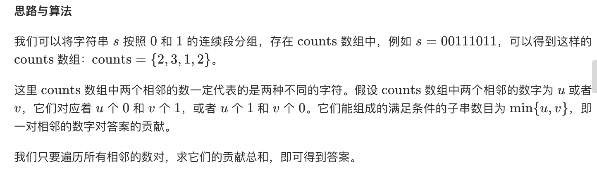
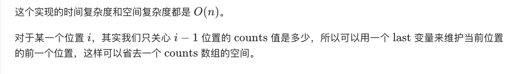

= 计数二进制子串
:toc:
:toclevels: 5
:toc-title:
:sectnums:

== 说明
给定一个字符串 s，计算具有相同数量0和1的非空(连续)子字符串的数量，并且这些子字符串中的所有0和所有1都是组合在一起的。

重复出现的子串要计算它们出现的次数。

示例 1 :
```
输入: "00110011"
输出: 6
解释: 有6个子串具有相同数量的连续1和0：“0011”，“01”，“1100”，“10”，“0011” 和 “01”。

请注意，一些重复出现的子串要计算它们出现的次数。

另外，“00110011”不是有效的子串，因为所有的0（和1）没有组合在一起。
```
示例 2 :
```
输入: "10101"
输出: 4
解释: 有4个子串：“10”，“01”，“10”，“01”，它们具有相同数量的连续1和0。
```
注意：

- s.length 在1到50,000之间。
- s 只包含“0”或“1”字符。

== 参考
- https://leetcode-cn.com/problems/count-binary-substrings/

== 题解


```go
func countBinarySubstrings(s string) int {
	if s == "" {
		return 0
	}
	counts := []int{}
	count := 1
	for i := 1; i < len(s); i++ {
		if s[i] != s[i-1] {
			counts = append(counts, count)
			count = 1
			continue
		}
		count++
	}
	counts = append(counts, count)
	if len(counts) < 2 {
		return 0
	}
	result := 0
	for i := 1; i < len(counts); i++ {
		result += min(counts[i], counts[i-1])
	}

	return result
}

func min(x, y int) int {
	if x < y {
		return x
	}
	return y
}
```



```go
func countBinarySubstrings(s string) int {
	if s == "" {
		return 0
	}
	pre, cur := 0, 0
	count := 1
	result := 0
	for i := 1; i < len(s); i++ {
		if s[i] != s[i-1] {
			pre, cur = cur, count
			result += min(pre, cur)
			count = 1
			continue
		}
		count++
	}
	result += min(cur, count)

	return result
}

func min(x, y int) int {
	if x < y {
		return x
	}
	return y
}
```

复杂度:

- 时间复杂度: o(n)
- 空间复杂度: o(1)

