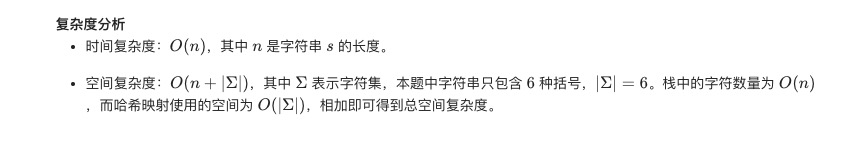

= 有效的括号
:toc:
:toclevels:
:toc-title:
:sectnums:

== 说明
给定一个只包括 '('，')'，'{'，'}'，'['，']' 的字符串，判断字符串是否有效。

有效字符串需满足：

- 左括号必须用相同类型的右括号闭合。
- 左括号必须以正确的顺序闭合。

注意空字符串可被认为是有效字符串。

示例 1:
```
输入: "()"
输出: true
```
示例 2:
```
输入: "()[]{}"
输出: true
```
示例 3:
```
输入: "(]"
输出: false
```
示例 4:
```
输入: "([)]"
输出: false
```
示例 5:
```
输入: "{[]}"
输出: true
```

== 参考
https://leetcode-cn.com/problems/valid-parentheses/

== 题解
=== 栈
image:images/1.jpg[]

```python
def isValid(s: str) -> bool:
    if not s:
        return True
    tmp = {"(": ")", "[": "]", "{": "}"}
    stack = []
    for item in s:
        if not stack and item in [")", "]", "}"]:
            return False
        if item in tmp:
            stack.append(item)
            continue
        tmp_item = stack.pop()
        if item != tmp[tmp_item]:
            return False
    if len(stack) > 0:
        return False
    return True
```



