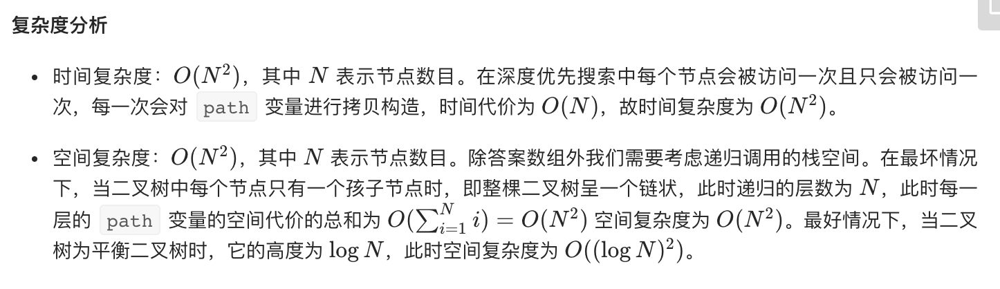

= 二叉树的所有路径
:toc:
:toc-title:
:toclevels:
:sectnums:

== 说明
给定一个二叉树，返回所有从根节点到叶子节点的路径。

说明: 叶子节点是指没有子节点的节点。

示例:

输入:
```
   1
 /   \
2     3
 \
  5
```
输出: ["1->2->5", "1->3"]

解释: 所有根节点到叶子节点的路径为: 1->2->5, 1->3


== 参考
- https://leetcode-cn.com/problems/binary-tree-paths/

== 题解

image:images/1.png[]

```

var paths []string
func binaryTreePaths(root *TreeNode) []string {
    paths = []string{}
    if root == nil {
        return []string{}
    }
    recurse(root,"")
    return paths
}

func recurse(root *TreeNode, path string) {
    if root != nil {
        path = path + strconv.Itoa(root.Val)
        if root.Left == nil && root.Right == nil {
            paths = append(paths, path)
        } else {
            path += "->"
            recurse(root.Left, path)
            recurse(root.Right, path)
        }
    }
}
```


