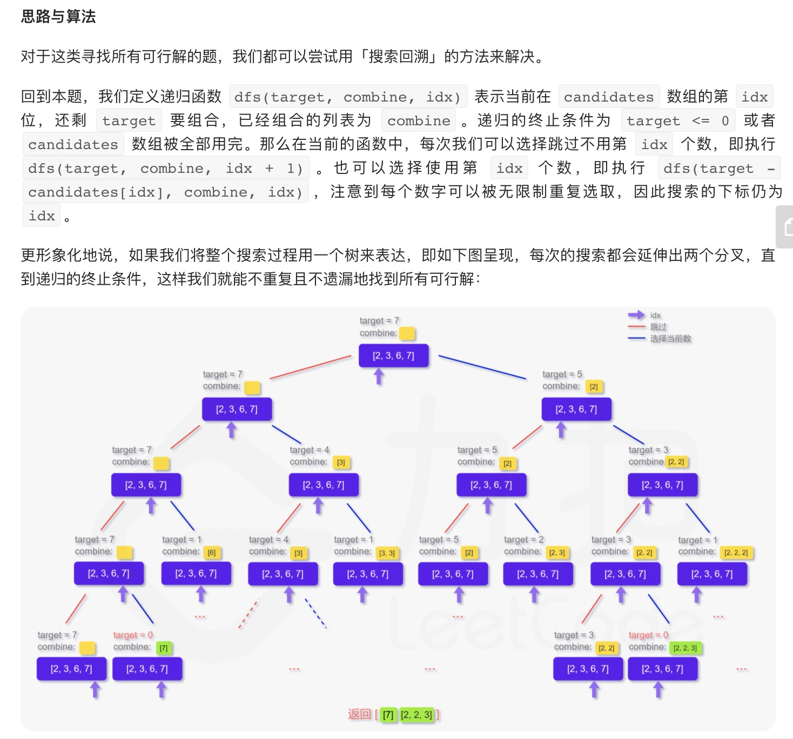
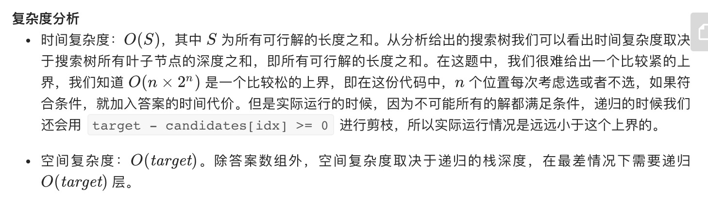

= 组合总和
:toc:
:toc-title:
:toclevels:
:sectnums:

== 说明
给定一个无重复元素的数组 candidates 和一个目标数 target ，找出 candidates 中所有可以使数字和为 target 的组合。

candidates 中的数字可以无限制重复被选取。

说明：

- 所有数字（包括 target）都是正整数。
- 解集不能包含重复的组合。 

示例 1：
```
输入：candidates = [2,3,6,7], target = 7,
所求解集为：
[
  [7],
  [2,2,3]
]
```
示例 2：
```
输入：candidates = [2,3,5], target = 8,
所求解集为：
[
  [2,2,2,2],
  [2,3,3],
  [3,5]
]
```

提示：

- 1 <= candidates.length <= 30
- 1 <= candidates[i] <= 200
- candidate 中的每个元素都是独一无二的。
- 1 <= target <= 500

== 参考
- https://leetcode-cn.com/problems/combination-sum/

== 题解
=== 回溯



```python
import copy
def combinationSum(candidates: [int], target: int) -> [[int]]:
    result = []
    temp = []

    def dfs(target, idx):
        if idx == len(candidates):
            return
        if target == 0:
            comb = copy.deepcopy(temp)
            result.append(comb)
            return
        dfs(target, idx + 1)
        if target - candidates[idx] >= 0:
            temp.append(candidates[idx])
            dfs(target - candidates[idx], idx)
            temp.pop()

    dfs(target, 0)
    return result

```


