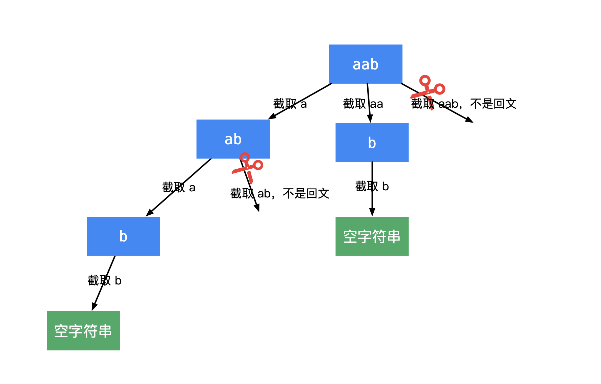

= 分割回文串
:toc:
:toc-title:
:toclevels:
:sectnums:


== 说明
给定一个字符串 s，将 s 分割成一些子串，使每个子串都是回文串。

返回 s 所有可能的分割方案。

示例:
```
输入: "aab"
输出:
[
  ["aa","b"],
  ["a","a","b"]
]
```

== 参考
- https://leetcode-cn.com/problems/palindrome-partitioning/

== 题解

搜索问题主要使用回溯法。

回溯法思考的步骤：

- 画递归树；

- 根据自己画的递归树编码。



思考如何根据这棵递归树编码：

1、每一个结点表示剩余没有扫描到的字符串，产生分支是截取了剩余字符串的前缀；

2、产生前缀字符串的时候，判断前缀字符串是否是回文。

- 如果前缀字符串是回文，则可以产生分支和结点；
- 如果前缀字符串不是回文，则不产生分支和结点，这一步是剪枝操作。

3、在叶子结点是空字符串的时候结算，此时从根结点到叶子结点的路径，就是结果集里的一个结果，使用深度优先遍历，记录下所有可能的结果。

采用一个路径变量 path 搜索，path 全局使用一个（注意结算的时候，需要生成一个拷贝），因此在递归执行方法结束以后需要回溯，即将递归之前添加进来的元素拿出去；
path 的操作只在列表的末端，因此合适的数据结构是栈。


```go
func partition(s string) (result [][]string) {
    temp := []string{}
    n := len(s)
    var check func(i,j int) bool
    check = func(i,j int) bool {
        for i <= j {
            if s[i] != s[j] {
                return false
            }
            i ++
            j --
        }
        return true
    }

    var dfs func(idx int)
    dfs = func(idx int) {
        if idx == n {
            comb := make([]string,len(temp))
            copy(comb, temp)
            result = append(result, comb)
            return
        }
        for i := idx ; i < n ; i ++ {
            if !check(idx, i ) {
                continue
            }
            temp = append(temp,s[idx:i+1])
            dfs(i+1)
            temp = temp[:len(temp)-1]
        }
    }
    dfs(0)
    return
}
```
