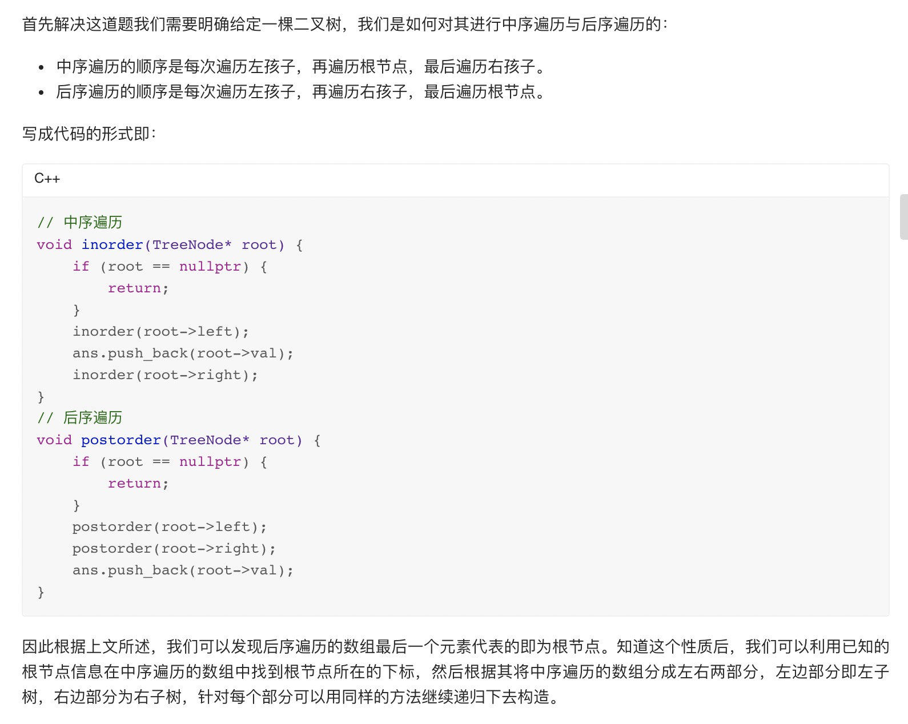
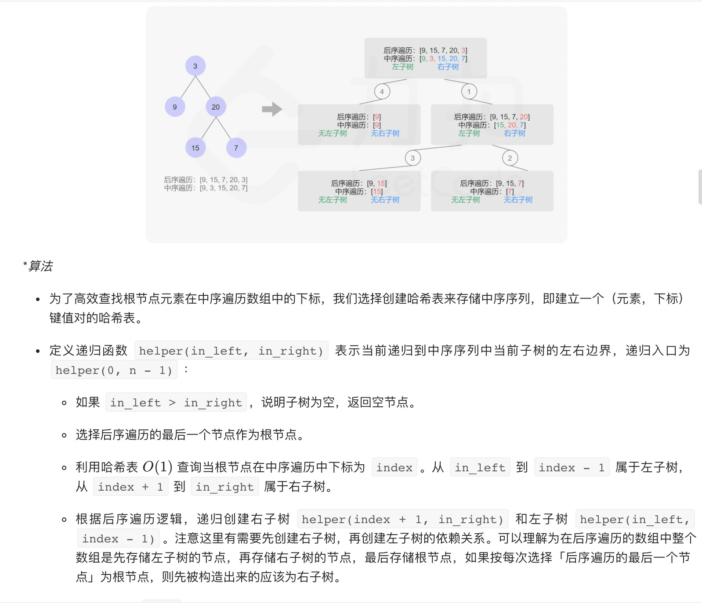
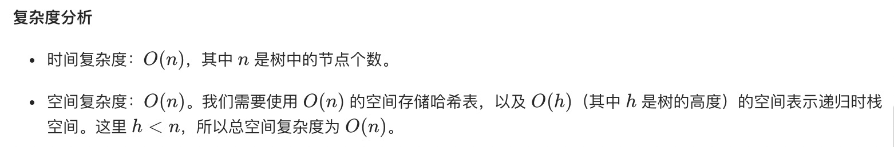

= 从中序与后序遍历序列构造二叉树
:toc:
:toclevels: 5
:toc-title:
:sectnums:

== 说明
根据一棵树的中序遍历与后序遍历构造二叉树。

注意:
你可以假设树中没有重复的元素。

例如，给出
```
中序遍历 inorder = [9,3,15,20,7]
后序遍历 postorder = [9,15,7,20,3]
返回如下的二叉树：

    3
   / \
  9  20
    /  \
   15   7

```

== 参考
- https://leetcode-cn.com/problems/construct-binary-tree-from-inorder-and-postorder-traversal/

== 题解
=== 递归




```go
func buildTree(inorder []int, postorder []int) *TreeNode {
    idxMap := map[int]int{}
    for i, v := range inorder {
        idxMap[v] = i
    }
    var build func(int, int) *TreeNode
    build = func(inorderLeft, inorderRight int) *TreeNode {
        // 无剩余节点
        if inorderLeft > inorderRight {
            return nil
        }

        // 后序遍历的末尾元素即为当前子树的根节点
        val := postorder[len(postorder)-1]
        postorder = postorder[:len(postorder)-1]
        root := &TreeNode{Val: val}

        // 根据 val 在中序遍历的位置，将中序遍历划分成左右两颗子树
        // 由于我们每次都从后序遍历的末尾取元素，所以要先遍历右子树再遍历左子树
        inorderRootIndex := idxMap[val]
        root.Right = build(inorderRootIndex+1, inorderRight)
        root.Left = build(inorderLeft, inorderRootIndex-1)
        return root
    }
    return build(0, len(inorder)-1)
}

```


