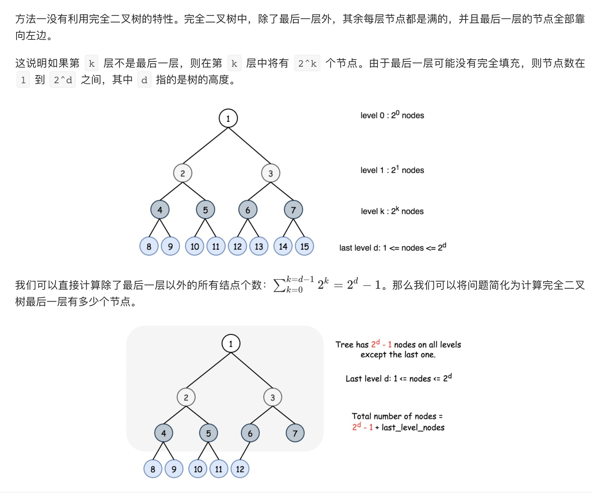
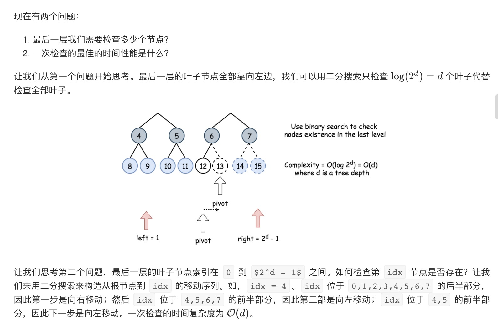
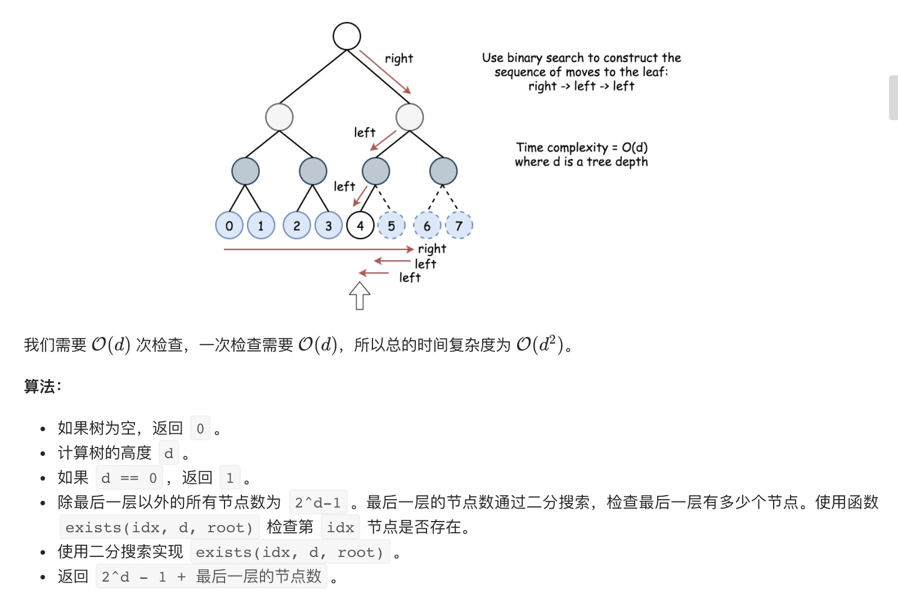

= 完全二叉树的节点个数
:toc:
:toc-title:
:toclevels: 5
:sectnums:

== 说明
给出一个完全二叉树，求出该树的节点个数。

说明：

完全二叉树的定义如下：在完全二叉树中，除了最底层节点可能没填满外，其余每层节点数都达到最大值，并且最下面一层的节点都集中在该层最左边的若干位置。若最底层为第 h 层，则该层包含 1~ 2h 个节点。

示例:
```
输入:
    1
   / \
  2   3
 / \  /
4  5 6

输出: 6
```

== 参考
- https://leetcode-cn.com/problems/count-complete-tree-nodes/

== 题解
=== 线性时间
最简单的解决方法就是用递归一个一个的计算节点。

```python
class Solution:
    def countNodes(self, root: TreeNode) -> int:
        return 1 + self.countNodes(root.right) + self.countNodes(root.left) if root else 0

```

复杂度分析

时间复杂度：O(N)。
空间复杂度：O(logN)，其中 d 指的是树的的高度，运行过程中堆栈所使用的空间。

=== 二分搜索






```python
def countNodes(root: TreeNode) -> int:

    def compute_path(root):
        d = 0
        while root.left:
            d += 1
            root = root.left
        return d

    def exists(idx, d, node):
        left, right = 0, 2 ** d - 1
        for _ in range(d):
            mid = left + (right - left) // 2
            if idx <= mid:
                node = node.left
                right = mid
            else:
                node = node.right
                left = mid + 1
        return node is not None

    if not root:
        return 0
    d = compute_path(root)
    if d == 0:
        return 1
    left, right = 1, 2 ** d - 1
    while left <= right:
        mid = left + (right - left) // 2
        if exists(mid, d, root):
            left = mid + 1
        else:
            right = mid - 1
    return (2 ** d - 1) + left
```

```go

func countNodes(root *TreeNode) int {
	if root == nil {
		return 0
	}
	d := compute_depth(root)
	if d == 0 {
		return 1
	}
	left, right := 1, int(math.Pow(2, float64(d)))-1
	for left <= right {
		mid := left + (right-left)/2
		if exists(mid, d, root) {
			left = mid + 1
		} else {
			right = mid - 1
		}
	}
	return (int(math.Pow(2, float64(d))) - 1) + left
}

func compute_depth(root *TreeNode) int {
	d := 0
	for root.Left != nil {
		root = root.Left
		d++
	}
	return d
}

func exists(idx, d int, node *TreeNode) bool {
	left, right := 0, int(math.Pow(2, float64(d)))-1
	for i := 0; i < d; i++ {
		mid := left + (right-left)/2
		if idx <= mid {
			node = node.Left
			right = mid
		} else {
			node = node.Right
			left = mid + 1
		}
	}
	return node != nil
}
```


