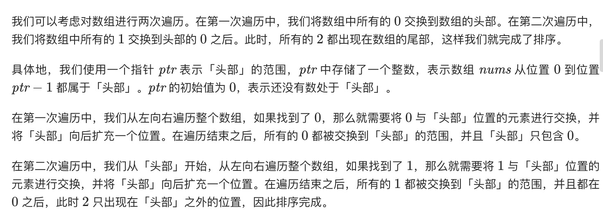
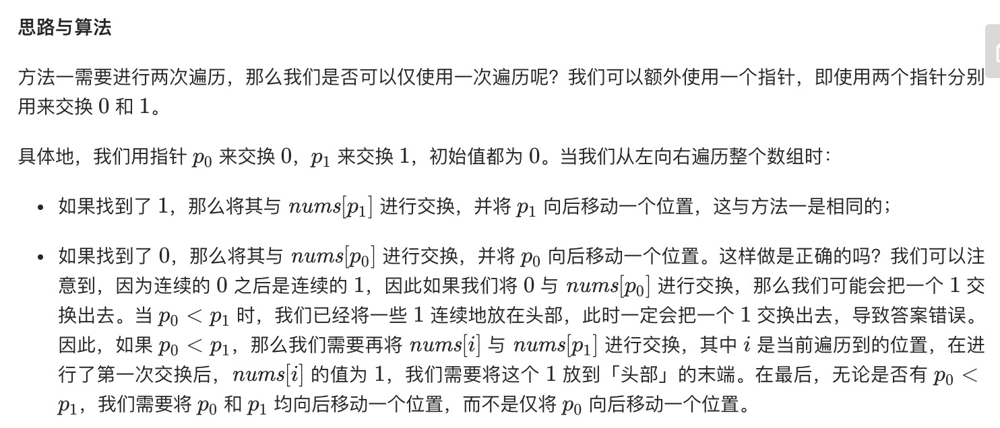

=  颜色分类
:toc:
:toc-title:
:toclevels: 5
:sectnums:

== 说明
给定一个包含红色、白色和蓝色，一共 n 个元素的数组，原地对它们进行排序，使得相同颜色的元素相邻，并按照红色、白色、蓝色顺序排列。

此题中，我们使用整数 0、 1 和 2 分别表示红色、白色和蓝色。

注意:
不能使用代码库中的排序函数来解决这道题。

示例:
```
输入: [2,0,2,1,1,0]
输出: [0,0,1,1,2,2]
```
进阶：

- 一个直观的解决方案是使用计数排序的两趟扫描算法。
- 首先，迭代计算出0、1 和 2 元素的个数，然后按照0、1、2的排序，重写当前数组。
- 你能想出一个仅使用常数空间的一趟扫描算法吗？

== 参考

- https://leetcode-cn.com/problems/sort-colors/

== 题解
=== 单指针
本题是经典的「荷兰国旗问题」，由计算机科学家 Edsger W. Dijkstra 首先提出。

根据题目中的提示，我们可以统计出数组中 0, 1, 2 的个数，再根据它们的数量，重写整个数组。这种方法较为简单，也很容易想到，而本题解中会介绍两种基于指针进行交换的方法。



```python
def sortColors(nums: [int]) -> None:
    """
    Do not return anything, modify nums in-place instead.
    """
    n = len(nums)
    ptr = 0
    for i in range(n) :
        if nums[i] == 0 :
            nums[i] , nums[ptr] = nums[ptr] , nums[i]
            ptr += 1
    for i in range(n) :
        if nums[i] == 1 :
            nums[i], nums[ptr] = nums[ptr] , nums[i]
            ptr += 1
```


```go
func sortColors(nums []int)  {
    n := len(nums)
    ptr := 0
    for i := 0 ; i < n ; i ++ {
        if nums[i] == 0 {
            nums[i],nums[ptr] = nums[ptr] , nums[i]
            ptr ++
        }
    }
    for i := 0 ; i < n ; i ++ {
        if nums[i] == 1 {
            nums[i],nums[ptr] = nums[ptr] , nums[i]
            ptr ++
        }
    }
}
```

复杂度分析:

- 时间复杂度：O(n)，其中 n 是数组 nums 的长度。
- 空间复杂度：O(1)。

=== 双指针



```go
func sortColors(nums []int)  {
    n := len(nums)
    p0, p1 := 0,0
    for i := 0 ; i < n ; i ++ {
        if nums[i] == 1 {
            nums[i] , nums[p1] = nums[p1] , nums[i]
            p1 ++
        } else if nums[i] == 0 {
            nums[i], nums[p0] = nums[p0] , nums[i]
            if p0 < p1 {
                nums[i] , nums[p1] = nums[p1] , nums[i]
            }
            p0 ++
            p1 ++
        }
    }
}
```


复杂度分析

- 时间复杂度：O(n)，其中 n 是数组 nums 的长度。
- 空间复杂度：O(1)。
