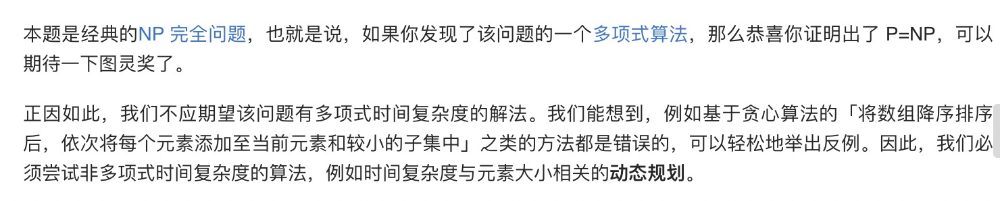
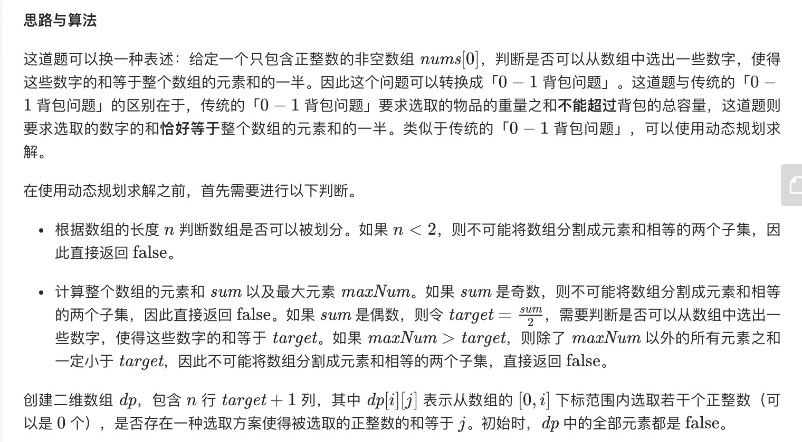
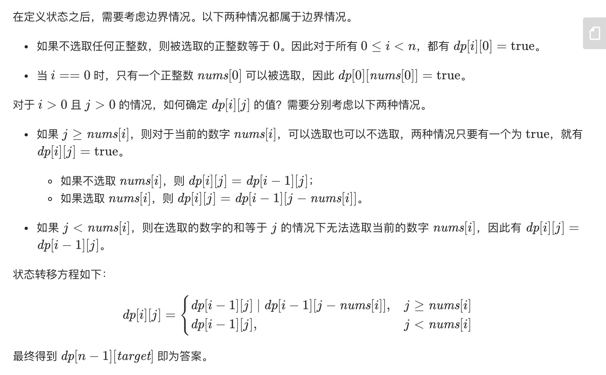
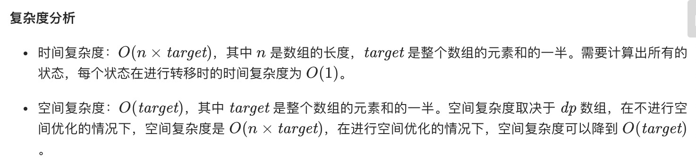

= 分割等和子集
:toc:
:toclevels:
:toc-title:
:sectnums:

== 说明
给定一个只包含正整数的非空数组。是否可以将这个数组分割成两个子集，使得两个子集的元素和相等。

注意:

每个数组中的元素不会超过 100
数组的大小不会超过 200
示例 1:
```
输入: [1, 5, 11, 5]

输出: true

解释: 数组可以分割成 [1, 5, 5] 和 [11].
 
```
示例 2:
```
输入: [1, 2, 3, 5]

输出: false

解释: 数组不能分割成两个元素和相等的子集.

```

== 参考
- https://leetcode-cn.com/problems/partition-equal-subset-sum/solution/fen-ge-deng-he-zi-ji-by-leetcode-solution/

== 题解




```go
func canPartition(nums []int) bool {
    n := len(nums)
    if n < 2 {
        return false
    }

    sum, max := 0, 0
    for _, v := range nums {
        sum += v
        if v > max {
            max = v
        }
    }
    if sum%2 != 0 {
        return false
    }

    target := sum / 2
    if max > target {
        return false
    }

    dp := make([][]bool, n)
    for i := range dp {
        dp[i] = make([]bool, target+1)
    }
    for i := 0; i < n; i++ {
        dp[i][0] = true
    }
    dp[0][nums[0]] = true
    for i := 1; i < n; i++ {
        v := nums[i]
        for j := 1; j <= target; j++ {
            if j >= v {
                dp[i][j] = dp[i-1][j] || dp[i-1][j-v]
            } else {
                dp[i][j] = dp[i-1][j]
            }
        }
    }
    return dp[n-1][target]
}

```


```go
func canPartition(nums []int) bool {
    n := len(nums)
    if n < 2 {
        return false
    }
    sum,max := 0,0
    for _, k := range nums {
        sum += k
        if k > max {
            max = k
        }
    }
    if sum % 2 != 0 {
        return false
    }
    target := sum >> 1
    if max > target {
        return false
    }
    dp := make([]bool, target + 1)
    dp[0] = true
    for i := 0 ; i < n ; i ++ {
        v := nums[i]
        for j := target ; j >= v ; j-- {
            dp[j] = dp[j] || dp[j-v]
        }
    }
    return dp[target]
}
```


