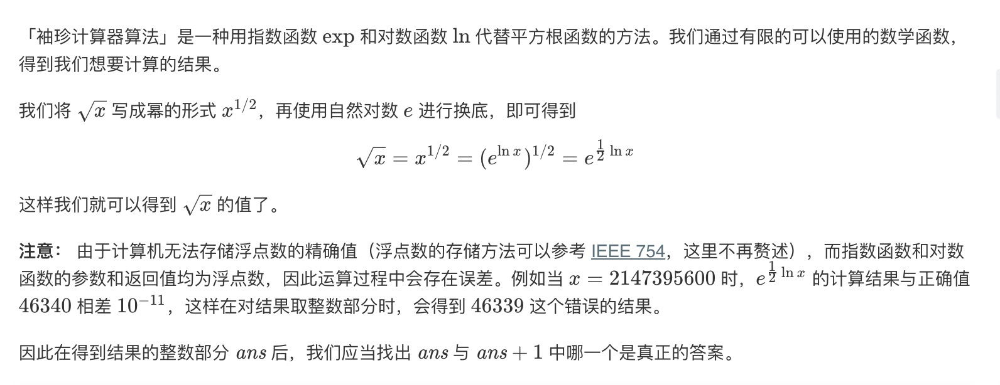

= x 的平方根
:toc:
:toc-title: 目录
:toclevels: 5
:sectnums:

实现 int sqrt(int x) 函数。

计算并返回 x 的平方根，其中 x 是非负整数。

由于返回类型是整数，结果只保留整数的部分，小数部分将被舍去。

示例 1:
```
输入: 4
输出: 2

```
示例 2:
```
输入: 8
输出: 2
说明: 8 的平方根是 2.82842...,
     由于返回类型是整数，小数部分将被舍去。
```

== 解法思路
=== 珍珠计算器方法
「袖珍计算器算法」是一种用指数函数 exp 和对数函数ln 代替平方根函数的方法。我们通过有限的可以使用的数学函数，得到我们想要计算的结果。



=== 二分法查找
由于 xx 平方根的整数部分 ans 是满足 k^2 \leq xk
2
 ≤x 的最大 k 值，因此我们可以对 k 进行二分查找，从而得到答案。

二分查找的下界为 0，上界可以粗略地设定为 x。在二分查找的每一步中，我们只需要比较中间元素 mid 的平方与 x 的大小关系，并通过比较的结果调整上下界的范围。由于我们所有的运算都是整数运算，不会存在误差，因此在得到最终的答案 ans 后，也就不需要再去尝试ans+1 了。


```go
func mySqrt2(x int) int {
	left, right, result := 0, x, -1
	for left <= right {
		mid := (left + right) >> 1
		if mid*mid <= x {
			result = mid
			left = mid + 1
		} else {
			right = mid - 1
		}
	}
	return result
}
```

=== 牛顿法
```python
def Sqrt(x:int) -> int :
    """

    :param x:
    :return:
    """
    if x == 0:
        return 0
    c, x0 = float(x), float(x)
    while True:
        xi = 0.5 * (x0 + c / x0)
        if abs(x0 - xi) < 1e-7:
            break
        x0 = xi
    return int(x0)
```

== 参考

https://leetcode-cn.com/problems/sqrtx/solution/x-de-ping-fang-gen-by-leetcode-solution/


