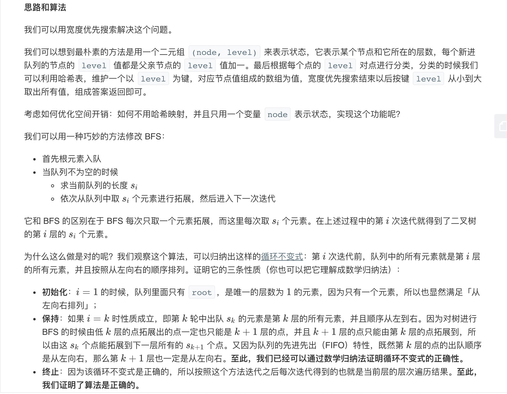

= 二叉树的层序遍历
:toc:
:toc-title: 目录
:toclevels: 5
:sectnums:

== 说明
给你一个二叉树，请你返回其按 层序遍历 得到的节点值。 （即逐层地，从左到右访问所有节点）。

 

示例：
二叉树：[3,9,20,null,null,15,7],

```
    3
   / \
  9  20
    /  \
   15   7
```
返回其层次遍历结果：
```
[
  [3],
  [9,20],
  [15,7]
]
```

== 参考
https://leetcode-cn.com/problems/binary-tree-level-order-traversal/

== 题解
=== 宽度优先搜索



```go
func levelOrder(root *TreeNode) [][]int {
	result := [][]int{}
	if root == nil {
		return result
	}
	q := []*TreeNode{root}
	for i := 0; len(q) > 0; i++ {
		result = append(result, []int{})
		p := []*TreeNode{}
		for j := 0; j < len(q); j++ {
			node := q[j]
			result[i] = append(result[i], node.Val)
			if node.Left != nil {
				p = append(p, node.Left)
			}
			if node.Right != nil {
				p = append(p, node.Right)
			}
		}
		q = p
	}

	return result
}
```

复杂度分析

记树上所有节点的个数为 n。

- 时间复杂度：每个点进队出队各一次，故渐进时间复杂度为 O(n)。
- 空间复杂度：队列中元素的个数不超过 n 个，故渐进空间复杂度为 O(n)。

