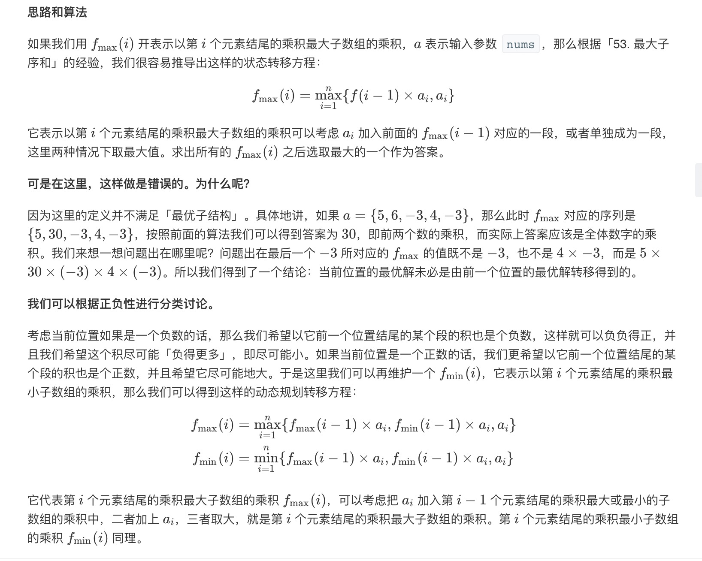

= 乘积最大子数组
:toc:
:toc-title: 目录
:toclevels: 5
:sectnums:

== 说明
给你一个整数数组 nums ，请你找出数组中乘积最大的连续子数组（该子数组中至少包含一个数字），并返回该子数组所对应的乘积。

示例 1:
```
输入: [2,3,-2,4]
输出: 6
解释: 子数组 [2,3] 有最大乘积 6。
```
示例 2:
```
输入: [-2,0,-1]
输出: 0
解释: 结果不能为 2, 因为 [-2,-1] 不是子数组。

```

== 参考
https://leetcode-cn.com/problems/maximum-product-subarray/

== 知识点
动态规划，参考： link:../../../data_structure/dynamicProgramming/[动态规划]

== 题解
=== 动态规划
给定数据可能存在负数，当是负数，当前的最大变最小，最小变最大

所以需要维护当前序列的前一个一个最大值和最小值




```
func maxProduct(nums []int) int {
	if len(nums) == 0 {
		return 0
	}
	nums_min := nums[0]
	nums_max := nums[0]
	result := nums[0]
	for i := 1; i < len(nums); i++ {
		a := nums_min
		b := nums_max
		nums_min = min(nums[i], nums[i]*a, nums[i]*b)
		nums_max = max(nums[i], nums[i]*a, nums[i]*b)
		if nums_max > result {
			result = nums_max
		}
	}
	return result
}

func max(a, b, c int) int {
	if a > b {
		if a > c {
			return a
		}
		return c
	}
	if b > c {
		return b
	}
	return c
}

func min(a, b, c int) int {
	if a > b {
		if c > b {
			return b
		}
		return c
	}
	if a > c {
		return c
	}
	return a
}

```

复杂度:

- 时间复杂度: o(n),一次遍历
- 空间复杂度: o(1),常数空间存储中间变量

=== 暴力求解
两次循环找到最大值

```
func maxProduct(nums []int) int {
	result := math.MinInt64
	for i := 0; i < len(nums); i++ {
		tmp := 1
		for j := i; j >= 0; j-- {
			tmp *= nums[j]
			if tmp > result {
				result = tmp
			}
		}
	}
	return result
}
```
