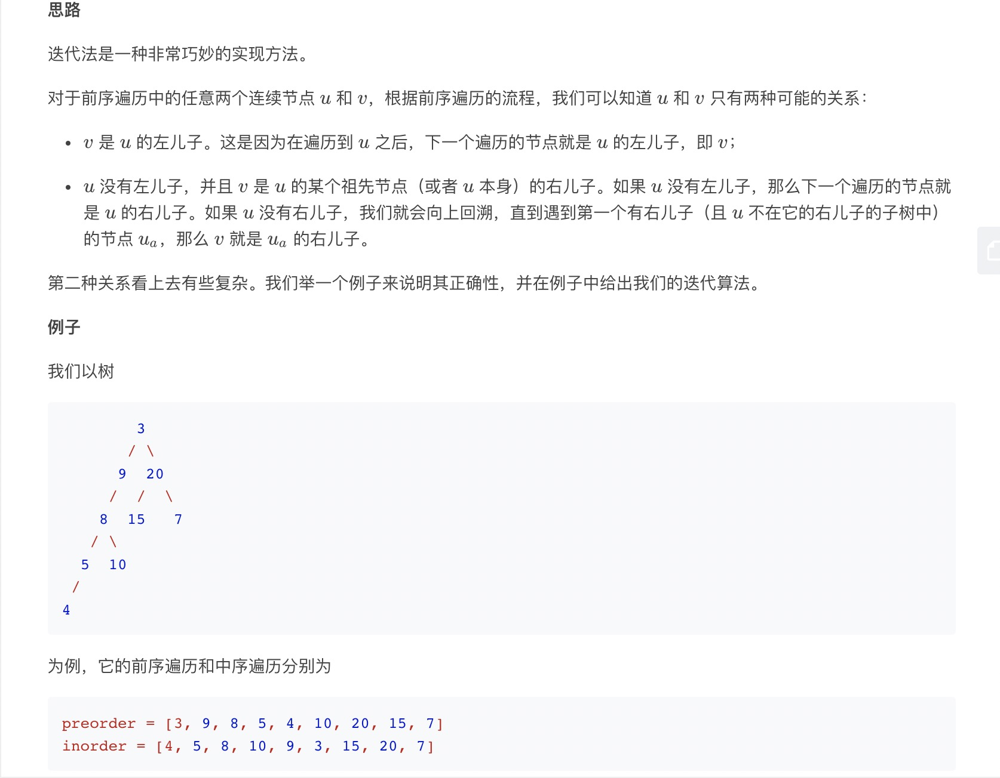
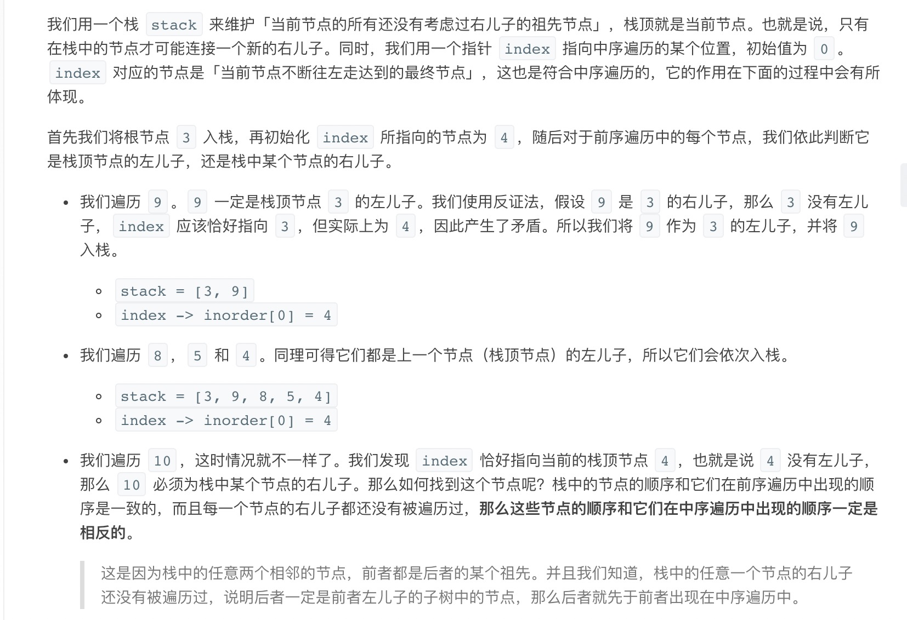
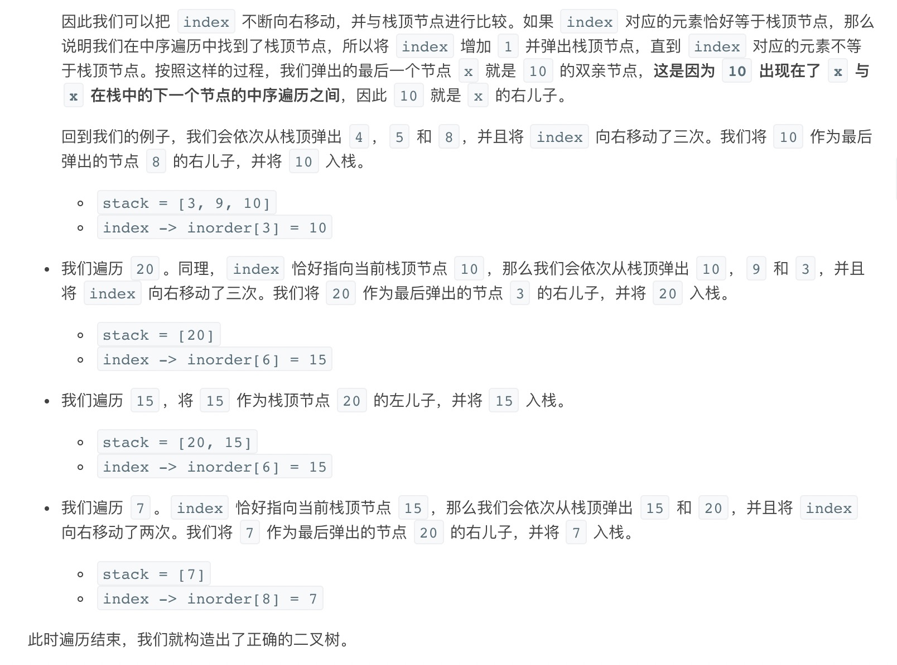

= 从前序与中序遍历序列构造二叉树
:toc: right
:toc-title: 目录
:toclevels: 5
:sectnums:

== 题目说明
根据一棵树的前序遍历与中序遍历构造二叉树。

注意:
你可以假设树中没有重复的元素。

例如，给出
```
前序遍历 preorder = [3,9,20,15,7]
中序遍历 inorder = [9,3,15,20,7]
返回如下的二叉树：

    3
   / \
  9  20
    /  \
   15   7

```

== 参考
https://leetcode-cn.com/problems/construct-binary-tree-from-preorder-and-inorder-traversal/


== 知识点
- link:../../../data_structure/iterate/[迭代]
- link:../../../data_structure/recursion/[递归]
- 二叉树

=== 二叉树遍历
==== 二叉树前序遍历的顺序为：

- 先遍历根节点；
- 随后递归地遍历左子树；
- 最后递归地遍历右子树。

==== 二叉树中序遍历的顺序为：

- 先递归地遍历左子树；
- 随后遍历根节点；
- 最后递归地遍历右子树。

== 题解
=== 递归


```python
class TreeNode:
    def __init__(self, x):
        self.val = x
        self.left = None
        self.right = None


def buildTree(preorder: [int], inorder: [int]) -> TreeNode:
    def tmp_build_tree(preorder_left: int, preorder_right: int, inorder_left: int, inorder_right: int) -> TreeNode:
        if preorder_left > preorder_right:
            return None
        # 前序遍历的root 节点
        preorder_root = preorder_left
        # 中序遍历的root 节点
        inorder_root = index[preorder[preorder_root]]

        # 构造根节点
        root = TreeNode(preorder[preorder_root])

        # 中序遍历左子树的长度
        inorder_left_size = inorder_root - inorder_left
        # 构造左子树
        root.left = tmp_build_tree(preorder_left + 1, preorder_left + inorder_left_size, inorder_left,
                                   inorder_root - 1)
        # 构造右子树
        root.right = tmp_build_tree(preorder_left + inorder_left_size + 1, preorder_right, inorder_root + 1,
                                    inorder_right)
        return root

    n = len(inorder)
    index = {key: i for i, key in enumerate(inorder)}
    return tmp_build_tree(0, n - 1, 0, n - 1)
```

复杂度:

- 时间复杂度: o(n),n 是数中节点的个数
- 空间复杂度: o(n), 除去返回的答案需要的 O(n) 空间之外，我们还需要使用 O(n) 的空间存储哈希映射，以及 O(h)（其中 h 是树的高度）的空间表示递归时栈空间。这里 h < n，所以总空间复杂度为 O(n)。

=== 迭代







```python
class Solution:
    def buildTree(self, preorder: List[int], inorder: List[int]) -> TreeNode:
        if not preorder:
            return None

        root = TreeNode(preorder[0])
        stack = [root]
        inorderIndex = 0
        for i in range(1, len(preorder)):
            preorderVal = preorder[i]
            node = stack[-1]
            if node.val != inorder[inorderIndex]:
                node.left = TreeNode(preorderVal)
                stack.append(node.left)
            else:
                while stack and stack[-1].val == inorder[inorderIndex]:
                    node = stack.pop()
                    inorderIndex += 1
                node.right = TreeNode(preorderVal)
                stack.append(node.right)

        return root

```

复杂度分析

- 时间复杂度：O(n)，其中 n 是树中的节点个数。
- 空间复杂度：O(n)，除去返回的答案需要的 O(n) 空间之外，我们还需要使用 O(h)（其中 h 是树的高度）的空间存储栈。这里 h < n，所以（在最坏情况下）总空间复杂度为 O(n)。
