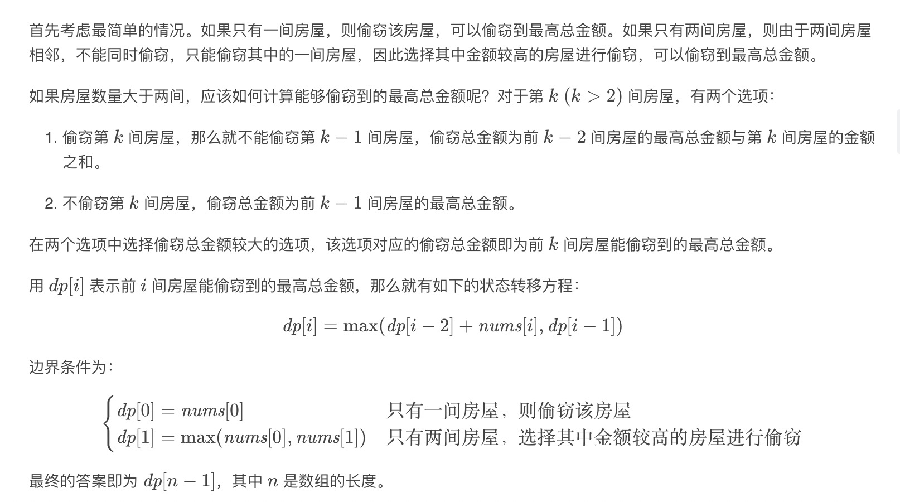

= 打家劫舍
:toc::
:toc-title: 目录
:toclevels: 5
:sectnums:

== 说明
你是一个专业的小偷，计划偷窃沿街的房屋。每间房内都藏有一定的现金，影响你偷窃的唯一制约因素就是相邻的房屋装有相互连通的防盗系统，如果两间相邻的房屋在同一晚上被小偷闯入，系统会自动报警。

给定一个代表每个房屋存放金额的非负整数数组，计算你 不触动警报装置的情况下 ，一夜之内能够偷窃到的最高金额。

示例 1:
```
输入: [1,2,3,1]
输出: 4
解释: 偷窃 1 号房屋 (金额 = 1) ，然后偷窃 3 号房屋 (金额 = 3)。
     偷窃到的最高金额 = 1 + 3 = 4 。
```
示例 2:
```
输入: [2,7,9,3,1]
输出: 12
解释: 偷窃 1 号房屋 (金额 = 2), 偷窃 3 号房屋 (金额 = 9)，接着偷窃 5 号房屋 (金额 = 1)。
     偷窃到的最高金额 = 2 + 9 + 1 = 12 。
```

== 参考
https://leetcode-cn.com/problems/house-robber/

== 知识点
- 动态规划

== 题解



```go
func rob(nums []int) int {
	n := len(nums)
	if n == 0 {
		return 0
	}
	if n == 1 {
		return nums[0]
	}
	dp := make([]int, n)
	dp[0] = nums[0]
	dp[1] = max(nums[0], nums[1])
	for i := 2; i < n; i++ {
		dp[i] = max(dp[i-2]+nums[i], dp[i-1])
	}
	return dp[n-1]
}
```

复杂度:

- 时间复杂度: o(n) ,需要遍历一遍数组
- 空间复杂度: o(1) , 使用滚动数组，可以只存储前两间房屋的最高总金额，而不需要存储整个数组的结果，因此空间复杂度是 O(1)。

