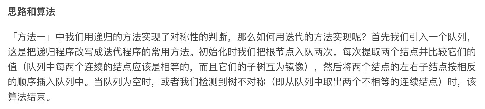

= 对称二叉树
:toc:
:toc-title: 目录
:toclevels: 5
:sectnums:

== 题目说明
给定一个二叉树，检查它是否是镜像对称的。

 

例如，二叉树 [1,2,2,3,4,4,3] 是对称的。
```
    1
   / \
  2   2
 / \ / \
3  4 4  3
```

但是下面这个 [1,2,2,null,3,null,3] 则不是镜像对称的:

```
    1
   / \
  2   2
   \   \
   3    3
 
```

== 参考
https://leetcode-cn.com/problems/symmetric-tree/

== 知识点
- 二叉树
- 镜面堆成
- 递归
- 迭代

== 题解
=== 递归
image:images/1.jpg

image:images/2.jpg

```python
def isSymmetric(root: TreeNode) -> bool:
    def check(left, right):
        if not left and not right:
            return True
        if not left or not right:
            return False
        return left.val == right and check(left.left, right.right) and check(left.right, right.left)

    return check(root, root)
```

复杂度:

- 时间复杂度: o(n), 最差需要遍历整棵树，故渐进时间复杂度为o(n)
- 空间复杂度: o(n), 和递归的栈空间有关，递归层数不超过n，故渐进空间复杂度为o(n)

=== 迭代


```python
def isSymmetric(root: TreeNode) -> bool:
    queue = [root, root]
    while queue:
        left, right = queue[:2]
        queue = queue[2:]
        if not left and not right:
            continue
        if not left or not right:
            return False
        if left.val != right.val:
            return False
        queue.extend([left.left, right.right, left.right, right.left])
    return True
```

复杂度:

- 时间复杂度: o(n)
- 空间复杂度: 这里需要用一个队列来维护节点，每个节点最多进队一次，出队一次，队列中最多不会超过 n 个点，故渐进空间复杂度为 O(n)

