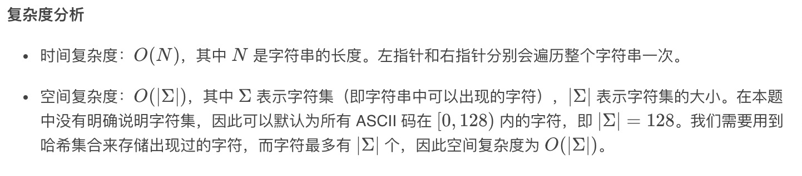

= 无重复字符的最长子串
:toc:
:toc-title: 目录
:toclevels: 5
:sectnums:

== 说明
给定一个字符串，请你找出其中不含有重复字符的 最长子串 的长度。

示例 1:
```
输入: "abcabcbb"
输出: 3
解释: 因为无重复字符的最长子串是 "abc"，所以其长度为 3。
```
示例 2:
```
输入: "bbbbb"
输出: 1
解释: 因为无重复字符的最长子串是 "b"，所以其长度为 1。
```
示例 3:
```
输入: "pwwkew"
输出: 3
解释: 因为无重复字符的最长子串是 "wke"，所以其长度为 3。
     请注意，你的答案必须是 子串 的长度，"pwke" 是一个子序列，不是子串。
```

== 参考
https://leetcode-cn.com/problems/longest-substring-without-repeating-characters/

== 知识点
- 滑动窗口

== 题解


```python
def lengthOfLongestSubstring(s: str) -> int:
    tmp = set()
    n = len(s)
    j, result = 0, 0
    for i in range(n):
        if i != 0:
            # 左指针右移
            tmp.remove(s[i - 1])
        while j < n and s[j] not in tmp:
            tmp.add(s[j])
            # 右指针移动
            j += 1
        result = max(result, j - i)
    return result
```



